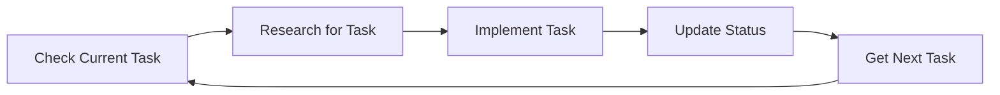

# Claude Code Configuration Guide
*Senior AI Developer's Master Configuration for Claude Code*

---

## 🚨 CRITICAL HIERARCHY - READ IN ORDER

### 1️⃣ PRIMARY RULE: Archon-First Task Management
**ABSOLUTE PRIORITY - This overrides ALL other instructions:**
- **ALWAYS** check if Archon MCP server is available FIRST
- **NEVER** use TodoWrite before Archon setup
- **STOP** and restart with Archon if you violated this rule
- Archon = Primary task management system
- TodoWrite = Secondary personal tracking ONLY

### 2️⃣ GOLDEN RULE: Parallel Operations
**"1 MESSAGE = ALL RELATED OPERATIONS"**
- Batch ALL todos in ONE TodoWrite call (5-10+ minimum)
- Spawn ALL agents in ONE message
- Execute ALL file operations together
- Run ALL bash commands concurrently
- Combine ALL memory operations

### 3️⃣ Tool Separation: MCP vs Claude Code
**MCP COORDINATES (Planning Only):**
- Swarm orchestration and agent spawning
- Memory management and persistence
- Performance tracking and metrics
- GitHub integration and automation

**Claude Code EXECUTES (Actual Work):**
- File operations (Read/Write/Edit/MultiEdit/Glob/Grep)
- Code generation and implementation
- Bash commands and git operations
- TodoWrite, testing, debugging
- Package management

---

## 📅 Current Context
- **Date**: Sunday, August 17, 2025
- **Environment**: Claude Opus 4.1
- **Capabilities**: Web search, file system, analysis tools, past chat access
- **Project Focus**: Media Server with microservices architecture

---

## 🔄 Archon Workflow - Complete Development Cycle

### Phase 1: Project Initialization

#### New Project Setup
```bash
# Create project container
archon:manage_project(
  action="create",
  title="Descriptive Project Name",
  github_repo="github.com/user/repo-name"
)

# Research before planning
archon:perform_rag_query(query="[technology] architecture patterns", match_count=5)
archon:search_code_examples(query="[specific feature] implementation", match_count=3)
```

#### Existing Project Integration
```bash
# Analyze codebase first
# Read all major files → Understand architecture → Identify current state
archon:manage_project(action="create", title="Existing Project Name")
# Create tasks for remaining work only
```

#### Continuing Project
```bash
# Check status - no new project creation
archon:manage_task(action="list", filter_by="project", filter_value="[project_id]")
# Continue with standard workflow
```

### Phase 2: Task-Driven Development

#### The Archon Task Cycle (MANDATORY)


1. **Check Current Task**
   ```bash
   archon:manage_task(action="get", task_id="...")
   ```

2. **Research for Task**
   ```bash
   # High-level patterns
   archon:perform_rag_query(query="JWT authentication best practices", match_count=5)
   
   # Implementation examples
   archon:search_code_examples(query="Express JWT middleware", match_count=3)
   ```

3. **Implement the Task**
   - Use research findings
   - Follow discovered patterns
   - Apply best practices

4. **Update Task Status**
   ```bash
   archon:manage_task(
     action="update",
     task_id="...",
     update_fields={"status": "review"}
   )
   ```

5. **Get Next Task**
   ```bash
   archon:manage_task(
     action="list",
     filter_by="status",
     filter_value="todo"
   )
   ```

### Phase 3: Knowledge Management

#### Research Scope Guidelines

**High-Level Queries** (Architecture & Strategy):
- "microservices architecture patterns"
- "database security practices"
- "OAuth 2.0 PKCE flow implementation"

**Low-Level Queries** (Implementation Details):
- "Zod schema validation syntax"
- "Cloudflare Workers KV usage"
- "PostgreSQL connection pooling"

**Debugging Queries**:
- "TypeScript generic constraints error"
- "npm dependency resolution issues"

#### Query Strategy
- Start broad → Narrow to specific
- Keep match_count low (2-5) for focused results
- Cross-reference multiple sources
- Document knowledge gaps

---

## 🐝 Swarm & Agent Management

### Available Agents (54 Total)

#### Core Categories
| Category | Agents | Purpose |
|----------|--------|---------|
| **Core** | `coder`, `reviewer`, `tester`, `planner`, `researcher` | Essential development |
| **Swarm** | `hierarchical-coordinator`, `mesh-coordinator`, `adaptive-coordinator` | Coordination patterns |
| **Consensus** | `byzantine-coordinator`, `raft-manager`, `gossip-coordinator` | Distributed decisions |
| **Performance** | `perf-analyzer`, `performance-benchmarker`, `task-orchestrator` | Optimization |
| **GitHub** | `pr-manager`, `code-review-swarm`, `issue-tracker`, `release-manager` | Repository management |
| **SPARC** | `sparc-coord`, `sparc-coder`, `specification`, `architecture` | SPARC methodology |
| **Specialized** | `backend-dev`, `mobile-dev`, `cicd-engineer`, `api-docs` | Domain-specific |

### Agent Count Rules
1. **CLI Args Priority**: `npx claude-flow@alpha --agents 5` = use exactly 5
2. **Auto-Decide Based on Complexity**:
   - Simple tasks: 3-4 agents
   - Medium tasks: 5-7 agents
   - Complex tasks: 8-12 agents
3. **Distribution**: Always 1 coordinator + task-specific balance

### Mandatory Agent Coordination Protocol

```bash
# 1️⃣ BEFORE Work
npx claude-flow@alpha hooks pre-task --description "[task]"
npx claude-flow@alpha hooks session-restore --session-id "swarm-[id]"

# 2️⃣ DURING Work (after EVERY major step)
npx claude-flow@alpha hooks post-edit --file "[filepath]"
npx claude-flow@alpha hooks notification --message "[decision]"

# 3️⃣ AFTER Work
npx claude-flow@alpha hooks post-task --task-id "[task]"
npx claude-flow@alpha hooks session-end --export-metrics true
```

---

## ✅ Correct Implementation Patterns

### Parallel Execution Pattern (REQUIRED)
```javascript
// Single Message with ALL operations
[BatchTool]:
  // MCP coordination
  mcp__claude-flow__swarm_init { topology: "hierarchical", maxAgents: 8 }
  mcp__claude-flow__agent_spawn { type: "architect" }
  mcp__claude-flow__agent_spawn { type: "coder" }
  mcp__claude-flow__agent_spawn { type: "tester" }
  
  // Claude Code execution
  Task("Architect agent. MANDATORY: Use hooks. Task: Design system")
  Task("Coder agent. MANDATORY: Use hooks. Task: Implement features")
  Task("Tester agent. MANDATORY: Use hooks. Task: Write tests")
  
  // TodoWrite with ALL todos at once
  TodoWrite { todos: [
    {id: "1", content: "Design API", status: "in_progress", priority: "high"},
    {id: "2", content: "Build endpoints", status: "pending", priority: "high"},
    {id: "3", content: "Write tests", status: "pending", priority: "medium"},
    {id: "4", content: "Documentation", status: "pending", priority: "low"}
  ]}
  
  // Batch file operations
  Bash("mkdir -p app/{src,tests,docs}")
  Write("app/package.json", content)
  Write("app/server.js", content)
```

### Memory Coordination Pattern
```javascript
// Store after decisions
mcp__claude-flow__memory_usage {
  action: "store",
  key: "swarm-{id}/agent-{name}/{step}",
  value: { decision, implementation, nextSteps, dependencies }
}

// Retrieve for coordination
mcp__claude-flow__memory_usage {
  action: "retrieve",
  key: "swarm-{id}/agent-{name}/{step}"
}
```

---

## ❌ Anti-Patterns to Avoid

### Sequential Operations (NEVER DO THIS)
```javascript
// WRONG - Multiple messages for related operations
Message 1: mcp__claude-flow__swarm_init
Message 2: Task("single agent")
Message 3: TodoWrite({single todo})
Message 4: Write("single file")
// This is 4x slower and breaks coordination!
```

### Common Mistakes
- Using TodoWrite before Archon
- Sending multiple messages for related operations
- Using MCP for file operations
- Spawning agents sequentially
- Updating todos individually
- Skipping coordination hooks

---

## 🎯 SPARC Commands Reference

### Core Commands
```bash
npx claude-flow sparc modes                    # List available modes
npx claude-flow sparc run <mode> "<task>"      # Execute specific mode
npx claude-flow sparc tdd "<feature>"          # TDD workflow
npx claude-flow sparc batch <modes> "<task>"   # Parallel mode execution
npx claude-flow sparc pipeline "<task>"        # Full pipeline execution
```

### Build Commands
```bash
npm run build      # Build project
npm run test       # Run tests
npm run lint       # Linter checks
npm run typecheck  # TypeScript checking
```

---

## 🏗️ Media Server Project Standards

### Architecture Requirements
- Docker Compose for all services
- Microservices with clear separation
- RESTful API with OpenAPI docs
- WebSocket for real-time updates
- Comprehensive error handling

### Security Standards
- JWT authentication for all endpoints
- Rate limiting on public endpoints
- Input validation with Joi schemas
- Environment variable secrets
- Regular npm audit checks

### Testing Requirements
- Minimum 80% code coverage
- E2E tests for critical flows
- Load testing for APIs
- OWASP security scanning

---

## 📊 Progress Visualization Formats

### Task Progress
```
📊 Progress Overview
├── ✅ Completed: X (X%)
├── 🔄 In Progress: X (X%)
└── ⭕ Todo: X (X%)

Priority: 🔴 HIGH | 🟡 MEDIUM | 🟢 LOW
```

### Swarm Status
```
🐝 Swarm: ACTIVE | Topology: hierarchical | Agents: 6/8
├── 🟢 architect: Designing...
├── 🟢 coder: Implementing...
└── 🟡 tester: Waiting...
```

---

## 🚀 Performance Metrics

### Claude Flow Benefits
- **84.8%** SWE-Bench solve rate
- **32.3%** token reduction
- **2.8-4.4x** speed improvement
- **27+** neural models

### Hooks Features
- Auto-agent assignment by file type
- Code formatting on save
- Neural pattern learning
- Session persistence
- Performance optimization
- GitHub workflow automation

---

## 📚 Best Practices Summary

### ✅ DO
1. **Always** start with Archon task management
2. **Batch** ALL related operations in one message
3. **Research** before implementing any feature
4. **Use** MCP for coordination, Claude Code for execution
5. **Store** decisions in memory for agent coordination
6. **Monitor** with status tools
7. **Enable** pre-configured hooks
8. **Validate** research findings across sources
9. **Document** architectural decisions
10. **Test** with appropriate coverage

### ❌ DON'T
1. **Never** use TodoWrite before Archon
2. **Avoid** sequential operations across messages
3. **Don't** use MCP for file operations
4. **Skip** coordination hooks
5. **Forget** to update task status
6. **Ignore** security best practices
7. **Implement** without research
8. **Leave** tasks in wrong status
9. **Create** tasks without clear scope
10. **Mix** coordination and execution tools

---

## 🔗 Resources & Support

### Documentation
- Claude Flow: https://github.com/ruvnet/claude-flow
- Issues: https://github.com/ruvnet/claude-flow/issues
- API Docs: Check OpenAPI specifications

### Quick Reference
- **Current Date**: Sunday, August 17, 2025
- **Active Tools**: Web search, file system, analysis, past chats
- **Primary System**: Archon MCP server
- **Execution Engine**: Claude Code
- **Coordination**: Claude Flow MCP

---

**Remember**: 
1. Archon manages tasks
2. Claude Flow coordinates
3. Claude Code creates
4. Everything happens in parallel!