# Cloud-Native Media Server Architecture 2025

## Executive Summary

This document outlines a complete architectural redesign of the media server platform, incorporating cutting-edge technologies and patterns for 2025 and beyond. The architecture is designed for extreme scalability, AI-enhanced experiences, edge computing optimization, and cloud-native deployment.

## Architecture Principles

### Core Design Principles
1. **Cloud-Native First**: Built for Kubernetes, serverless, and multi-cloud
2. **AI/ML Native**: Integrated machine learning for recommendations, content optimization, and predictive scaling
3. **Edge-Optimized**: WebAssembly modules for edge compute and client-side processing
4. **Event-Driven**: Asynchronous, reactive architecture with event sourcing
5. **API-First**: GraphQL federation with REST fallback
6. **Security by Design**: Zero-trust architecture with service mesh
7. **Observability-First**: Full telemetry, distributed tracing, and AIOps integration

## High-Level Architecture

```mermaid
graph TB
    %% Client Layer
    subgraph "Client Layer"
        WEB[Web App - React/WASM]
        MOBILE[Mobile Apps - React Native]
        TV[Smart TV Apps]
        VR[VR/AR Clients]
    end

    %% Edge Layer
    subgraph "Edge Computing Layer"
        CDN[Global CDN]
        EDGE[Edge Functions - WASM]
        CACHE[Edge Cache - Redis]
    end

    %% API Gateway Layer
    subgraph "API Gateway"
        GRAPHQL[GraphQL Federation Gateway]
        REST[REST API Gateway]
        GRPC[gRPC Gateway]
        WEBSOCKET[WebSocket Gateway]
    end

    %% Service Mesh
    subgraph "Service Mesh - Istio"
        AUTH[Auth Service]
        MEDIA[Media Services]
        ML[ML Services]
        STREAMING[Streaming Services]
    end

    %% Core Services
    subgraph "Microservices"
        subgraph "Media Management"
            CATALOG[Catalog Service]
            METADATA[Metadata Service]
            TRANSCODE[Transcoding Service]
            STORAGE[Storage Service]
        end

        subgraph "AI/ML Services"
            RECOMMEND[Recommendation Engine]
            CONTENT[Content Analysis]
            PREDICT[Predictive Analytics]
            PERSONAL[Personalization Service]
        end

        subgraph "User Services"
            USERS[User Management]
            PROFILES[Profile Service]
            SOCIAL[Social Features]
            ACTIVITY[Activity Tracking]
        end

        subgraph "Content Delivery"
            STREAM[Streaming Engine]
            ADAPTIVE[Adaptive Bitrate]
            P2P[P2P Distribution]
            DOWNLOAD[Download Manager]
        end
    end

    %% Data Layer
    subgraph "Data Layer"
        subgraph "Databases"
            POSTGRES[PostgreSQL - Primary]
            MONGO[MongoDB - Content]
            ELASTIC[Elasticsearch - Search]
            TIMESCALE[TimescaleDB - Analytics]
        end

        subgraph "Caching"
            REDIS[Redis Cluster]
            MEMCACHED[Memcached]
        end

        subgraph "Storage"
            S3[Object Storage - S3]
            BLOCK[Block Storage]
            IPFS[IPFS - Distributed]
        end
    end

    %% Event Bus
    subgraph "Event Streaming"
        KAFKA[Apache Kafka]
        PULSAR[Apache Pulsar]
        NATS[NATS Streaming]
    end

    %% Observability
    subgraph "Observability Platform"
        METRICS[Prometheus + Thanos]
        TRACES[Jaeger + Tempo]
        LOGS[Loki + Elasticsearch]
        AIOPS[AIOps Platform]
    end
```



## Detailed Component Architecture

### 1. Client Layer

#### Web Application
```yaml
technology_stack:
  frontend:
    - framework: React 18+ with Server Components
    - state: Zustand + React Query
    - ui: Tailwind CSS + Radix UI
    - wasm: Rust-based WebAssembly modules
    - pwa: Progressive Web App with offline support
  
  features:
    - Real-time collaboration
    - Offline-first architecture
    - WebRTC for P2P streaming
    - WebGPU for advanced graphics
    - WebXR for VR/AR experiences
```

#### Mobile Applications
```yaml
technology_stack:
  framework: React Native with Fabric
  native_modules:
    - Video player: Native modules with hardware acceleration
    - Download manager: Background downloads with resume
    - Offline sync: SQLite + Realm
    - ML inference: TensorFlow Lite
```

### 2. Edge Computing Layer

#### Edge Functions (WebAssembly)
```yaml
runtime: Cloudflare Workers / Fastly Compute@Edge
modules:
  - content_optimization:
      language: Rust
      compile_target: wasm32-wasi
      functions:
        - Image optimization
        - Video thumbnail generation
        - Manifest manipulation
        - A/B testing logic
  
  - security:
      language: Go
      compile_target: wasm32-wasi
      functions:
        - Token validation
        - Rate limiting
        - Geo-blocking
        - DDoS protection
```

### 3. API Gateway Layer

#### GraphQL Federation Gateway
```yaml
implementation: Apollo Federation v2
schema_design:
  - Federated across microservices
  - Real-time subscriptions via WebSocket
  - Automatic persisted queries
  - Schema versioning and evolution

services:
  - User Service: User management and authentication
  - Media Service: Content catalog and metadata
  - Streaming Service: Playback and delivery
  - Analytics Service: Usage and recommendations
```

### 4. Microservices Architecture

#### Media Management Services

##### Catalog Service
```yaml
technology:
  language: Go
  framework: Fiber
  database: PostgreSQL with JSONB
  cache: Redis with write-through

responsibilities:
  - Media library management
  - Collection organization
  - Search and filtering
  - Bulk operations

api:
  - GraphQL schema module
  - gRPC for internal communication
  - Event publishing to Kafka
```

##### Metadata Service
```yaml
technology:
  language: Python
  framework: FastAPI
  ml_framework: spaCy + Transformers
  
features:
  - Automatic metadata extraction
  - Natural language processing
  - Image recognition for posters
  - Audio fingerprinting
  - Subtitle extraction and translation
```

##### Transcoding Service
```yaml
technology:
  language: Rust
  framework: Actix Web
  transcoding: FFmpeg + Hardware acceleration
  
architecture:
  - Job queue: Redis + BullMQ
  - Workers: Kubernetes Jobs with GPU
  - Storage: S3-compatible object storage
  
profiles:
  - HEVC/H.265 for 4K
  - AV1 for next-gen
  - VP9 for web
  - Adaptive bitrate ladder
```

#### AI/ML Services

##### Recommendation Engine
```yaml
technology:
  training: Python + PyTorch
  serving: TorchServe + Triton
  feature_store: Feast
  
algorithms:
  - Collaborative filtering
  - Content-based filtering
  - Deep learning (Transformers)
  - Reinforcement learning for exploration
  
real_time:
  - Redis for feature caching
  - Kafka for event streaming
  - Edge inference with ONNX
```

##### Content Analysis Service
```yaml
technology:
  language: Python
  framework: Ray Serve
  models:
    - Video understanding: VideoMAE
    - Audio analysis: Whisper
    - Text extraction: EasyOCR
    - Scene detection: TransNetV2
    
capabilities:
  - Automatic chapter generation
  - Content moderation
  - Genre classification
  - Mood detection
  - Actor/character recognition
```

### 5. Data Architecture

#### Primary Database (PostgreSQL)
```sql
-- Distributed PostgreSQL with Citus
CREATE TABLE media_items (
    id UUID PRIMARY KEY,
    title TEXT NOT NULL,
    metadata JSONB,
    vector_embedding vector(768), -- pgvector for similarity search
    created_at TIMESTAMPTZ DEFAULT NOW()
) PARTITION BY HASH (id);

-- Full-text search with PostgreSQL
CREATE INDEX idx_media_fts ON media_items 
USING GIN (to_tsvector('english', title || ' ' || metadata->>'description'));
```

#### Time-Series Analytics (TimescaleDB)
```sql
-- Hypertable for streaming analytics
CREATE TABLE streaming_events (
    time TIMESTAMPTZ NOT NULL,
    user_id UUID,
    media_id UUID,
    event_type TEXT,
    metadata JSONB
);

SELECT create_hypertable('streaming_events', 'time');

-- Continuous aggregates for real-time analytics
CREATE MATERIALIZED VIEW hourly_stats
WITH (timescaledb.continuous) AS
SELECT 
    time_bucket('1 hour', time) AS hour,
    media_id,
    COUNT(DISTINCT user_id) as unique_viewers,
    AVG((metadata->>'watch_time')::numeric) as avg_watch_time
FROM streaming_events
GROUP BY hour, media_id;
```

#### Graph Database (Neo4j)
```cypher
// Social graph and recommendations
CREATE (u:User {id: $userId})
CREATE (m:Media {id: $mediaId})
CREATE (u)-[:WATCHED {rating: 5, timestamp: datetime()}]->(m)

// Recommendation query
MATCH (u:User {id: $userId})-[:WATCHED]->(m:Media)<-[:WATCHED]-(other:User)
MATCH (other)-[:WATCHED]->(rec:Media)
WHERE NOT (u)-[:WATCHED]->(rec)
RETURN rec, COUNT(*) as score
ORDER BY score DESC
LIMIT 10
```

### 6. Service Mesh Configuration

#### Istio Service Mesh
```yaml
apiVersion: networking.istio.io/v1beta1
kind: VirtualService
metadata:
  name: media-service
spec:
  hosts:
  - media-service
  http:
  - match:
    - headers:
        x-user-tier:
          exact: premium
    route:
    - destination:
        host: media-service
        subset: v2-premium
      weight: 100
  - route:
    - destination:
        host: media-service
        subset: v1-standard
      weight: 90
    - destination:
        host: media-service
        subset: v2-premium
      weight: 10  # Canary deployment
---
apiVersion: networking.istio.io/v1beta1
kind: DestinationRule
metadata:
  name: media-service
spec:
  host: media-service
  trafficPolicy:
    connectionPool:
      tcp:
        maxConnections: 100
      http:
        http1MaxPendingRequests: 10
        http2MaxRequests: 100
    loadBalancer:
      consistentHash:
        httpCookie:
          name: "session"
          ttl: 3600s
  subsets:
  - name: v1-standard
    labels:
      version: v1
  - name: v2-premium
    labels:
      version: v2
    trafficPolicy:
      tls:
        mode: ISTIO_MUTUAL
```

### 7. Event-Driven Architecture

#### Apache Kafka Configuration
```yaml
topics:
  - name: media.events
    partitions: 50
    replication: 3
    retention: 168h
    
  - name: user.activities
    partitions: 100
    replication: 3
    retention: 720h
    
  - name: ml.predictions
    partitions: 20
    replication: 3
    retention: 24h

streams:
  recommendation_pipeline:
    input: user.activities
    output: ml.predictions
    processing:
      - Filter by engagement metrics
      - Enrich with user preferences
      - Apply ML model
      - Publish recommendations
```

#### Event Sourcing
```typescript
// Event store using EventStore DB
interface MediaEvent {
  aggregateId: string;
  eventType: string;
  eventData: any;
  metadata: EventMetadata;
}

class MediaAggregate {
  async uploadMedia(file: File): Promise<void> {
    const events = [
      {
        eventType: 'MediaUploaded',
        eventData: {
          fileId: file.id,
          size: file.size,
          format: file.format
        }
      },
      {
        eventType: 'TranscodingRequested',
        eventData: {
          profiles: ['1080p', '720p', '480p']
        }
      }
    ];
    
    await this.eventStore.appendToStream(
      `media-${this.id}`,
      events
    );
  }
}
```

### 8. Observability Platform

#### Distributed Tracing
```yaml
# OpenTelemetry configuration
receivers:
  otlp:
    protocols:
      grpc:
        endpoint: 0.0.0.0:4317
      http:
        endpoint: 0.0.0.0:4318

processors:
  batch:
    timeout: 1s
    send_batch_size: 1024
  
  tail_sampling:
    policies:
      - name: errors-policy
        type: status_code
        status_code: {status_codes: [ERROR]}
      - name: slow-traces
        type: latency
        latency: {threshold_ms: 1000}

exporters:
  jaeger:
    endpoint: jaeger-collector:14250
  
  prometheus:
    endpoint: 0.0.0.0:8889

service:
  pipelines:
    traces:
      receivers: [otlp]
      processors: [batch, tail_sampling]
      exporters: [jaeger]
    
    metrics:
      receivers: [otlp]
      processors: [batch]
      exporters: [prometheus]
```

#### AIOps Integration
```python
# Anomaly detection with Prophet and MLflow
from prophet import Prophet
import mlflow

class AnomalyDetector:
    def __init__(self):
        self.models = {}
    
    def train_model(self, metric_name: str, historical_data: pd.DataFrame):
        with mlflow.start_run():
            model = Prophet(
                changepoint_prior_scale=0.05,
                seasonality_mode='multiplicative'
            )
            model.fit(historical_data)
            
            # Log model to MLflow
            mlflow.prophet.log_model(model, "prophet_model")
            mlflow.log_param("metric_name", metric_name)
            
            self.models[metric_name] = model
    
    def detect_anomalies(self, metric_name: str, current_value: float) -> bool:
        model = self.models.get(metric_name)
        if not model:
            return False
        
        # Predict expected value
        future = model.make_future_dataframe(periods=1)
        forecast = model.predict(future)
        
        expected = forecast.iloc[-1]['yhat']
        lower = forecast.iloc[-1]['yhat_lower']
        upper = forecast.iloc[-1]['yhat_upper']
        
        # Check if current value is outside prediction interval
        is_anomaly = current_value < lower or current_value > upper
        
        if is_anomaly:
            self.trigger_alert(metric_name, current_value, expected)
        
        return is_anomaly
```

### 9. Security Architecture

#### Zero-Trust Security Model
```yaml
# OPA (Open Policy Agent) Policies
package media.authz

default allow = false

# Allow users to access their own content
allow {
    input.method == "GET"
    input.path == ["media", user_id, _]
    input.user.id == user_id
}

# Allow premium users to access 4K content
allow {
    input.method == "GET"
    input.path == ["media", _, "stream", "4k"]
    input.user.subscription == "premium"
}

# Rate limiting by user tier
rate_limit[msg] {
    input.user.subscription == "free"
    rate := 10
    msg := sprintf("Free tier limited to %d requests per minute", [rate])
}

rate_limit[msg] {
    input.user.subscription == "premium"
    rate := 1000
    msg := sprintf("Premium tier limited to %d requests per minute", [rate])
}
```

#### mTLS Configuration
```yaml
apiVersion: security.istio.io/v1beta1
kind: PeerAuthentication
metadata:
  name: default
  namespace: media-platform
spec:
  mtls:
    mode: STRICT
---
apiVersion: security.istio.io/v1beta1
kind: AuthorizationPolicy
metadata:
  name: media-service-authz
spec:
  selector:
    matchLabels:
      app: media-service
  action: ALLOW
  rules:
  - from:
    - source:
        principals: ["cluster.local/ns/media-platform/sa/api-gateway"]
    to:
    - operation:
        methods: ["GET", "POST"]
        paths: ["/api/v1/media/*"]
```

### 10. Deployment Architecture

#### Kubernetes Manifests
```yaml
apiVersion: apps/v1
kind: Deployment
metadata:
  name: media-service
  labels:
    app: media-service
    version: v2
spec:
  replicas: 3
  selector:
    matchLabels:
      app: media-service
  template:
    metadata:
      labels:
        app: media-service
        version: v2
      annotations:
        sidecar.istio.io/inject: "true"
        prometheus.io/scrape: "true"
        prometheus.io/port: "9090"
    spec:
      serviceAccountName: media-service
      containers:
      - name: media-service
        image: media-platform/media-service:2.0.0
        ports:
        - containerPort: 8080
          name: http
        - containerPort: 9090
          name: metrics
        env:
        - name: ENVIRONMENT
          value: production
        - name: OTEL_EXPORTER_OTLP_ENDPOINT
          value: "http://otel-collector:4317"
        resources:
          requests:
            memory: "512Mi"
            cpu: "500m"
          limits:
            memory: "1Gi"
            cpu: "1000m"
        livenessProbe:
          httpGet:
            path: /health
            port: 8080
          initialDelaySeconds: 30
          periodSeconds: 10
        readinessProbe:
          httpGet:
            path: /ready
            port: 8080
          initialDelaySeconds: 5
          periodSeconds: 5
---
apiVersion: v1
kind: Service
metadata:
  name: media-service
  labels:
    app: media-service
spec:
  ports:
  - port: 80
    targetPort: 8080
    name: http
  selector:
    app: media-service
---
apiVersion: autoscaling/v2
kind: HorizontalPodAutoscaler
metadata:
  name: media-service-hpa
spec:
  scaleTargetRef:
    apiVersion: apps/v1
    kind: Deployment
    name: media-service
  minReplicas: 3
  maxReplicas: 100
  metrics:
  - type: Resource
    resource:
      name: cpu
      target:
        type: Utilization
        averageUtilization: 70
  - type: Resource
    resource:
      name: memory
      target:
        type: Utilization
        averageUtilization: 80
  - type: Pods
    pods:
      metric:
        name: http_requests_per_second
      target:
        type: AverageValue
        averageValue: "1000"
  behavior:
    scaleDown:
      stabilizationWindowSeconds: 300
      policies:
      - type: Percent
        value: 10
        periodSeconds: 60
    scaleUp:
      stabilizationWindowSeconds: 0
      policies:
      - type: Percent
        value: 100
        periodSeconds: 30
      - type: Pods
        value: 5
        periodSeconds: 60
      selectPolicy: Max
```

#### Helm Chart Structure
```yaml
# Chart.yaml
apiVersion: v2
name: media-platform
description: Cloud-native media server platform
type: application
version: 2.0.0
appVersion: "2025.1"

dependencies:
  - name: postgresql-ha
    version: "11.x.x"
    repository: "https://charts.bitnami.com/bitnami"
  
  - name: redis-cluster
    version: "8.x.x"
    repository: "https://charts.bitnami.com/bitnami"
  
  - name: elasticsearch
    version: "8.x.x"
    repository: "https://helm.elastic.co"
  
  - name: kafka
    version: "20.x.x"
    repository: "https://charts.bitnami.com/bitnami"
    
  - name: istio
    version: "1.17.x"
    repository: "https://istio-release.storage.googleapis.com/charts"
```

### 11. Edge Computing and CDN

#### Edge Configuration
```javascript
// Cloudflare Workers example
addEventListener('fetch', event => {
  event.respondWith(handleRequest(event.request))
})

async function handleRequest(request) {
  const url = new URL(request.url)
  
  // WebAssembly module for image optimization
  const wasmModule = await loadWasmModule('image-optimizer.wasm')
  
  // Check cache
  const cache = caches.default
  let response = await cache.match(request)
  
  if (!response) {
    // Apply edge logic
    if (url.pathname.startsWith('/api/media/thumbnail')) {
      response = await generateThumbnail(request, wasmModule)
    } else if (url.pathname.startsWith('/api/stream')) {
      response = await optimizeStreamManifest(request)
    } else {
      response = await fetch(request)
    }
    
    // Cache response
    event.waitUntil(cache.put(request, response.clone()))
  }
  
  return response
}

async function generateThumbnail(request, wasmModule) {
  const imageUrl = new URL(request.url).searchParams.get('url')
  const size = new URL(request.url).searchParams.get('size') || '300x200'
  
  // Fetch original image
  const imageResponse = await fetch(imageUrl)
  const imageBuffer = await imageResponse.arrayBuffer()
  
  // Process with WebAssembly
  const optimized = wasmModule.optimizeImage(imageBuffer, size)
  
  return new Response(optimized, {
    headers: {
      'Content-Type': 'image/webp',
      'Cache-Control': 'public, max-age=31536000',
      'X-Edge-Location': request.cf.colo
    }
  })
}
```

### 12. Monitoring and Alerting

#### Prometheus Rules
```yaml
groups:
  - name: media_platform_alerts
    interval: 30s
    rules:
      - alert: HighStreamingLatency
        expr: |
          histogram_quantile(0.95, 
            sum(rate(streaming_request_duration_seconds_bucket[5m])) 
            by (le, service)
          ) > 2
        for: 5m
        labels:
          severity: warning
          team: platform
        annotations:
          summary: "High streaming latency detected"
          description: "95th percentile latency is {{ $value }}s for {{ $labels.service }}"
      
      - alert: TranscodingQueueBacklog
        expr: |
          sum(transcoding_queue_size) by (priority) > 1000
        for: 10m
        labels:
          severity: critical
          team: media
        annotations:
          summary: "Transcoding queue backlog"
          description: "{{ $value }} items in {{ $labels.priority }} priority queue"
      
      - alert: MLModelDrift
        expr: |
          abs(ml_model_prediction_drift) > 0.15
        for: 30m
        labels:
          severity: warning
          team: ml
        annotations:
          summary: "ML model drift detected"
          description: "Model {{ $labels.model }} showing {{ $value }} drift"
```

#### Grafana Dashboards
```json
{
  "dashboard": {
    "title": "Media Platform Overview",
    "panels": [
      {
        "title": "Streaming Metrics",
        "targets": [
          {
            "expr": "sum(rate(streaming_requests_total[5m])) by (service)",
            "legendFormat": "{{ service }}"
          }
        ],
        "type": "graph"
      },
      {
        "title": "AI/ML Performance",
        "targets": [
          {
            "expr": "histogram_quantile(0.95, sum(rate(ml_inference_duration_seconds_bucket[5m])) by (le, model))",
            "legendFormat": "{{ model }} p95"
          }
        ],
        "type": "graph"
      },
      {
        "title": "Edge Cache Hit Rate",
        "targets": [
          {
            "expr": "sum(rate(edge_cache_hits_total[5m])) / sum(rate(edge_cache_requests_total[5m])) * 100",
            "legendFormat": "Cache Hit Rate %"
          }
        ],
        "type": "stat"
      }
    ]
  }
}
```

## Migration Strategy

### Phase 1: Foundation (Months 1-3)
1. Set up Kubernetes clusters (EKS/GKE/AKS)
2. Deploy service mesh (Istio)
3. Implement observability platform
4. Create CI/CD pipelines

### Phase 2: Core Services (Months 4-6)
1. Migrate authentication to OIDC/OAuth2
2. Implement GraphQL federation gateway
3. Deploy core microservices
4. Set up event streaming platform

### Phase 3: Advanced Features (Months 7-9)
1. Deploy ML/AI services
2. Implement edge computing layer
3. Enable WebAssembly modules
4. Launch real-time features

### Phase 4: Optimization (Months 10-12)
1. Performance tuning
2. Cost optimization
3. Security hardening
4. Documentation and training

## Cost Optimization Strategies

### Multi-Cloud Cost Management
```yaml
strategies:
  compute:
    - Use spot instances for batch processing
    - Reserved instances for baseline capacity
    - Serverless for variable workloads
    
  storage:
    - Intelligent tiering for media files
    - Cold storage for archives
    - CDN for frequently accessed content
    
  networking:
    - Private peering to reduce egress
    - Edge caching to minimize origin requests
    - Compression and optimization
```

## Security Considerations

### Defense in Depth
1. **Network Security**: Service mesh with mTLS
2. **Application Security**: OWASP compliance, dependency scanning
3. **Data Security**: Encryption at rest and in transit
4. **Identity**: Zero-trust with continuous verification
5. **Compliance**: GDPR, CCPA, SOC2 compliance

## Performance Targets

### SLAs and SLOs
```yaml
availability:
  target: 99.99%
  measurement: Synthetic monitoring from multiple regions

latency:
  p50: < 100ms
  p95: < 300ms
  p99: < 1000ms

throughput:
  streaming: 1M concurrent streams
  api: 100K requests/second
  
error_rate:
  target: < 0.1%
  measurement: 5xx errors / total requests
```

## Conclusion

This architecture represents a complete transformation to a cloud-native, AI-enhanced, edge-optimized media platform. It provides:

1. **Infinite scalability** through Kubernetes and serverless
2. **Intelligence** through integrated ML/AI services
3. **Performance** through edge computing and optimization
4. **Reliability** through service mesh and observability
5. **Security** through zero-trust architecture
6. **Developer productivity** through modern APIs and tooling

The platform is designed to handle millions of users, petabytes of content, and evolve with emerging technologies through 2025 and beyond.