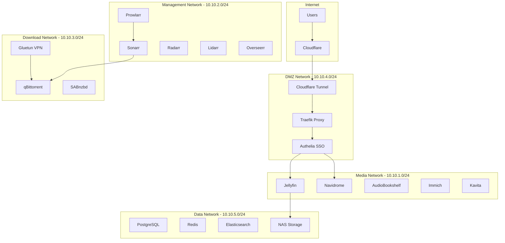
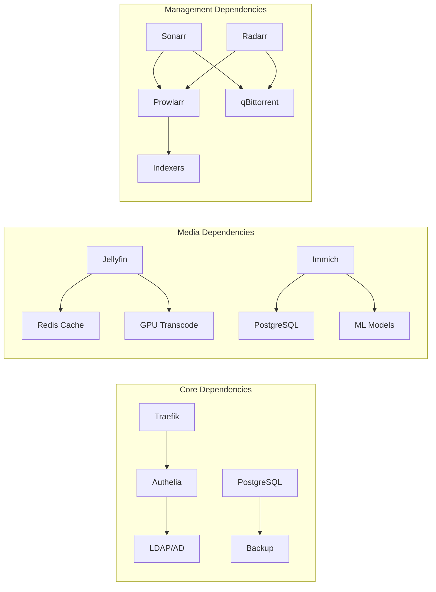
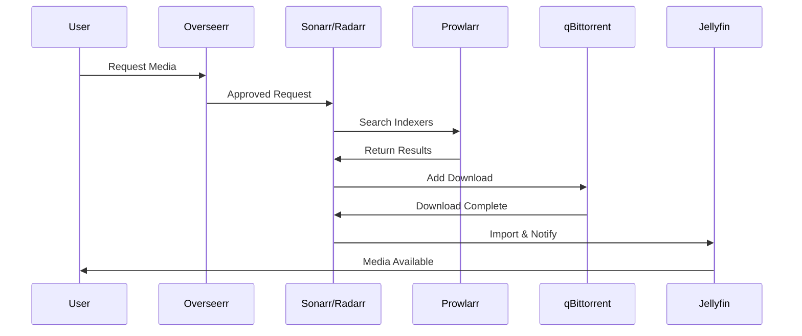
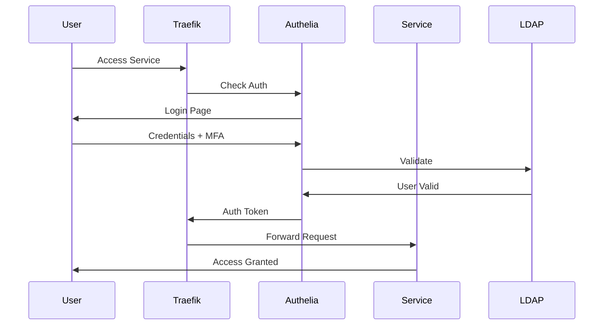
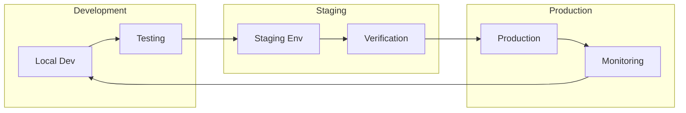

# Comprehensive Media Stack Architecture

## Executive Summary

This document presents a production-ready, enterprise-grade media server architecture supporting all media types (movies, TV, music, audiobooks, podcasts, photos, e-books, comics) with advanced features including hardware acceleration, single sign-on, monitoring, and high availability.

## Table of Contents

1. [Architecture Overview](#architecture-overview)
2. [System Components](#system-components)
3. [Network Architecture](#network-architecture)
4. [Service Architecture](#service-architecture)
5. [Data Flow Architecture](#data-flow-architecture)
6. [Security Architecture](#security-architecture)
7. [Performance Architecture](#performance-architecture)
8. [Deployment Architecture](#deployment-architecture)
9. [Monitoring & Observability](#monitoring--observability)
10. [Disaster Recovery](#disaster-recovery)

## Architecture Overview

### Design Principles

1. **Microservices Architecture**: Each media type handled by specialized services
2. **Zero-Trust Security**: Multiple authentication layers and network segmentation
3. **High Performance**: Hardware acceleration, intelligent caching, and CDN integration
4. **Unified Experience**: Single sign-on across all services with unified search
5. **Scalability**: Horizontal and vertical scaling capabilities
6. **Resilience**: Automatic failover and self-healing capabilities

### Architecture Layers

```
┌─────────────────────────────────────────────────────────────┐
│                    User Access Layer                        │
│            (Web, Mobile, Smart TV, API Clients)            │
├─────────────────────────────────────────────────────────────┤
│                     Edge Services                           │
│        (Cloudflare CDN, WAF, DDoS Protection)             │
├─────────────────────────────────────────────────────────────┤
│                 Authentication Gateway                      │
│              (Authelia SSO + Traefik Proxy)               │
├─────────────────────────────────────────────────────────────┤
│                  Application Services                       │
│    (Media Servers, Content Management, Support Tools)      │
├─────────────────────────────────────────────────────────────┤
│                    Data Services                           │
│     (Databases, Caching, Search, Message Queuing)         │
├─────────────────────────────────────────────────────────────┤
│                 Infrastructure Layer                        │
│        (Docker Swarm, Storage, Networking, GPU)           │
└─────────────────────────────────────────────────────────────┘
```

## System Components

### Media Services Matrix

| Media Type | Primary Service | Backup Service | Features |
|------------|----------------|----------------|----------|
| Movies/TV | Jellyfin | Plex | HW Transcoding, 4K HDR |
| Music | Navidrome | Airsonic-Advanced | Subsonic API, Playlists |
| Audiobooks | AudioBookshelf | Booksonic | Progress Sync, Series |
| Podcasts | AudioBookshelf | Podgrab | Auto-download, OPML |
| Photos | Immich | PhotoPrism | AI Recognition, Maps |
| E-Books | Calibre-Web | Kavita | EPUB/PDF, Sync |
| Comics | Kavita | Komga | CBR/CBZ, Reading Lists |

### Content Management Services

| Service | Purpose | Integration |
|---------|---------|-------------|
| Sonarr | TV Management | Jellyfin, Prowlarr |
| Radarr | Movie Management | Jellyfin, Prowlarr |
| Lidarr | Music Management | Navidrome, Prowlarr |
| Readarr | Book Management | Calibre-Web, Prowlarr |
| Mylar3 | Comic Management | Kavita, Prowlarr |
| Prowlarr | Indexer Management | All *arr services |
| Bazarr | Subtitle Management | Jellyfin, Sonarr/Radarr |

### Support Services

| Service | Purpose | Features |
|---------|---------|----------|
| Overseerr | Request Management | User requests, approval workflow |
| Homarr | Dashboard | Service status, quick access |
| qBittorrent | Downloads | VPN integration, RSS |
| SABnzbd | Usenet | SSL, automation |
| Tautulli | Analytics | Viewing stats, notifications |

## Network Architecture

### Network Topology



### VLAN Configuration

```yaml
vlans:
  dmz:
    id: 40
    subnet: 10.10.4.0/24
    description: "Public-facing services"
    
  media:
    id: 10
    subnet: 10.10.1.0/24
    description: "Media streaming services"
    
  management:
    id: 20
    subnet: 10.10.2.0/24
    description: "Content management services"
    
  download:
    id: 30
    subnet: 10.10.3.0/24
    description: "Download services (VPN isolated)"
    
  data:
    id: 50
    subnet: 10.10.5.0/24
    description: "Database and storage services"
    
  monitoring:
    id: 60
    subnet: 10.10.6.0/24
    description: "Monitoring and logging services"
```

## Service Architecture

### Container Orchestration

```yaml
docker_swarm:
  managers: 3
  workers: 5
  
  node_labels:
    media-01:
      - type=media
      - gpu=nvidia
      - storage=ssd
    
    data-01:
      - type=data
      - storage=nvme
      - db=primary
    
    download-01:
      - type=download
      - network=vpn
      
  placement_constraints:
    media_services:
      - node.labels.type == media
      - node.labels.gpu == nvidia
      
    databases:
      - node.labels.type == data
      - node.labels.db == primary
      
    download_services:
      - node.labels.type == download
      - node.labels.network == vpn
```

### Service Dependencies



## Data Flow Architecture

### Media Acquisition Flow



### Authentication Flow



## Security Architecture

### Security Layers

```yaml
security_layers:
  edge:
    cloudflare:
      - waf_rules: enabled
      - ddos_protection: enabled
      - bot_management: enabled
      - ssl_mode: full_strict
      
  network:
    firewall:
      - default_policy: deny_all
      - allowed_ports: [80, 443]
      - vpn_access: wireguard
      
    segmentation:
      - vlan_isolation: enforced
      - inter_vlan_routing: controlled
      - acl_rules: strict
      
  application:
    authentication:
      - provider: authelia
      - methods: [password, totp, webauthn]
      - session_duration: 1h
      
    authorization:
      - rbac: enabled
      - default_role: viewer
      - admin_mfa: required
      
  data:
    encryption:
      - at_rest: aes_256_gcm
      - in_transit: tls_1.3
      - key_rotation: 30_days
      
    backup:
      - encryption: enabled
      - offsite: true
      - immutable: true
```

### Container Security

```yaml
container_security:
  runtime:
    - security_opt: no-new-privileges
    - read_only: true
    - cap_drop: ALL
    - user: non-root
    
  network:
    - internal_only: true
    - encrypted_overlay: true
    
  secrets:
    - provider: docker_secrets
    - rotation: automatic
    
  scanning:
    - vulnerability_scan: daily
    - compliance_check: weekly
```

## Performance Architecture

### Hardware Acceleration

```yaml
gpu_allocation:
  nvidia_gpus:
    - device_0:
        service: jellyfin
        capabilities: [decode, encode]
        codecs: [h264, h265, av1]
        
    - device_1:
        service: immich
        capabilities: [ml_inference]
        models: [face_recognition, object_detection]
        
  intel_quicksync:
    services: [plex, tdarr]
    capabilities: [decode, encode]
```

### Caching Strategy

```yaml
caching:
  layers:
    cdn:
      provider: cloudflare
      cache_rules:
        - images: 1_year
        - css_js: 1_month
        - api: no_cache
        
    application:
      redis:
        - session_cache: 1h
        - metadata_cache: 24h
        - search_cache: 1h
        
    filesystem:
      ssd_cache:
        - transcoding: 100GB
        - thumbnails: 50GB
        - frequent_files: 200GB
```

### Performance Optimization

```yaml
optimizations:
  database:
    - connection_pooling: enabled
    - query_cache: 256MB
    - indexes: optimized
    
  media_delivery:
    - adaptive_bitrate: enabled
    - preload_metadata: true
    - chunk_size: 8MB
    
  transcoding:
    - hardware_acceleration: required
    - preset: medium
    - two_pass: false
```

## Deployment Architecture

### Docker Compose Structure

```yaml
compose_files:
  - docker-compose.yml          # Core services
  - compose.media.yml          # Media servers
  - compose.management.yml     # Content management
  - compose.monitoring.yml     # Monitoring stack
  - compose.security.yml       # Security services
  - compose.production.yml     # Production overrides
  - compose.backup.yml         # Backup services
```

### Deployment Pipeline



### Resource Allocation

```yaml
resources:
  media_services:
    jellyfin:
      cpu: 4
      memory: 8Gi
      gpu: required
      storage: 100Gi
      
    immich:
      cpu: 4
      memory: 16Gi
      gpu: required
      storage: 500Gi
      
  management_services:
    sonarr:
      cpu: 2
      memory: 2Gi
      storage: 50Gi
      
  infrastructure:
    traefik:
      cpu: 2
      memory: 1Gi
      replicas: 3
      
    postgresql:
      cpu: 4
      memory: 8Gi
      storage: 100Gi
      replicas: 2
```

## Monitoring & Observability

### Monitoring Stack

```yaml
monitoring:
  metrics:
    prometheus:
      retention: 90d
      scrape_interval: 15s
      exporters:
        - node_exporter
        - cadvisor
        - postgres_exporter
        - redis_exporter
        
  visualization:
    grafana:
      dashboards:
        - system_overview
        - media_analytics
        - service_health
        - user_activity
        
  logging:
    loki:
      retention: 30d
      index_period: 24h
      chunk_period: 1h
      
  alerting:
    alertmanager:
      receivers:
        - email
        - slack
        - pagerduty
```

### Key Metrics

```yaml
metrics:
  system:
    - cpu_usage
    - memory_usage
    - disk_io
    - network_throughput
    
  application:
    - concurrent_streams
    - transcode_queue
    - api_response_time
    - cache_hit_rate
    
  business:
    - active_users
    - media_consumption
    - storage_growth
    - bandwidth_usage
```

## Disaster Recovery

### Backup Strategy

```yaml
backup:
  schedules:
    databases:
      frequency: hourly
      retention: 7_days
      type: incremental
      
    configurations:
      frequency: daily
      retention: 30_days
      type: full
      
    media_metadata:
      frequency: daily
      retention: 7_days
      type: incremental
      
  destinations:
    - local_nas:
        protocol: nfs
        encryption: true
        
    - cloud_storage:
        provider: backblaze_b2
        encryption: client_side
        
    - offsite_nas:
        location: remote_datacenter
        protocol: rsync_ssh
```

### Recovery Procedures

```yaml
recovery:
  rto: 4_hours  # Recovery Time Objective
  rpo: 1_hour   # Recovery Point Objective
  
  procedures:
    service_failure:
      - automatic_restart
      - failover_replica
      - restore_from_backup
      
    data_corruption:
      - validate_backups
      - restore_point_in_time
      - verify_integrity
      
    complete_disaster:
      - provision_infrastructure
      - restore_configurations
      - restore_data
      - validate_services
```

## Implementation Roadmap

### Phase 1: Foundation (Week 1-2)
- Set up Docker Swarm cluster
- Configure networking and VLANs
- Deploy Traefik and Authelia
- Set up PostgreSQL and Redis

### Phase 2: Core Services (Week 3-4)
- Deploy Jellyfin with GPU support
- Configure Sonarr, Radarr, Prowlarr
- Set up qBittorrent with VPN
- Implement Overseerr

### Phase 3: Extended Media (Week 5-6)
- Deploy Navidrome for music
- Set up AudioBookshelf
- Configure Immich with ML
- Add Calibre-Web and Kavita

### Phase 4: Monitoring & Security (Week 7-8)
- Deploy Prometheus and Grafana
- Configure alerting rules
- Implement backup procedures
- Security hardening and testing

### Phase 5: Optimization (Week 9-10)
- Performance tuning
- CDN configuration
- Documentation
- User training

## Conclusion

This architecture provides a comprehensive, secure, and scalable media server solution supporting all media types with enterprise-grade features. The modular design allows for incremental implementation while maintaining the flexibility to adapt to changing requirements.