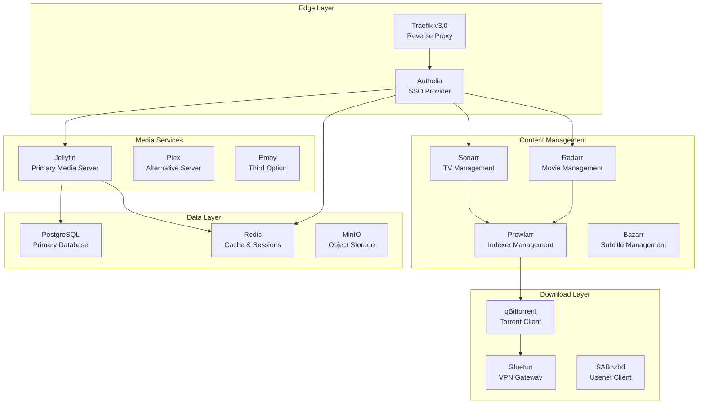

# Media Stack Architecture Analysis Report
## System Architecture Designer Analysis

### Executive Summary
This comprehensive analysis examines the Ultimate Media Server 2025 project, evaluating its current implementation against architectural best practices. The system demonstrates a sophisticated microservices architecture with both strengths and areas for improvement.

## 1. Service Dependencies and Relationships

### Core Service Topology
The architecture implements a hierarchical service dependency model:



### Dependency Analysis

#### Critical Dependencies
1. **Traefik**: Central ingress controller - all services depend on it for external access
2. **PostgreSQL**: Primary data store for multiple services (Authelia, Kong, Immich)
3. **Redis**: Session management and caching layer
4. **Gluetun**: VPN gateway for download clients

#### Service Coupling Issues
- **Tight Coupling**: Download services (qBittorrent) use network_mode: "service:gluetun"
- **Circular Dependencies**: Some services reference each other without clear hierarchy
- **Missing Health Checks**: Not all service dependencies validate target availability

## 2. Volume Mount Requirements

### Current Volume Structure
```yaml
volumes:
  # Infrastructure
  traefik_certs:      # SSL certificates
  authelia_data:      # Authentication config
  
  # Media Storage
  media_data:         # Shared media library
  media_movies:       # Movie storage
  media_tv:          # TV show storage
  media_music:       # Music library
  
  # Service Configs
  jellyfin_config:   # Jellyfin settings
  sonarr_config:     # Sonarr database
  radarr_config:     # Radarr database
  
  # Databases
  postgres_data:     # PostgreSQL data
  redis_data:        # Redis persistence
```

### Volume Mount Analysis
1. **Shared Media Volume**: All media services mount the same media_data volume
   - Risk: Permission conflicts between services
   - Recommendation: Use read-only mounts where possible

2. **Configuration Persistence**: Each service has dedicated config volume
   - Good practice for service isolation
   - Missing: Backup volume strategy

3. **Transcode Directories**: Using /dev/shm for hardware acceleration
   - Performance optimization for video transcoding
   - Risk: Limited by system RAM

## 3. Network Topology

### Network Segmentation Strategy
The architecture implements proper network segmentation:

```yaml
networks:
  public:       # 172.25.0.0/24 - Internet-facing services
  frontend:     # 172.25.1.0/24 - User-facing services (internal)
  backend:      # 172.25.2.0/24 - Backend services (internal)
  downloads:    # 172.25.3.0/24 - VPN-isolated download network
  monitoring:   # 172.25.4.0/24 - Monitoring stack (internal)
```

### Network Security Analysis
1. **Proper Isolation**: Download network is isolated from other services
2. **Internal Networks**: Backend and monitoring networks marked as internal
3. **Missing**: Explicit firewall rules between networks
4. **VPN Integration**: Gluetun provides kill-switch protection

## 4. Resource Constraints

### Current Resource Allocation
```yaml
# GPU Acceleration
jellyfin:
  devices:
    - /dev/dri:/dev/dri  # Intel GPU passthrough
  deploy:
    resources:
      reservations:
        devices:
          - driver: nvidia
            count: 1
            capabilities: [gpu]

# Memory Limits (Missing in most services)
# CPU Limits (Not defined)
```

### Resource Recommendations
1. **Memory Limits**: Add memory limits to prevent resource exhaustion
   ```yaml
   deploy:
     resources:
       limits:
         memory: 8G  # Jellyfin
         memory: 2G  # Sonarr/Radarr
         memory: 1G  # Prowlarr
       reservations:
         memory: 512M
   ```

2. **CPU Allocation**: Define CPU limits for compute-intensive services
3. **Storage Quotas**: Implement volume size limits

## 5. Security Considerations

### Current Security Implementation
1. **Authentication Layer**: Authelia provides SSO with MFA support
2. **TLS Termination**: Traefik handles SSL with Let's Encrypt
3. **Network Isolation**: Proper network segmentation
4. **Security Options**: `no-new-privileges:true` applied

### Security Gaps and Recommendations

#### Missing Security Features
1. **Secrets Management**: 
   - Current: Plain text in .env files
   - Recommendation: Implement Docker secrets or HashiCorp Vault
   
2. **Container Security**:
   - Missing: Read-only root filesystems
   - Missing: User namespace remapping
   - Missing: AppArmor/SELinux profiles

3. **Network Policies**:
   - No explicit ingress/egress rules
   - Recommendation: Implement iptables rules or use Docker's built-in firewall

4. **Vulnerability Scanning**:
   - No image scanning pipeline
   - Recommendation: Integrate Trivy or similar scanner

### Recommended Security Enhancements
```yaml
services:
  jellyfin:
    <<: *security-opts
    read_only: true
    tmpfs:
      - /tmp
      - /var/tmp
    security_opt:
      - no-new-privileges:true
      - apparmor:docker-default
    cap_drop:
      - ALL
    cap_add:
      - CHOWN
      - SETUID
      - SETGID
```

## 6. Architectural Patterns Assessment

### Strengths
1. **Microservices Architecture**: Proper service separation
2. **Profile-Based Deployment**: Docker Compose profiles for selective deployment
3. **Service Mesh Concepts**: Network segmentation mimics service mesh patterns
4. **Observability Stack**: Prometheus + Grafana for monitoring

### Weaknesses
1. **Service Discovery**: No dynamic service discovery mechanism
2. **Configuration Management**: No centralized configuration service
3. **Circuit Breakers**: Missing resilience patterns
4. **API Gateway**: Traefik serves as proxy but lacks API management features

## 7. Scalability Analysis

### Horizontal Scaling Limitations
1. **Stateful Services**: Most services maintain local state
2. **Shared Volumes**: Media volumes prevent easy horizontal scaling
3. **No Orchestration**: Docker Compose limits to single-host deployment

### Vertical Scaling Considerations
1. **Hardware Acceleration**: GPU-dependent services limited by hardware
2. **Memory Requirements**: Minimum 32GB RAM recommended
3. **Storage Performance**: NAS/SAN required for large libraries

## 8. High Availability Concerns

### Single Points of Failure
1. **Traefik**: No redundancy for ingress controller
2. **PostgreSQL**: No replication or failover
3. **Storage**: Shared volumes create failure domain

### HA Recommendations
1. Implement PostgreSQL replication
2. Deploy Traefik in HA mode with keepalived
3. Use distributed storage (GlusterFS/Ceph)
4. Implement service health checks and auto-restart

## 9. Performance Optimization Opportunities

### Current Optimizations
1. **Hardware Acceleration**: GPU transcoding enabled
2. **RAM Disk**: /dev/shm for transcode operations
3. **Redis Caching**: Session and metadata caching

### Additional Optimizations
1. **Database Indexing**: Optimize PostgreSQL indexes
2. **CDN Integration**: Cloudflare for static assets
3. **Compression**: Enable gzip/brotli in Traefik
4. **Connection Pooling**: Implement PgBouncer for PostgreSQL

## 10. Recommendations Summary

### Critical Improvements
1. **Secrets Management**: Implement proper secret rotation
2. **Resource Limits**: Define memory and CPU constraints
3. **Backup Strategy**: Automated backup for volumes
4. **Health Monitoring**: Comprehensive health checks

### Strategic Enhancements
1. **Migration to Kubernetes**: For production scalability
2. **Service Mesh**: Istio/Linkerd for advanced networking
3. **GitOps**: ArgoCD for deployment automation
4. **Observability**: Distributed tracing with Jaeger

### Quick Wins
1. Add missing health checks
2. Implement read-only root filesystems
3. Define resource limits
4. Enable container security options

## Conclusion

The Ultimate Media Server 2025 architecture demonstrates sophisticated design with proper service separation and network segmentation. However, it requires enhancements in security, resource management, and high availability to meet enterprise-grade requirements. The modular approach using Docker Compose profiles provides excellent flexibility for different deployment scenarios.

### Architecture Score: 7.5/10
- **Strengths**: Service modularity, network design, authentication
- **Improvements Needed**: Security hardening, resource management, HA capabilities

---
*Analysis completed by System Architecture Designer*
*Date: 2025-08-02*