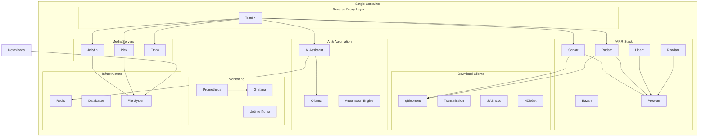

# 🚀 Ultimate Media Server 2025 - Single Container Edition


> **The most comprehensive media server solution in a single container - 30+ services, AI-powered, production-ready**

## ✨ Overview

Ultimate Media Server 2025 Single Container Edition combines all the essential media server services into one unified, optimized container. Built with s6-overlay for proper process supervision, this solution provides enterprise-grade functionality with home-user simplicity.

### 🎯 Key Features

- **🎬 Complete Media Stack**: Jellyfin, Plex, Emby with full hardware acceleration
- **📺 *ARR Suite**: Sonarr, Radarr, Lidarr, Readarr, Bazarr, Prowlarr - fully integrated
- **⬇️ Download Clients**: qBittorrent, Transmission, SABnzbd, NZBGet with VPN support
- **🤖 AI Integration**: Ollama-powered AI assistant with smart recommendations
- **📊 Monitoring**: Prometheus, Grafana, Uptime Kuma with custom dashboards
- **🔒 Security**: Traefik reverse proxy with optional SSL/TLS and authentication
- **📱 Mobile Optimized**: Responsive dashboards and PWA support
- **⚡ High Performance**: Optimized for minimal resource usage and maximum throughput

## 🏗️ Architecture



## 🚀 Quick Start

### Prerequisites

- Docker 20.10+ with BuildKit support
- Docker Compose v2.0+
- 8GB+ RAM (16GB+ recommended)
- 100GB+ free disk space
- Hardware transcoding support (Intel QuickSync/NVIDIA GPU) - optional

### 1. Clone and Setup

```bash
git clone https://github.com/ultimate-media-server/2025-single-container.git
cd 2025-single-container

# Copy environment template
cp .env.ultimate-single-container-2025.template .env

# Edit configuration (required)
nano .env
```

### 2. Deploy

```bash
# Quick deployment with default settings
./deploy-ultimate-single-container-2025.sh --quick-start

# Or customize the deployment
./deploy-ultimate-single-container-2025.sh
```

### 3. Access Your Services

Once deployed, access your media server at:
- **Main Dashboard**: http://localhost
- **Jellyfin**: http://localhost:8096
- **Plex**: http://localhost:32400/web
- **AI Assistant**: http://localhost:8090

## 📋 Complete Service List

### 🎬 Media Servers
- **Jellyfin** (8096) - Open-source media server with hardware acceleration
- **Plex** (32400) - Premium media server with advanced features
- **Emby** (8097) - Alternative media server solution

### 📺 Media Management (*ARR Suite)
- **Sonarr** (8989) - TV show automation and management
- **Radarr** (7878) - Movie automation and management
- **Lidarr** (8686) - Music automation and management
- **Readarr** (8787) - Book and audiobook management
- **Bazarr** (6767) - Subtitle management for movies and TV
- **Prowlarr** (9696) - Indexer management and integration

### ⬇️ Download Clients
- **qBittorrent** (8080) - Modern torrent client with web interface
- **Transmission** (9091) - Lightweight torrent client
- **SABnzbd** (8085) - Usenet binary newsreader
- **NZBGet** (6789) - Efficient usenet downloader

### 🎫 Request Management
- **Overseerr** (5055) - Media discovery and request management for Plex
- **Jellyseerr** (5056) - Media discovery and request management for Jellyfin
- **Ombi** (3579) - Alternative request management system

### 📊 Dashboards
- **Homepage** (3000) - Modern, fast dashboard with service integration
- **Homarr** (7575) - Stylish dashboard with customizable widgets
- **Organizr** (8181) - Unified dashboard with authentication
- **Tautulli** (8182) - Plex monitoring and statistics

### 📚 Content Libraries
- **Calibre-Web** (8083) - E-book library management
- **Audiobookshelf** (13378) - Audiobook and podcast server
- **Navidrome** (4533) - Modern music server with streaming
- **PhotoPrism** (2342) - AI-powered photo management
- **Immich** (2283) - Google Photos alternative
- **Paperless-ngx** (8010) - Document management system
- **Nextcloud** (8084) - Personal cloud storage
- **Komga** (8090) - Comic and manga server

### 🔧 Utilities
- **Vaultwarden** (8085) - Bitwarden-compatible password manager
- **Pi-hole** (8053) - Network-wide ad blocking
- **AdGuard Home** (8054) - Alternative DNS ad blocker
- **Syncthing** (8384) - Continuous file synchronization
- **FileBrowser** (8086) - Web-based file manager
- **Code Server** (8443) - VS Code in your browser
- **Gitea** (3002) - Lightweight Git service

### 📈 Monitoring & Management
- **Prometheus** (9090) - Metrics collection and alerting
- **Grafana** (3000) - Metrics visualization and dashboards
- **Uptime Kuma** (3001) - Uptime monitoring
- **Portainer** (9000) - Docker container management
- **Netdata** (19999) - Real-time system monitoring
- **Glances** (61208) - System monitoring tool
- **Scrutiny** (8082) - Hard drive health monitoring

### 🤖 AI & Automation
- **AI Assistant** (8090) - Intelligent media server assistant
- **Ollama** (11434) - Local AI language models
- **Automation Engine** - Smart download and media management

### 🔧 Infrastructure
- **Traefik** (80/443) - Reverse proxy with automatic SSL
- **Redis** (6379) - In-memory data store
- **Internal DNS** - Service discovery and load balancing

## ⚙️ Configuration

### Environment Variables

The `.env` file contains over 100 configuration options organized into sections:

```bash
# System Configuration
PUID=1000                    # User ID
PGID=1000                    # Group ID
TZ=America/New_York          # Timezone

# Security
API_KEY=your-secure-key      # API authentication key
SECURE_MODE=true             # Enable security features
DISABLE_TELEMETRY=true       # Disable analytics

# Features
AI_ENABLED=true              # Enable AI features
ENABLE_MONITORING=true       # Enable monitoring stack
ENABLE_4K_TRANSCODING=true   # Enable 4K hardware transcoding

# External APIs
TMDB_API_KEY=               # The Movie Database API key
TVDB_API_KEY=               # TheTVDB API key
```

### Directory Structure

```
./
├── config/                 # Service configurations
├── data/
│   ├── media/
│   │   ├── movies/         # Movie library
│   │   ├── tv/             # TV show library
│   │   ├── music/          # Music library
│   │   └── books/          # Book library
│   └── downloads/          # Download directory
├── models/                 # AI model storage
├── logs/                   # Application logs
└── backups/                # Backup storage
```

## 🔒 Security

### Built-in Security Features

- **Secure by Default**: All services configured with security best practices
- **API Key Authentication**: Centralized API key management
- **Rate Limiting**: Protection against abuse and DoS attacks
- **Input Validation**: Comprehensive input sanitization
- **Reverse Proxy**: All traffic routed through Traefik with security headers
- **Container Security**: Non-root user execution and capability dropping

### Optional Security Enhancements

- **SSL/TLS**: Automatic certificate generation with Let's Encrypt
- **Authentication**: Integration with external auth providers
- **VPN Integration**: Route download traffic through VPN
- **Network Isolation**: Segmented networks for different service tiers

## 📊 Performance

### Resource Requirements

| Component | Minimum | Recommended | High Performance |
|-----------|---------|-------------|------------------|
| CPU | 4 cores | 8 cores | 16+ cores |
| RAM | 8GB | 16GB | 32GB+ |
| Storage | 100GB | 500GB | 2TB+ |
| Network | 100Mbps | 1Gbps | 10Gbps |

### Optimization Features

- **Hardware Transcoding**: Intel QuickSync, NVIDIA NVENC/NVDEC support
- **Intelligent Caching**: Redis-based caching for improved performance
- **Resource Limits**: Configurable CPU and memory limits per service
- **Network Optimization**: Optimized networking stack with custom MTU
- **Storage Optimization**: Efficient file handling and compression

## 🤖 AI Features

### Smart Automation

- **Intelligent Recommendations**: AI-powered content suggestions
- **Auto-Organization**: Smart file naming and organization
- **Quality Monitoring**: Automatic quality assessment and upgrading
- **Trend Analysis**: Popular content detection and suggestion

### AI Assistant Capabilities

- **Natural Language Interface**: Chat with your media server
- **Media Search**: "Find action movies from 2020"
- **Download Management**: "Download the latest Marvel movie"
- **System Monitoring**: "How is my server performing?"
- **Troubleshooting**: Automated problem detection and resolution

## 📱 Mobile & Remote Access

### Mobile Optimization

- **Responsive Design**: Optimized for all screen sizes
- **PWA Support**: Install as an app on mobile devices
- **Offline Functionality**: Critical features work without internet
- **Touch-Friendly**: Gesture-based navigation

### Remote Access

- **Secure Tunneling**: Built-in secure remote access
- **Dynamic DNS**: Automatic domain management
- **Mobile Apps**: Compatible with all major media apps
- **Bandwidth Optimization**: Adaptive streaming for mobile networks

## 🔧 Management

### Administration

```bash
# View container status
docker ps -f name=ultimate-media-server-2025

# Check service health
docker exec ultimate-media-server-2025 /app/healthcheck.sh

# View logs
docker logs ultimate-media-server-2025 -f

# Access container shell
docker exec -it ultimate-media-server-2025 /bin/bash

# Restart specific service
docker exec ultimate-media-server-2025 s6-svc -r /var/run/s6/services/jellyfin
```

### Backup and Restore

```bash
# Backup configuration
docker exec ultimate-media-server-2025 /app/scripts/backup.sh

# Restore from backup
docker exec ultimate-media-server-2025 /app/scripts/restore.sh /backups/backup-20250807.tar.gz
```

### Updates

```bash
# Update container image
docker-compose -f docker-compose.ultimate-single-container-2025.yml pull
docker-compose -f docker-compose.ultimate-single-container-2025.yml up -d

# Update AI models
docker exec ultimate-media-server-2025 ollama pull llama2
```

## 🔍 Troubleshooting

### Common Issues

#### Services Not Starting
```bash
# Check service status
docker exec ultimate-media-server-2025 s6-svstat /var/run/s6/services/*

# View service logs
docker exec ultimate-media-server-2025 cat /var/log/s6-uncaught-logs/current
```

#### Performance Issues
```bash
# Monitor resource usage
docker stats ultimate-media-server-2025

# Check system health
docker exec ultimate-media-server-2025 /app/scripts/performance-check.sh
```

#### Network Connectivity
```bash
# Test service connectivity
docker exec ultimate-media-server-2025 curl -I http://localhost:8096

# Check DNS resolution
docker exec ultimate-media-server-2025 nslookup google.com
```

### Logs and Debugging

- **Container logs**: `docker logs ultimate-media-server-2025`
- **Service logs**: `/config/*/logs/` within container
- **System logs**: `/var/log/` within container
- **Debug mode**: Set `DEBUG_MODE=true` in `.env`

## 🤝 Community

### Support Channels

- **GitHub Issues**: Bug reports and feature requests
- **Discord Server**: Real-time community support
- **Documentation**: Comprehensive guides and tutorials
- **Video Tutorials**: Step-by-step setup guides

### Contributing

We welcome contributions! Please see our [Contributing Guide](CONTRIBUTING.md) for details.

### License

This project is licensed under the MIT License - see the [LICENSE](LICENSE) file for details.

## 🙏 Acknowledgments

Special thanks to the amazing open-source projects that make this possible:

- [s6-overlay](https://github.com/just-containers/s6-overlay) - Process supervision
- [Jellyfin](https://jellyfin.org/) - Media server
- [Sonarr/Radarr](https://github.com/Sonarr/Sonarr) - Media automation
- [Traefik](https://traefik.io/) - Reverse proxy
- [Ollama](https://ollama.ai/) - Local AI models
- And many more amazing open-source projects!

---

<p align="center">
  <strong>🚀 Start your ultimate media server journey today! 🚀</strong>
</p>

<p align="center">
  <a href="#quick-start">Quick Start</a> •
  <a href="#configuration">Configuration</a> •
  <a href="#troubleshooting">Troubleshooting</a> •
  <a href="#community">Community</a>
</p>