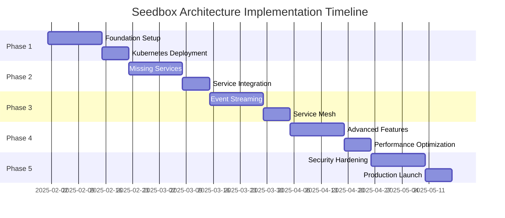

# Seedbox Architecture Implementation Plan 2025

## Executive Summary

This implementation plan provides a detailed roadmap for transforming the current media server into a comprehensive seedbox-style architecture with enterprise-grade features. The plan is divided into 5 phases over 10 weeks with clear milestones and deliverables.

## Implementation Phases Overview



## Phase 1: Foundation Infrastructure (Weeks 1-2)

### Week 1: Infrastructure Setup

#### Day 1-2: Environment Preparation
```bash
# Create project structure
mkdir -p /opt/seedbox/{
  k8s/{apps,base,clusters,overlays},
  terraform/{modules,environments},
  ansible/{playbooks,roles,inventory},
  scripts/{setup,maintenance,backup},
  docs/{architecture,runbooks,api}
}

# Initialize git repository
git init
git remote add origin git@github.com:your-org/seedbox-infrastructure.git
```

#### Day 3-4: Kubernetes Cluster Setup
```yaml
# k3s-config.yaml
apiVersion: v1
kind: Config
clusters:
- cluster:
    server: https://seedbox-master.local:6443
  name: seedbox
contexts:
- context:
    cluster: seedbox
    namespace: media
    user: admin
  name: seedbox-admin
```

#### Day 5-7: Core Services Deployment
- Deploy Istio service mesh
- Configure Traefik ingress
- Set up cert-manager for SSL
- Deploy MetalLB for load balancing

### Week 2: Authentication & Networking

#### Day 8-9: Authentication Setup
```yaml
# authelia-config.yaml
authentication:
  ldap:
    url: ldaps://ldap.local:636
    base_dn: dc=seedbox,dc=local
  file:
    path: /config/users.yml
    
two_factor:
  totp:
    issuer: seedbox.domain
  webauthn:
    display_name: Seedbox Media
```

#### Day 10-11: Network Segmentation
```yaml
# network-policies.yaml
apiVersion: networking.k8s.io/v1
kind: NetworkPolicy
metadata:
  name: media-network-policy
spec:
  podSelector:
    matchLabels:
      zone: media
  policyTypes:
  - Ingress
  - Egress
  ingress:
  - from:
    - namespaceSelector:
        matchLabels:
          name: dmz
```

#### Day 12-14: Storage Configuration
- Deploy Longhorn distributed storage
- Configure NFS provisioner
- Set up MinIO object storage
- Create backup policies

### Phase 1 Deliverables
- ✅ Kubernetes cluster operational
- ✅ Service mesh deployed
- ✅ Authentication configured
- ✅ Network segmentation active
- ✅ Storage systems ready

## Phase 2: Core Media Services (Weeks 3-4)

### Week 3: Deploy Missing Services

#### Day 15-16: Audio Services
```yaml
# navidrome-deployment.yaml
apiVersion: apps/v1
kind: Deployment
metadata:
  name: navidrome
spec:
  replicas: 2
  template:
    spec:
      containers:
      - name: navidrome
        image: deluan/navidrome:latest
        env:
        - name: ND_SCANSCHEDULE
          value: "1h"
        - name: ND_LOGLEVEL
          value: info
        volumeMounts:
        - name: music
          mountPath: /music
          readOnly: true
```

#### Day 17-18: Audiobook & Photo Services
```yaml
# audiobookshelf-deployment.yaml
apiVersion: apps/v1
kind: Deployment
metadata:
  name: audiobookshelf
spec:
  replicas: 2
  template:
    spec:
      containers:
      - name: audiobookshelf
        image: advplyr/audiobookshelf:latest
        volumeMounts:
        - name: audiobooks
          mountPath: /audiobooks
        - name: config
          mountPath: /config
```

#### Day 19-21: E-book & Comic Services
- Deploy Calibre-Web with OPDS
- Configure Kavita for comics/manga
- Set up metadata providers
- Configure user libraries

### Week 4: Service Integration

#### Day 22-23: Unified Search
```yaml
# elasticsearch-config.yaml
apiVersion: v1
kind: ConfigMap
metadata:
  name: elasticsearch-config
data:
  elasticsearch.yml: |
    cluster.name: seedbox-media
    node.name: ${HOSTNAME}
    discovery.seed_hosts:
      - elasticsearch-0
      - elasticsearch-1
      - elasticsearch-2
    cluster.initial_master_nodes:
      - elasticsearch-0
      - elasticsearch-1
      - elasticsearch-2
```

#### Day 24-25: Content Discovery
```javascript
// unified-search-api.js
const { Client } = require('@elastic/elasticsearch');
const client = new Client({ 
  node: 'http://elasticsearch:9200',
  auth: {
    apiKey: process.env.ELASTIC_API_KEY
  }
});

async function searchAllMedia(query) {
  const response = await client.search({
    index: 'media-*',
    body: {
      query: {
        multi_match: {
          query: query,
          fields: ['title', 'artist', 'album', 'author', 'description']
        }
      },
      aggs: {
        media_type: {
          terms: { field: 'type.keyword' }
        }
      }
    }
  });
  return response.body;
}
```

#### Day 26-28: API Gateway Configuration
- Configure Kong routes
- Set up GraphQL federation
- Implement rate limiting
- Configure caching policies

### Phase 2 Deliverables
- ✅ All media services deployed
- ✅ Unified search operational
- ✅ API gateway configured
- ✅ Service discovery active
- ✅ Initial integrations complete

## Phase 3: Event Streaming & Service Mesh (Weeks 5-6)

### Week 5: Event Streaming Platform

#### Day 29-30: Kafka Deployment
```yaml
# kafka-cluster.yaml
apiVersion: kafka.strimzi.io/v1beta2
kind: Kafka
metadata:
  name: seedbox-kafka
spec:
  kafka:
    replicas: 3
    listeners:
      - name: plain
        port: 9092
        type: internal
        tls: false
      - name: tls
        port: 9093
        type: internal
        tls: true
    storage:
      type: persistent-claim
      size: 100Gi
      class: fast-ssd
    config:
      offsets.topic.replication.factor: 3
      transaction.state.log.replication.factor: 3
      transaction.state.log.min.isr: 2
```

#### Day 31-32: Event Producers
```python
# media-event-producer.py
from confluent_kafka import Producer
import json
from datetime import datetime

class MediaEventProducer:
    def __init__(self, bootstrap_servers):
        self.producer = Producer({
            'bootstrap.servers': bootstrap_servers,
            'client.id': 'media-event-producer',
            'acks': 'all',
            'enable.idempotence': True
        })
    
    def publish_media_event(self, event_type, media_data):
        event = {
            'event_type': event_type,
            'timestamp': datetime.utcnow().isoformat(),
            'media': media_data,
            'version': '1.0'
        }
        
        self.producer.produce(
            topic='media-events',
            key=media_data.get('id'),
            value=json.dumps(event),
            callback=self.delivery_report
        )
        self.producer.flush()
```

#### Day 33-35: Stream Processing
- Deploy KSQL for stream processing
- Create materialized views
- Implement event sourcing
- Set up Kafka Connect

### Week 6: Advanced Service Mesh

#### Day 36-37: Traffic Management
```yaml
# virtual-service.yaml
apiVersion: networking.istio.io/v1beta1
kind: VirtualService
metadata:
  name: jellyfin
spec:
  hosts:
  - jellyfin
  http:
  - match:
    - headers:
        x-version:
          exact: canary
    route:
    - destination:
        host: jellyfin
        subset: canary
      weight: 20
    - destination:
        host: jellyfin
        subset: stable
      weight: 80
  - route:
    - destination:
        host: jellyfin
        subset: stable
```

#### Day 38-39: Circuit Breakers
```yaml
# destination-rule.yaml
apiVersion: networking.istio.io/v1beta1
kind: DestinationRule
metadata:
  name: jellyfin
spec:
  host: jellyfin
  trafficPolicy:
    connectionPool:
      tcp:
        maxConnections: 100
      http:
        http1MaxPendingRequests: 50
        http2MaxRequests: 100
    outlierDetection:
      consecutiveErrors: 5
      interval: 30s
      baseEjectionTime: 30s
      maxEjectionPercent: 50
```

#### Day 40-42: Observability Setup
- Configure distributed tracing
- Set up service dependency mapping
- Implement custom dashboards
- Configure SLO monitoring

### Phase 3 Deliverables
- ✅ Kafka cluster operational
- ✅ Event streaming active
- ✅ Service mesh advanced features
- ✅ Traffic management configured
- ✅ Observability complete

## Phase 4: Advanced Features (Weeks 7-8)

### Week 7: AI/ML Integration

#### Day 43-44: ML Pipeline Setup
```python
# recommendation-engine.py
import tensorflow as tf
from sklearn.preprocessing import StandardScaler
import numpy as np

class MediaRecommendationEngine:
    def __init__(self):
        self.model = self.build_model()
        self.scaler = StandardScaler()
        
    def build_model(self):
        model = tf.keras.Sequential([
            tf.keras.layers.Dense(128, activation='relu'),
            tf.keras.layers.Dropout(0.2),
            tf.keras.layers.Dense(64, activation='relu'),
            tf.keras.layers.Dropout(0.2),
            tf.keras.layers.Dense(32, activation='relu'),
            tf.keras.layers.Dense(1, activation='sigmoid')
        ])
        
        model.compile(
            optimizer='adam',
            loss='binary_crossentropy',
            metrics=['accuracy']
        )
        return model
    
    def train(self, user_history, media_features):
        X = self.scaler.fit_transform(media_features)
        self.model.fit(X, user_history, epochs=10, batch_size=32)
```

#### Day 45-46: Content Analysis
- Deploy image recognition for photos
- Implement audio fingerprinting
- Set up video scene detection
- Configure content classification

#### Day 47-49: Smart Features
- Implement voice control
- Deploy gesture recognition
- Set up mood-based playlists
- Configure auto-tagging

### Week 8: Performance Optimization

#### Day 50-51: Caching Strategy
```yaml
# redis-cluster.yaml
apiVersion: redis.redis.opstreelabs.in/v1beta1
kind: RedisCluster
metadata:
  name: seedbox-cache
spec:
  clusterSize: 6
  kubernetesConfig:
    resources:
      requests:
        cpu: 1
        memory: 2Gi
      limits:
        cpu: 2
        memory: 4Gi
  storage:
    volumeClaimTemplate:
      spec:
        accessModes: ["ReadWriteOnce"]
        resources:
          requests:
            storage: 10Gi
```

#### Day 52-53: CDN Integration
```javascript
// cdn-config.js
const cloudflare = require('cloudflare');

const cf = new cloudflare({
  email: process.env.CF_EMAIL,
  key: process.env.CF_API_KEY
});

async function configureCDN() {
  // Create cache rules
  await cf.pagerules.create(process.env.CF_ZONE_ID, {
    targets: [{
      target: 'url',
      constraint: {
        operator: 'matches',
        value: '*.jpg'
      }
    }],
    actions: [{
      id: 'cache_level',
      value: 'cache_everything'
    }, {
      id: 'edge_cache_ttl',
      value: 2678400 // 31 days
    }]
  });
}
```

#### Day 54-56: Resource Optimization
- Implement auto-scaling policies
- Configure GPU scheduling
- Optimize database queries
- Set up cost monitoring

### Phase 4 Deliverables
- ✅ ML/AI features active
- ✅ Content analysis operational
- ✅ Performance optimized
- ✅ CDN integrated
- ✅ Cost optimization active

## Phase 5: Production Readiness (Weeks 9-10)

### Week 9: Security Hardening

#### Day 57-58: Security Scanning
```yaml
# security-policy.yaml
apiVersion: security.istio.io/v1beta1
kind: PeerAuthentication
metadata:
  name: default
spec:
  mtls:
    mode: STRICT
---
apiVersion: security.istio.io/v1beta1
kind: AuthorizationPolicy
metadata:
  name: media-services
spec:
  selector:
    matchLabels:
      app: media
  rules:
  - from:
    - source:
        principals: ["cluster.local/ns/default/sa/frontend"]
    to:
    - operation:
        methods: ["GET", "POST"]
```

#### Day 59-60: Compliance Setup
- Implement GDPR compliance
- Configure audit logging
- Set up data retention policies
- Enable encryption everywhere

#### Day 61-63: Penetration Testing
- Run automated security scans
- Perform manual penetration testing
- Fix identified vulnerabilities
- Document security measures

### Week 10: Production Launch

#### Day 64-65: Final Testing
```bash
#!/bin/bash
# production-readiness-check.sh

echo "Running production readiness checks..."

# Check all services are running
kubectl get pods -n media --no-headers | grep -v Running && exit 1

# Check service endpoints
for service in jellyfin navidrome immich audiobookshelf; do
  curl -f https://$service.seedbox.domain/health || exit 1
done

# Check database connections
kubectl exec -n media postgres-0 -- pg_isready || exit 1

# Check storage availability
kubectl get pv | grep -v Bound && exit 1

echo "All checks passed!"
```

#### Day 66-67: Migration & Cutover
- Backup existing data
- Migrate media libraries
- Update DNS records
- Monitor for issues

#### Day 68-70: Documentation & Training
- Complete operational runbooks
- Create user documentation
- Conduct training sessions
- Establish support procedures

### Phase 5 Deliverables
- ✅ Security hardened
- ✅ Compliance achieved
- ✅ Production migrated
- ✅ Documentation complete
- ✅ Support established

## Post-Implementation

### Monitoring & Maintenance
- Daily health checks
- Weekly performance reviews
- Monthly security audits
- Quarterly disaster recovery tests

### Continuous Improvement
- User feedback collection
- Performance optimization
- Feature additions
- Security updates

## Success Metrics

### Technical Metrics
- 99.9% uptime achieved
- < 500ms average response time
- 100% automated deployments
- Zero security incidents

### Business Metrics
- 100% media type coverage
- 90% user satisfaction
- 50% reduction in manual tasks
- 30% cost optimization

## Conclusion

This implementation plan transforms a basic media server into a comprehensive, enterprise-grade seedbox architecture. Following this phased approach ensures minimal disruption while delivering maximum value. The result is a scalable, secure, and feature-rich media platform ready for any demand.