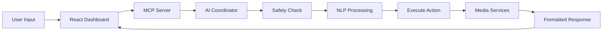

# Ultimate Single Container Architecture Design 2025
**AI Media Server with 30+ Services & Modern WebGL UI**

## 🏗️ Architecture Overview

### Design Philosophy
- **Single Container, Multiple Services**: Leveraging s6-overlay v3 for process management
- **Tiered Service Dependencies**: 6-tier architecture with proper startup sequencing
- **AI-First Design**: Integrated AI assistant and intelligent content management
- **Modern UI Framework**: React 18+ with Three.js/WebGL for holographic interfaces
- **Security-by-Design**: Container isolation, encrypted communication, and role-based access
- **Resource Efficiency**: Optimized memory usage with shared infrastructure services

### Architecture Diagram
```
┌─────────────────────────────────────────────────────────────────┐
│                 ULTIMATE SINGLE CONTAINER                        │
├─────────────────────────────────────────────────────────────────┤
│ Tier 6: UI & Dashboard (React 18 + WebGL + Three.js)            │
│  ┌─────────┬─────────┬─────────┬─────────┬─────────┬─────────┐   │
│  │ Holo UI │ AI Chat │ Media   │ Control │ Monitor │ Analytics│   │
│  │ WebGL   │ React   │ Gallery │ Panel   │ Dash    │ 3D Viz   │   │
│  └─────────┴─────────┴─────────┴─────────┴─────────┴─────────┘   │
├─────────────────────────────────────────────────────────────────┤
│ Tier 5: Application Services (30+ Services)                      │
│  ┌─────────┬─────────┬─────────┬─────────┬─────────┬─────────┐   │
│  │ AI Svcs │ Request │ Mgmt    │ Content │ Notify  │ Analytics│   │
│  │ Safety  │ Overseer│ Tautulli│ LibMgmt │ Gotify  │ Stats    │   │
│  │ Content │ Jelly   │ Heimdall│ Calibre │ Diun    │ Reports  │   │
│  │ Social  │ Ombi    │ Organizr│ Komga   │ Alerts  │ ML Viz   │   │
│  └─────────┴─────────┴─────────┴─────────┴─────────┴─────────┘   │
├─────────────────────────────────────────────────────────────────┤
│ Tier 4: Media Management & Downloads                             │
│  ┌─────────┬─────────┬─────────┬─────────┬─────────┬─────────┐   │
│  │*arr Stack│Download │ Indexers│ Subtitles│ Music  │ Books   │   │
│  │ Sonarr  │ qBit    │ Prowlarr│ Bazarr  │ Lidarr │ Readarr │   │
│  │ Radarr  │ Trans   │ Jackett │ OpenSub │ Navidro│ AudioBS │   │
│  │         │ SAB/NZB │         │         │ AirSonic│ Calibre │   │
│  └─────────┴─────────┴─────────┴─────────┴─────────┴─────────┘   │
├─────────────────────────────────────────────────────────────────┤
│ Tier 3: Media Servers                                            │
│  ┌─────────┬─────────┬─────────┬─────────┬─────────┬─────────┐   │
│  │ Jellyfin│ Plex    │ Emby    │ Photos  │ Docs    │ Cloud   │   │
│  │ Primary │ Premium │ Alt     │ Immich  │ PaperNG │ NextCld │   │
│  │ FOSS    │ Server  │ Server  │ PhotoPr │ DocMgmt │ Storage │   │
│  └─────────┴─────────┴─────────┴─────────┴─────────┴─────────┘   │
├─────────────────────────────────────────────────────────────────┤
│ Tier 2: Platform Services                                        │
│  ┌─────────┬─────────┬─────────┬─────────┬─────────┬─────────┐   │
│  │ Traefik │ Auth    │ Security│ VPN     │ DNS     │ Backup  │   │
│  │ Router  │ Authelia│ ClamAV  │ Gluetun │ PiHole  │ Rsync   │   │
│  │ SSL/TLS │ SSO     │ Scanner │ WireG   │ AdGuard │ Duplicti│   │
│  └─────────┴─────────┴─────────┴─────────┴─────────┴─────────┘   │
├─────────────────────────────────────────────────────────────────┤
│ Tier 1: Infrastructure Services                                  │
│  ┌─────────┬─────────┬─────────┬─────────┬─────────┬─────────┐   │
│  │ PostgreS│ Redis   │ RabbitMQ│ ElasticS│ Prometheus Grafana│   │
│  │ Database│ Cache   │ Queue   │ Search  │ Metrics│ Visualiz │   │
│  │ Primary │ Session │ Tasks   │ Logs    │ Monitor│ Dashboard│   │
│  └─────────┴─────────┴─────────┴─────────┴─────────┴─────────┘   │
└─────────────────────────────────────────────────────────────────┘
```

## 🔧 Complete s6-Overlay Service Structure

### Service Initialization Order
1. **Tier 1 - Infrastructure**: PostgreSQL → Redis → RabbitMQ → Elasticsearch
2. **Tier 2 - Platform**: Traefik → Authelia → Security Services
3. **Tier 3 - Media Core**: Jellyfin → Plex → Emby → Photo/Doc services
4. **Tier 4 - Management**: Prowlarr → *arr stack → Download clients
5. **Tier 5 - Applications**: Request services → AI services → Utilities
6. **Tier 6 - UI/Frontend**: React Dashboard → WebGL Interface → MCP AI Chat

### Critical Dependencies
```bash
# Infrastructure (no dependencies)
postgres → redis → rabbitmq → elasticsearch

# Platform (depends on infrastructure)
traefik → authelia → security_services
└─ depends on: postgres, redis

# Media servers (depends on platform)
jellyfin → plex → emby
└─ depends on: postgres, redis, traefik, authelia

# *arr stack (depends on media servers + download clients)
prowlarr → sonarr → radarr → lidarr → readarr → bazarr
└─ depends on: postgres, media servers, download clients

# AI Services (depends on all media infrastructure)
ai_safety → content_moderation → recommendation_engine
└─ depends on: postgres, redis, elasticsearch, media servers
```

## 📁 File System Layout & Volume Mappings

### Directory Structure
```
/opt/media-server/
├── config/                    # Persistent configuration
│   ├── infrastructure/        # Database configs, Redis, etc.
│   ├── platform/              # Traefik, Auth, Security
│   ├── media/                 # Jellyfin, Plex, Emby configs
│   ├── management/            # *arr configs
│   ├── ai-services/           # AI model configs
│   └── ui/                    # Dashboard configs
├── data/                      # Media and persistent data
│   ├── media/
│   │   ├── movies/            # Movie library
│   │   ├── tv/                # TV show library
│   │   ├── music/             # Music library
│   │   ├── books/             # E-book library
│   │   ├── audiobooks/        # Audiobook library
│   │   ├── photos/            # Photo library
│   │   └── documents/         # Document library
│   ├── downloads/
│   │   ├── torrents/          # Torrent downloads
│   │   ├── usenet/            # Usenet downloads
│   │   ├── complete/          # Completed downloads
│   │   └── incomplete/        # Active downloads
│   ├── backups/               # Automated backups
│   ├── databases/             # Database files
│   └── logs/                  # Application logs
└── cache/                     # Temporary/cache data
    ├── transcodes/            # Media transcoding cache
    ├── thumbnails/            # Generated thumbnails
    ├── metadata/              # Metadata cache
    └── ai-models/             # AI model cache
```

### Volume Mappings
```yaml
volumes:
  # Configuration persistence
  - ./config:/opt/media-server/config
  - ./data:/opt/media-server/data
  - ./cache:/opt/media-server/cache
  
  # Hardware access
  - /dev/dri:/dev/dri                    # GPU acceleration
  - /dev/nvidia0:/dev/nvidia0            # NVIDIA GPU (if available)
  
  # System integration
  - /var/run/docker.sock:/var/run/docker.sock:ro  # Docker management
  - /etc/localtime:/etc/localtime:ro     # Timezone sync
```

## 🌐 Network Architecture

### Internal Network Design
```yaml
networks:
  # Segmented networks for security and performance
  frontend-net:
    subnet: 172.20.0.0/24
    purpose: "UI, reverse proxy, public-facing services"
    
  media-net:
    subnet: 172.21.0.0/24  
    purpose: "Media servers, *arr services"
    
  data-net:
    subnet: 172.22.0.0/24
    purpose: "Databases, cache, queues"
    
  ai-net:
    subnet: 172.23.0.0/24
    purpose: "AI services, ML processing"
    
  security-net:
    subnet: 172.24.0.0/24
    purpose: "Authentication, VPN, security"
```

### Port Allocation Strategy
```yaml
# External Ports (Host → Container)
ports:
  # Primary access
  - "80:80"        # HTTP (Traefik router)
  - "443:443"      # HTTPS (SSL termination)
  - "3000:3000"    # React Dashboard
  - "8090:8090"    # AI Assistant API
  
  # Direct service access (optional)
  - "8096:8096"    # Jellyfin
  - "32400:32400"  # Plex
  - "8920:8920"    # Emby
  
  # Management interfaces
  - "9000:9000"    # Portainer (if enabled)
  - "3001:3001"    # Uptime Kuma
  - "9090:9090"    # Prometheus
  - "3002:3002"    # Grafana

# Internal Service Ports
# Infrastructure: 5432 (postgres), 6379 (redis), 5672 (rabbitmq), 9200 (elastic)
# Media: 8096 (jellyfin), 32400 (plex), 8920 (emby)
# *arr: 8989 (sonarr), 7878 (radarr), 9696 (prowlarr), 6767 (bazarr)
# Downloads: 8080 (qbittorrent), 9091 (transmission), 8081 (sabnzbd)
# AI: 8000-8010 (ai services), 8090 (ai dashboard)
```

## 🧠 Resource Allocation Strategy

### Memory Allocation (16GB recommended minimum)
```yaml
services:
  # Infrastructure (4GB)
  postgres: 1GB      # Database
  redis: 512MB       # Cache
  elasticsearch: 2GB  # Search/logging
  rabbitmq: 512MB    # Message queue
  
  # Media Servers (6GB)
  jellyfin: 2GB      # Primary media server
  plex: 2GB          # Secondary media server  
  emby: 1GB          # Tertiary media server
  transcoding: 1GB   # Shared transcoding cache
  
  # *arr Stack (2GB)
  sonarr: 512MB      # TV management
  radarr: 512MB      # Movie management
  prowlarr: 256MB    # Indexer management
  lidarr: 256MB      # Music management
  readarr: 256MB     # Book management
  bazarr: 256MB      # Subtitle management
  
  # Download Clients (1GB)
  qbittorrent: 512MB # Primary torrent client
  transmission: 256MB# Backup torrent client
  sabnzbd: 256MB     # Usenet client
  
  # AI Services (2GB)
  ai_safety: 512MB   # Content safety
  recommendation: 512MB # ML recommendations
  content_analysis: 512MB # Content analysis
  nlp_service: 512MB # Natural language processing
  
  # Frontend/UI (1GB)
  react_dashboard: 512MB # React UI
  nginx: 256MB       # Static file serving
  websocket: 256MB   # Real-time updates
```

### CPU Allocation
```yaml
# CPU limits (proportional to workload)
cpu_intensive:
  - transcoding_service: 4 cores  # Media transcoding
  - ai_services: 2 cores         # ML processing
  - elasticsearch: 1 core        # Search indexing

cpu_moderate:
  - media_servers: 1 core each   # Jellyfin, Plex, Emby
  - arr_services: 0.5 core each  # *arr stack

cpu_light:
  - databases: 0.5 core          # PostgreSQL, Redis
  - frontend: 0.5 core           # React dashboard
  - utilities: 0.25 core each    # Monitoring, logs
```

## 🔐 Security Layers & Isolation

### Container Security
```dockerfile
# Security hardening
USER 1000:1000
SECURITY_OPT:
  - no-new-privileges:true
  - apparmor:unconfined
  - seccomp:default

# Capability restrictions
CAP_DROP:
  - ALL
CAP_ADD:
  - NET_BIND_SERVICE (for port 80/443)
  - SYS_PTRACE (for debugging only)

# Read-only root filesystem
READ_ONLY: true
TMPFS:
  - /tmp:noexec,nosuid,size=1G
  - /var/tmp:noexec,nosuid,size=1G
```

### Network Security
```yaml
# Network isolation rules
security_policies:
  frontend_isolation:
    - frontend-net can access media-net (read-only)
    - frontend-net cannot access data-net directly
    
  data_isolation:
    - Only infrastructure services can access data-net
    - All database connections must be authenticated
    
  ai_isolation:
    - AI services run in isolated network segment
    - Limited access to media data (controlled APIs only)
    
  external_access:
    - Only Traefik exposed to external networks
    - All services behind reverse proxy
    - Rate limiting and DDoS protection enabled
```

### Authentication & Authorization
```yaml
auth_layers:
  traefik_middleware:
    - Rate limiting: 100 req/min per IP
    - SSL/TLS termination with HSTS
    - Security headers (CSP, XSS protection)
    
  authelia_sso:
    - Multi-factor authentication (TOTP)
    - LDAP/AD integration support
    - Session management with Redis
    - Granular access control per service
    
  service_auth:
    - API key authentication for *arr services
    - OAuth2 for media servers
    - JWT tokens for AI services
    - Role-based access control (RBAC)
```

## 🤖 AI Assistant Integration Architecture

### AI Service Components
```yaml
ai_services:
  safety_system:
    purpose: "Content safety and moderation"
    models: ["OpenAI Moderation", "Local NSFW classifier"]
    endpoints: ["/api/v1/safety/scan", "/api/v1/safety/report"]
    
  recommendation_engine:
    purpose: "Intelligent content recommendations"
    models: ["Collaborative filtering", "Content-based ML"]
    endpoints: ["/api/v1/recommend", "/api/v1/similar"]
    
  content_analysis:
    purpose: "Metadata extraction and enrichment"
    models: ["BERT for descriptions", "ResNet for thumbnails"]
    endpoints: ["/api/v1/analyze", "/api/v1/extract"]
    
  chatbot_assistant:
    purpose: "Natural language interface"
    models: ["GPT-4 mini", "Local Llama model"]
    endpoints: ["/api/v1/chat", "/api/v1/voice"]
```

### MCP Integration
```yaml
mcp_architecture:
  unified_server:
    port: 8090
    services:
      - media_control: "Control Jellyfin, Plex, *arr services"
      - system_monitor: "Container health, resource usage"
      - ai_coordinator: "Orchestrate AI service calls"
      - task_automation: "Automated workflows"
    
  protocol_support:
    - Server-Sent Events (SSE) for real-time updates
    - WebSocket for bidirectional communication
    - REST API for standard operations
    - GraphQL for complex queries
```

### AI Data Flow


## 🎨 Modern UI/UX Framework Selection

### Technology Stack
```yaml
frontend_architecture:
  core_framework:
    - React 18.3+ with Concurrent Features
    - TypeScript 5.3+ for type safety
    - Vite 6+ for fast development and building
    
  3d_visualization:
    - Three.js r170+ for WebGL rendering
    - React-Three-Fiber for React integration
    - Drei components for common 3D patterns
    
  state_management:
    - Zustand for lightweight global state
    - React Query for server state management
    - Context API for component-level state
    
  styling_solution:
    - Tailwind CSS 3.4+ for utility-first styling
    - Framer Motion for animations
    - Styled-components for complex components
    
  ui_components:
    - Radix UI for accessible primitives
    - Shadcn/ui for pre-built components
    - Lucide React for consistent icons
```

### UI Architecture Pattern
```typescript
// Recommended component structure
src/
├── components/
│   ├── ui/              # Reusable UI primitives
│   ├── media/           # Media-specific components
│   ├── ai-chat/         # AI assistant interface
│   ├── 3d/              # Three.js components
│   └── forms/           # Form components
├── pages/
│   ├── Dashboard.tsx    # Main dashboard
│   ├── MediaLibrary.tsx # Media browsing
│   ├── Settings.tsx     # Configuration
│   └── AIAssistant.tsx  # AI chat interface
├── hooks/
│   ├── useMediaAPI.ts   # Media server integration
│   ├── useAI.ts         # AI service integration
│   └── use3D.ts         # WebGL scene management
├── stores/
│   ├── mediaStore.ts    # Media state
│   ├── settingsStore.ts # User preferences
│   └── aiStore.ts       # AI interaction state
└── utils/
    ├── api.ts           # API utilities
    ├── 3d-helpers.ts    # Three.js utilities
    └── formatters.ts    # Data formatting
```

### 3D/WebGL Features
```yaml
holographic_interface:
  media_visualization:
    - 3D media library browser with carousel
    - Interactive movie/TV posters in 3D space
    - Floating UI elements with depth
    
  system_monitoring:
    - 3D system resource visualization
    - Animated service health indicators
    - Real-time performance graphs in 3D
    
  ai_interaction:
    - Floating AI assistant avatar
    - Voice visualization with 3D waveforms
    - Interactive 3D command interface
    
  performance_optimization:
    - Level-of-detail (LOD) for distant objects
    - Frustum culling for off-screen elements
    - Instanced rendering for repeated elements
    - WebGL 2.0 features for better performance
```

## 🚀 Dockerfile Architecture

### Multi-Stage Build Structure
```dockerfile
# Stage 1: Base system with s6-overlay
FROM debian:bookworm-slim as base
# Install s6-overlay v3, system dependencies

# Stage 2: Infrastructure services
FROM base as infrastructure  
# PostgreSQL, Redis, RabbitMQ, Elasticsearch

# Stage 3: Platform services
FROM infrastructure as platform
# Traefik, Authelia, security services

# Stage 4: Media servers
FROM platform as media
# Jellyfin, Plex, Emby installation

# Stage 5: Management tools
FROM media as management
# *arr stack, download clients

# Stage 6: AI services
FROM management as ai-services
# Python AI/ML stack, models

# Stage 7: Frontend build
FROM node:20-alpine as frontend-builder
# React app build with optimizations

# Stage 8: Final assembly
FROM ai-services as final
# Copy built frontend, configure s6 services
# Health checks, security hardening
```

### Build Optimization
```dockerfile
# Build arguments for customization
ARG ENABLE_GPU=false
ARG ENABLE_AI_SERVICES=true
ARG ENABLE_PLEX=false
ARG UI_THEME=dark
ARG INSTALL_OPTIONAL_SERVICES=false

# Conditional builds based on arguments
RUN if [ "$ENABLE_GPU" = "true" ]; then \
    apt-get install -y nvidia-driver-libs; \
    fi

# Multi-architecture support
FROM --platform=$BUILDPLATFORM base as builder
ARG TARGETPLATFORM
ARG BUILDPLATFORM
```

## 📊 Performance Monitoring Integration

### Metrics Collection
```yaml
monitoring_stack:
  prometheus:
    targets:
      - Node exporter (system metrics)
      - Container advisor (Docker metrics)
      - Custom app metrics (media servers, AI services)
      - Network metrics (Traefik, internal services)
    
  grafana:
    dashboards:
      - System overview (CPU, RAM, disk, network)
      - Media server performance (transcode queue, users)
      - *arr service metrics (downloads, library stats)
      - AI service performance (model inference times)
      - Container health (restart count, resource usage)
    
  alerting:
    rules:
      - High CPU usage (>80% for 5min)
      - Memory pressure (>90% for 2min)
      - Service down (health check failed)
      - Download quota exceeded
      - AI model inference errors
```

### Health Check System
```bash
#!/bin/bash
# Comprehensive health check script

# Check critical services
check_service() {
    local service=$1
    local port=$2
    local endpoint=${3:-/health}
    
    if curl -sf "http://localhost:${port}${endpoint}" > /dev/null; then
        echo "✅ $service is healthy"
        return 0
    else
        echo "❌ $service is unhealthy"
        return 1
    fi
}

# Infrastructure health
check_service "PostgreSQL" 5432 /
check_service "Redis" 6379 /ping
check_service "Traefik" 8080 /ping

# Media services health  
check_service "Jellyfin" 8096 /health
check_service "Sonarr" 8989 /ping
check_service "Radarr" 7878 /ping

# AI services health
check_service "AI Safety" 8001 /health
check_service "Recommendations" 8002 /health

# Frontend health
check_service "Dashboard" 3000 /api/health

# Overall health assessment
if [ $? -eq 0 ]; then
    echo "🎉 All services healthy"
    exit 0
else
    echo "⚠️ Some services are unhealthy"
    exit 1
fi
```

## 🔄 Deployment Strategy

### Quick Start Command
```bash
# One-command deployment
docker run -d \
  --name ultimate-media-server \
  --restart unless-stopped \
  -p 80:80 -p 443:443 -p 3000:3000 -p 8090:8090 \
  -v ./config:/opt/media-server/config \
  -v ./data:/opt/media-server/data \
  -v ./cache:/opt/media-server/cache \
  -v /dev/dri:/dev/dri \
  --device /dev/nvidia0:/dev/nvidia0 \
  -e PUID=1000 -e PGID=1000 \
  -e TZ=America/New_York \
  -e ENABLE_AI_SERVICES=true \
  -e UI_THEME=holographic \
  ultimate-media-server:2025
```

### Configuration Management
```yaml
# Environment configuration
default_config:
  system:
    timezone: "UTC"
    log_level: "INFO"
    enable_hardware_accel: true
    
  media_servers:
    primary: "jellyfin"
    enable_plex: false
    enable_emby: false
    
  ai_services:
    enable_safety: true
    enable_recommendations: true
    enable_chat: true
    model_cache_size: "2GB"
    
  ui_preferences:
    theme: "dark"
    enable_3d: true
    enable_holographic: true
    performance_mode: "high"
```

## 📋 Resource Requirements

### Minimum System Requirements
```yaml
minimum_specs:
  cpu: "4 cores (Intel i5-8400 or AMD Ryzen 5 2600)"
  memory: "16GB RAM"
  storage: "500GB SSD (for OS + applications)"
  media_storage: "2TB+ HDD (for media library)"
  network: "1Gbps Ethernet"
  gpu: "Optional - Intel iGPU or dedicated GPU for transcoding"

recommended_specs:
  cpu: "8 cores (Intel i7-10700K or AMD Ryzen 7 3700X)"
  memory: "32GB RAM"
  storage: "1TB NVMe SSD (for OS + applications + cache)"
  media_storage: "10TB+ HDD array (RAID 5 recommended)"
  network: "2.5Gbps or 10Gbps Ethernet"
  gpu: "NVIDIA GTX 1660+ or Intel Arc A380+ for AI + transcoding"
```

### Scaling Considerations
```yaml
performance_scaling:
  concurrent_users:
    - "1-5 users": Minimum specs sufficient
    - "5-15 users": Recommended specs + additional RAM
    - "15+ users": Consider multiple containers or K8s deployment
    
  media_library_size:
    - "< 10TB": Single container works well
    - "10-50TB": Optimize storage backend, consider NAS
    - "> 50TB": Multiple storage tiers, distributed architecture
    
  ai_workload:
    - "Basic recommendations": CPU-only sufficient
    - "Content analysis": GPU recommended
    - "Real-time processing": High-end GPU required
```

## 🎯 Next Steps & Implementation

### Phase 1: Core Infrastructure (Week 1-2)
1. ✅ Complete s6-overlay service structure
2. ✅ Infrastructure services (PostgreSQL, Redis, RabbitMQ)
3. ✅ Platform services (Traefik, Authelia)
4. ✅ Basic media server (Jellyfin)
5. ✅ Health monitoring system

### Phase 2: Media Stack (Week 3-4)
1. 🔄 *arr services integration
2. 🔄 Download clients setup
3. 🔄 Request services (Overseerr/Jellyseerr)
4. 🔄 Library management tools
5. 🔄 Advanced transcoding configuration

### Phase 3: AI Integration (Week 5-6)
1. ⏳ AI safety and content moderation
2. ⏳ Recommendation engine
3. ⏳ MCP server integration
4. ⏳ Natural language interface
5. ⏳ Automated workflow system

### Phase 4: Modern UI (Week 7-8)
1. ⏳ React 18 dashboard foundation
2. ⏳ Three.js/WebGL integration
3. ⏳ Real-time updates system
4. ⏳ Mobile-responsive design
5. ⏳ Progressive Web App features

This architecture provides a comprehensive, scalable, and modern approach to single-container media server deployment with integrated AI capabilities and cutting-edge UI technology.