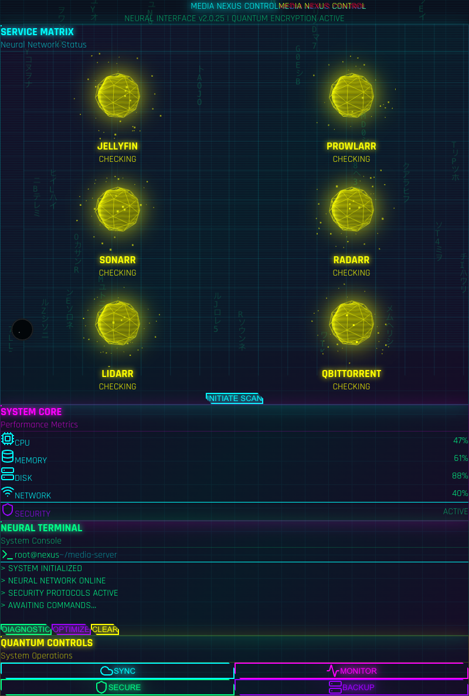

# 🌆 Cyberpunk Media Dashboard 2025

A futuristic, cyberpunk-themed media server dashboard with immersive 3D visualizations, real-time monitoring, and advanced UI effects.



## ✨ Features

### 🎨 Visual Design
- **Matrix Rain Effect** - Animated background with falling Japanese characters
- **Holographic Cards** - 3D perspective transforms with mouse tracking
- **Neon Glow Effects** - Dynamic color palette (cyan, pink, purple, green)
- **Glitch Animations** - Dual-layer RGB split text effects
- **3D Service Orbs** - WebGL-powered Three.js spheres with particle systems
- **Circuit Patterns** - Animated grid backgrounds and scanlines

### 🚀 Interactive Components
- **Service Monitoring** - Real-time status of media services
- **Neural Terminal** - Command-line interface with history
- **System Metrics** - Live CPU, memory, disk, and network stats
- **Quantum Controls** - Advanced system operations panel

### 🛠️ Technical Stack
- **Next.js 15.4.6** - React framework with App Router
- **Three.js** - 3D graphics and WebGL rendering
- **Framer Motion** - Smooth animations and transitions
- **TypeScript** - Type-safe development
- **Tailwind CSS** - Utility-first styling

## 📦 Installation

```bash
# Clone the repository
git clone https://github.com/yourusername/dashboard-2025.git
cd dashboard-2025

# Install dependencies
npm install

# Run development server
npm run dev
```

The application will start on `http://localhost:3000` (or next available port).

## 🎮 Usage

### Service Monitoring
Click on any service orb to open its web interface:
- **Jellyfin** - Media streaming server
- **Sonarr/Radarr** - TV/Movie automation
- **Prowlarr** - Indexer management
- **qBittorrent** - Download client

### Terminal Commands
The neural terminal supports various commands:
- `DIAGNOSTIC` - Run system diagnostics
- `OPTIMIZE` - Optimize neural pathways
- `CLEAR` - Clear terminal output

### System Controls
- **SYNC** - Synchronize services
- **MONITOR** - View detailed metrics
- **SECURE** - Security operations
- **BACKUP** - System backup

## 🔧 Configuration

### Environment Variables
Create a `.env.local` file:

```env
# Service API Keys (optional)
SONARR_API_KEY=your_api_key
RADARR_API_KEY=your_api_key
PROWLARR_API_KEY=your_api_key

# Service URLs (if different from defaults)
JELLYFIN_URL=http://localhost:8096
SONARR_URL=http://localhost:8989
```

### Customization

#### Colors
Edit `src/app/cyberpunk.css`:
```css
:root {
  --neon-cyan: #00ffff;
  --neon-pink: #ff00ff;
  --neon-purple: #9d00ff;
  /* Add your colors */
}
```

#### Services
Modify `src/components/cyberpunk/CyberpunkDashboard.tsx`:
```typescript
const SERVICES = [
  { name: 'JELLYFIN', port: 8096, icon: '🎬', color: '#00ffff' },
  // Add your services
]
```

## 🧪 Testing

```bash
# Run UI stress test
node test-ui.js

# Run TypeScript checks
npm run typecheck

# Build for production
npm run build
```

## 📊 Performance

- **JS Heap Size**: ~28 MB
- **DOM Nodes**: ~1100
- **First Paint**: <1s
- **Interactive**: <2s

### Optimizations
- Lazy-loaded 3D components
- Optimized WebGL rendering
- Proper cleanup of Three.js resources
- SSR-compatible animations

## 🐛 Troubleshooting

### Common Issues

#### Port Already in Use
```bash
# Kill existing process
pkill -f "next-server"

# Or use different port
PORT=3001 npm run dev
```

#### WebGL Not Supported
The dashboard will automatically fall back to 2D mode if WebGL is not available.

#### Hydration Mismatch
Fixed in latest version - ensure you're using deterministic values for SSR.

## 🚀 Deployment

### Docker
```bash
docker build -t cyberpunk-dashboard .
docker run -p 3000:3000 cyberpunk-dashboard
```

### Vercel
```bash
vercel deploy
```

### PM2
```bash
npm run build
pm2 start npm --name "dashboard" -- start
```

## 📝 Development

### Project Structure
```
dashboard-2025/
├── src/
│   ├── app/                 # Next.js app directory
│   │   ├── page.tsx         # Main page
│   │   ├── layout.tsx       # Root layout
│   │   └── cyberpunk.css    # Theme styles
│   └── components/
│       └── cyberpunk/       # Cyberpunk components
│           ├── CyberpunkDashboard.tsx
│           ├── ServiceOrb.tsx
│           ├── HolographicCard.tsx
│           └── ...
├── public/                  # Static assets
│   └── icons/              # PWA icons
└── package.json
```

### Contributing
1. Fork the repository
2. Create your feature branch (`git checkout -b feature/amazing-feature`)
3. Commit your changes (`git commit -m 'Add amazing feature'`)
4. Push to the branch (`git push origin feature/amazing-feature`)
5. Open a Pull Request

## 📄 License

MIT License - see LICENSE file for details

## 🙏 Acknowledgments

- Three.js for 3D graphics
- Framer Motion for animations
- Next.js team for the framework
- Cyberpunk 2077 for design inspiration

## 🔗 Links

- [Live Demo](https://your-demo-url.com)
- [Documentation](https://your-docs-url.com)
- [Issues](https://github.com/yourusername/dashboard-2025/issues)

---

Built with 💜 using Next.js and Three.js