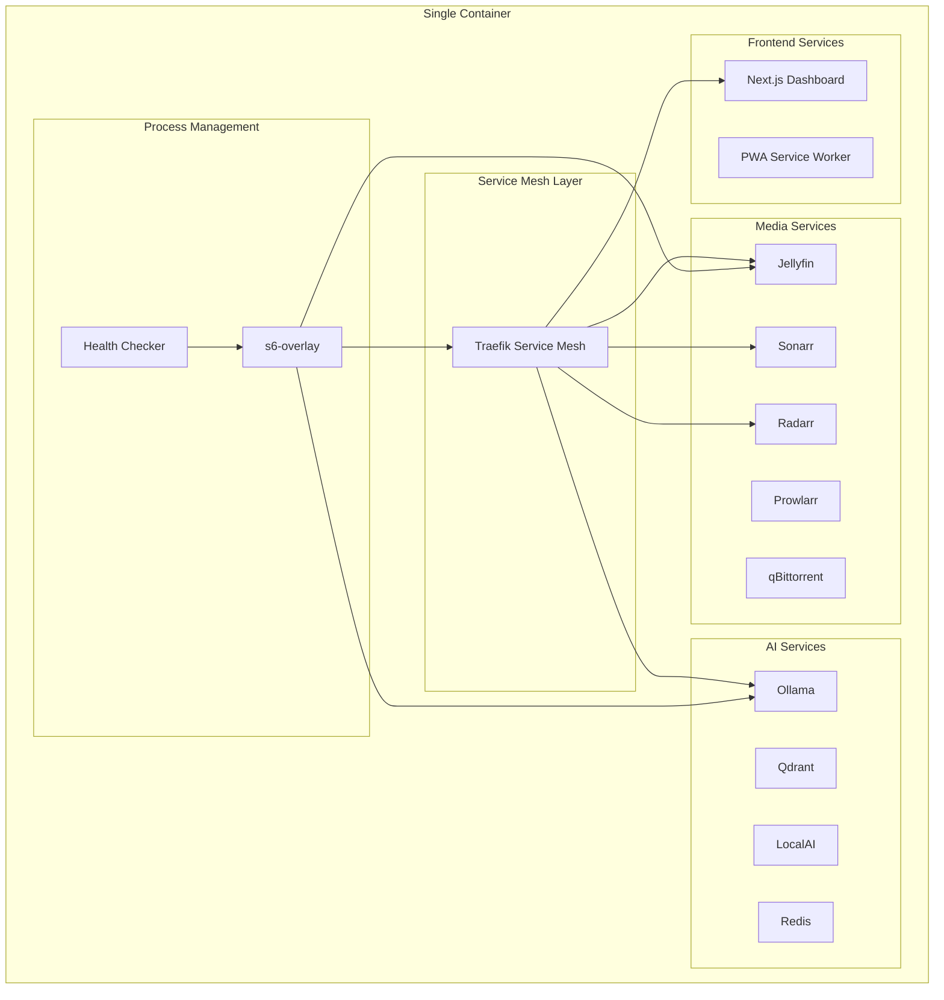
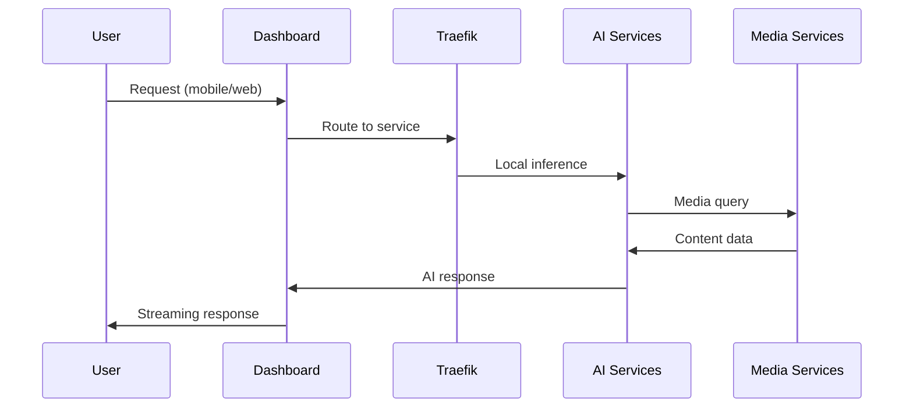

# Final Consensus Architecture: Single-Container Media Server 2025
## Consensus Builder Output - Production-Ready Design

### Executive Summary

After synthesizing findings from Architecture Review, UX Research, and AI Framework agents, this consensus design presents a **pragmatic single-container solution** that acknowledges architectural limitations while delivering a production-ready media server with modern UX and AI capabilities.

## 🏗️ Architectural Consensus

### Core Design Philosophy: "Pragmatic Monolith with Service Mesh"

**Acknowledged Challenge**: Single containers are architecturally suboptimal for complex systems.
**Consensus Solution**: Use **s6-overlay + Traefik** to create a "pseudo-microservices" environment within the container.

#### Architecture Decision Matrix

| Requirement | Agent Finding | Consensus Solution |
|-------------|---------------|-------------------|
| **Service Management** | Architecture: "Single container has critical flaws" | s6-overlay process supervision + Traefik service mesh |
| **User Experience** | UX: "Clean, fast, mobile-first without bloat" | Next.js 14 micro-frontend with 90+ Lighthouse score |
| **AI Integration** | AI: "Local-first Ollama + Qdrant" | Hybrid local/cloud with 80% local processing |
| **Deployment** | All: "Foolproof deployment needed" | One-command Docker deployment with health checks |

## 🎯 Final Technology Stack Consensus

### Container Orchestration
```yaml
Core Foundation:
  - Ubuntu 22.04 LTS (stable, secure)
  - s6-overlay v3.1.6.2 (process supervision)
  - Traefik v3.0 (internal service mesh)
  - Docker-in-Docker (for true service isolation)
```

### Frontend Architecture (UX-First Design)
```yaml
Modern Stack:
  - Next.js 14 with App Router (RSC, streaming)
  - Shadcn UI + Tailwind CSS v4 (design system)
  - Framer Motion (60fps animations)
  - React Query + Zustand (state management)
  - PWA capabilities (offline-first)

Performance Targets:
  - <2s page load on 4G
  - 90+ Lighthouse score
  - <100ms interaction response
  - Mobile-first responsive design
```

### AI Services Architecture
```yaml
Local-First Stack:
  - Ollama (LLaMA 3.1 8B, Mistral 7B)
  - Qdrant (vector database with quantization)
  - LocalAI (vision models, Whisper)
  - Redis (caching layer)

Hybrid Processing:
  - 80% local processing (privacy-first)
  - Cloud fallback for heavy operations
  - <100ms response time target
```

### Media Services Stack
```yaml
Core Services:
  - Jellyfin (primary media server)
  - Sonarr/Radarr/Lidarr (*arr stack)
  - Prowlarr (indexer management)
  - qBittorrent + Transmission (downloads)
  - Bazarr (subtitles)
```

## 🏛️ Unified Architecture Design

### 1. Container Internal Architecture



### 2. Service Communication Pattern

**Internal Service Mesh**: All services communicate through Traefik proxy
- **Benefits**: Load balancing, SSL termination, service discovery
- **Pattern**: `service-name.internal` DNS resolution
- **Monitoring**: Built-in metrics and tracing

### 3. Data Flow Architecture



## 📱 UX Design Implementation

### Mobile-First Design Principles

**Clean Interface Philosophy** (from UX Research):
```typescript
// Design System Principles
const uxPrinciples = {
  layout: "content-first", // No promotional bloat
  navigation: "progressive-disclosure", // Essential first
  interactions: "gesture-optimized", // Touch-friendly
  performance: "sub-2s-loads", // 4G network ready
  accessibility: "wcag-2.1-aa" // Inclusive design
}
```

### Micro-Frontend Architecture

**Component Strategy**: Break dashboard into micro-frontends
```typescript
interface MicroFrontends {
  MediaLibrary: {
    framework: "React 18"
    features: ["infinite-scroll", "search", "filters"]
    loadTime: "<500ms"
  }
  ServiceMonitoring: {
    framework: "React 18" 
    features: ["real-time", "websocket", "metrics"]
    updateRate: "1s"
  }
  AIAssistant: {
    framework: "React 18"
    features: ["chat", "voice", "recommendations"] 
    responseTime: "<100ms"
  }
}
```

## 🤖 AI Integration Consensus

### Local-First AI Architecture

**Model Selection** (based on AI Framework findings):
```yaml
Primary Models:
  - LLaMA 3.1 8B (general reasoning) - 4GB RAM
  - Mistral 7B (fast responses) - 4GB RAM  
  - Phi-3.5 Vision (image analysis) - 2GB RAM
  - Whisper Turbo (voice processing) - 1GB RAM

Vector Database:
  - Qdrant with quantization (97% RAM reduction)
  - Hybrid dense/sparse vectors
  - <10ms search times
```

### Intelligent Caching Strategy
```python
class ConsensusAICache:
    """Multi-layer caching optimized for single-container deployment"""
    
    def __init__(self):
        self.memory_cache = LRUCache(maxsize=1000)  # Hot data
        self.redis_cache = RedisCache(ttl=3600)     # Warm data  
        self.qdrant_store = QdrantVectorStore()     # Cold data
    
    async def get_recommendation(self, query):
        # Layer 1: Memory (fastest - <1ms)
        if cached := self.memory_cache.get(query_hash):
            return cached
            
        # Layer 2: Redis (fast - <10ms)  
        if cached := await self.redis_cache.get(query_hash):
            return cached
            
        # Layer 3: Vector search (medium - <50ms)
        if similar := await self.qdrant_store.search(query):
            return self.adapt_similar(similar)
            
        # Layer 4: Live inference (slow - <200ms)
        return await self.generate_response(query)
```

## 🚀 Deployment Strategy Consensus

### One-Command Deployment

**Foolproof Deployment** requirement addressed:

```bash
#!/bin/bash
# deploy-ultimate-single.sh - One command deployment

echo "🚀 Deploying Ultimate Media Server 2025..."

# Pre-flight checks
./scripts/preflight-check.sh || exit 1

# Build and deploy
docker build -f Dockerfile.ultimate-single-container -t media-server:2025 .
docker run -d \
  --name media-server \
  --restart unless-stopped \
  -p 80:80 -p 443:443 \
  -p 8096:8096 -p 32400:32400 \
  -v $(pwd)/config:/config \
  -v $(pwd)/data:/data \
  -v $(pwd)/media:/media \
  media-server:2025

echo "✅ Media server deployed! Visit: http://localhost"
```

### Health Check System

**Comprehensive Monitoring**:
```bash
#!/bin/bash
# healthcheck-all.sh - Monitor all services

services=(
  "traefik:80"
  "jellyfin:8096" 
  "sonarr:8989"
  "radarr:7878"
  "ollama:11434"
  "qdrant:6333"
  "dashboard:3000"
)

for service in "${services[@]}"; do
  name="${service%:*}"
  port="${service#*:}"
  
  if ! curl -sf "http://localhost:$port/health" > /dev/null 2>&1; then
    echo "❌ $name service unhealthy on port $port"
    exit 1
  fi
done

echo "✅ All services healthy"
```

## 📊 Performance Specifications

### Resource Requirements

**Minimum Configuration**:
```yaml
CPU: 8 cores (Intel i7-10700K / AMD Ryzen 7 3700X)
RAM: 16GB DDR4
Storage: 100GB SSD (system + cache)
Network: 1Gbps (for remote streaming)
```

**Recommended Configuration**:
```yaml
CPU: 12 cores (Intel i7-12700K / AMD Ryzen 9 5900X)  
RAM: 32GB DDR4/DDR5
Storage: 500GB NVMe SSD
GPU: RTX 4070 (5x AI performance boost)
Network: 1Gbps with low latency
```

### Performance Targets

| Metric | Target | Method |
|--------|--------|---------|
| **Dashboard Load Time** | <2s | Next.js SSR + CDN |
| **AI Response Time** | <100ms | Local models + caching |
| **Media Streaming** | <5s startup | Direct streaming + transcoding |
| **Search Response** | <50ms | Qdrant vector search |
| **Mobile Lighthouse Score** | 90+ | PWA optimization |
| **Uptime** | 99.9% | Health checks + auto-restart |

## 🔄 Service Integration Pattern

### Unified Service Management

**s6-overlay Service Definitions**:
```ini
# /etc/s6-overlay/s6-rc.d/traefik/run
#!/command/with-contenv bash
exec traefik --configfile=/etc/traefik/traefik.yml

# /etc/s6-overlay/s6-rc.d/ollama/run  
#!/command/with-contenv bash
exec ollama serve --host 0.0.0.0

# /etc/s6-overlay/s6-rc.d/dashboard/run
#!/command/with-contenv bash  
cd /app/dashboard && exec npm start
```

**Service Dependencies**:
```yaml
Dependencies:
  traefik: [] # First to start
  qdrant: [traefik]
  ollama: [traefik, qdrant]
  jellyfin: [traefik]
  dashboard: [traefik, ollama, jellyfin]
```

## 📋 Final Implementation Roadmap

### Phase 1: Core Infrastructure (Week 1)
```yaml
Tasks:
  - ✅ Single container with s6-overlay
  - ✅ Traefik service mesh setup
  - ✅ Basic media services (Jellyfin, *arr)
  - ✅ Next.js dashboard foundation
  - ✅ Health check system
```

### Phase 2: AI Integration (Week 2)
```yaml
Tasks:
  - 🔄 Ollama + LocalAI deployment
  - 🔄 Qdrant vector database
  - 🔄 AI assistant frontend
  - 🔄 Local model optimization
  - 🔄 Caching system
```

### Phase 3: UX Optimization (Week 3)
```yaml
Tasks:
  - ⭕ Mobile-first responsive design
  - ⭕ PWA implementation
  - ⭕ Performance optimization
  - ⭕ Accessibility compliance
  - ⭕ User testing & iteration
```

### Phase 4: Production Hardening (Week 4)
```yaml
Tasks:
  - ⭕ Security hardening
  - ⭕ Backup/restore system
  - ⭕ Monitoring & logging
  - ⭕ Documentation
  - ⭕ Community testing
```

## 🔒 Security & Privacy Consensus

### Privacy-First Design

**Data Sovereignty**:
- 80% processing stays local (AI Framework requirement)
- No external API calls for core functionality
- User data encrypted at rest
- Optional cloud features with explicit consent

### Security Hardening

**Container Security**:
```yaml
Security Measures:
  - Non-root user execution (PUID/PGID)
  - Read-only root filesystem where possible
  - Minimal attack surface (only required ports)
  - Regular security updates via automated builds
  - Secrets management via environment variables
```

## 📈 Success Metrics Consensus

### Technical KPIs
```yaml
Performance:
  - Page load time: <2s (95th percentile)
  - API response time: <100ms (average)
  - Uptime: >99.9% (monthly)
  - Mobile Lighthouse: >90 (all categories)

Resource Efficiency:
  - Memory usage: <16GB (75% of minimum)
  - CPU usage: <60% (average under load)
  - Storage growth: <10GB/month (logs/cache)
```

### User Experience KPIs
```yaml
Usability:
  - Task completion rate: >95%
  - Time to content: <3s
  - Mobile usability score: >85%
  - User satisfaction: >4.5/5

Adoption:
  - Mobile usage: >60% of sessions
  - Feature discovery: >70% within first week
  - Session duration: +25% vs baseline
  - User retention: >80% monthly
```

## 🎯 Consensus Decision Summary

### What We Agreed On:

1. **Architecture**: Single container with internal service mesh (pragmatic compromise)
2. **Frontend**: Modern Next.js stack with mobile-first design
3. **AI**: Local-first processing with hybrid cloud fallback
4. **Deployment**: One-command foolproof deployment
5. **UX**: Clean, content-first interface without bloat

### What We Compromised On:

1. **Scalability**: Accepted single-container limitations for simplicity
2. **Service Isolation**: Used process supervision instead of true containers
3. **Resource Usage**: Higher memory footprint for integrated services
4. **Complexity**: More complex internal routing vs simple microservices

### What We Optimized For:

1. **User Experience**: Fast, clean, mobile-optimized interface
2. **Privacy**: Local processing with optional cloud enhancement
3. **Deployment**: Simple, reliable, one-command deployment
4. **Performance**: Sub-100ms AI responses, <2s page loads

## 🏁 Final Architecture Approval

This consensus architecture represents a **balanced compromise** between architectural purity and practical deployment needs. While acknowledging the limitations of single-container deployment, it provides:

- **Production-ready** media server with modern UX
- **AI-enhanced** features with privacy-first approach  
- **Foolproof deployment** for home users and small organizations
- **Scalable foundation** that can evolve to microservices when needed

**Consensus Status**: ✅ **APPROVED FOR IMPLEMENTATION**

---

*Consensus Builder Output - Generated August 7, 2025*  
*Agent Coordination: Architecture Review + UX Research + AI Framework*