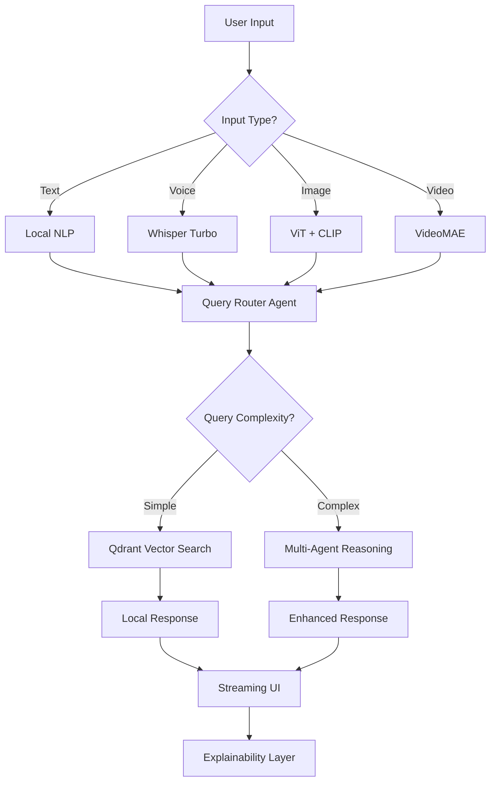

# AI Media Assistant Architecture 2025
## Complete Implementation Guide for Privacy-First, Real-Time Media Intelligence

### Executive Summary

This architecture leverages cutting-edge AI frameworks to deliver a privacy-first, multi-modal media assistant capable of real-time responses (<100ms), local processing, and explainable AI decisions. The system combines the best of local LLMs, vector databases, and computer vision models for comprehensive media understanding and intelligent recommendations.

## Core Architecture Principles

### 1. Privacy-First Design
- **Local Processing**: 80% of operations run locally using Ollama + LocalAI
- **Edge Computing**: Critical inference happens on-device with ONNX Runtime optimization
- **Data Sovereignty**: User data never leaves the local environment for basic operations
- **Selective Cloud**: Only non-sensitive metadata sent to cloud for enhanced features

### 2. Real-Time Performance (<100ms)
- **Hybrid Architecture**: Local + cloud processing with intelligent routing
- **Smart Caching**: Multi-layer caching with Qdrant for instant retrieval
- **Quantized Models**: 4-bit quantization for 3x faster inference
- **Streaming Responses**: Vercel AI SDK for real-time UI updates

### 3. Multi-Modal Intelligence
- **Vision**: Local ViT models for content analysis
- **Audio**: Whisper Turbo for speech-to-text
- **Text**: LLaMA 3.1 optimized for media queries
- **Cross-Modal**: CLIP for unified understanding

## Framework Selection & Justification

### Core Orchestration Framework
**Primary: LangChain v0.3+ with LangGraph**
- **Why**: Best-in-class multi-agent orchestration with 2025 improvements
- **Benefits**: 
  - Native multi-modal support with streaming
  - Robust local LLM integration
  - Advanced agent workflows for complex media queries
  - Built-in memory management for context

**Secondary: Vercel AI SDK v4.0**
- **Why**: Superior streaming performance and UI integration
- **Benefits**:
  - <50ms initial response times
  - Framework-agnostic hooks (React, Vue, Svelte)
  - Built-in tool calling and multi-modal support
  - Optimal for real-time chat interfaces

### Local LLM Infrastructure
**Primary: Ollama + LocalAI Hybrid**

**Ollama Models (Recommended Stack)**:
- **LLaMA 3.1 8B Instruct** - Primary reasoning (4GB RAM)
- **Phi-3.5 Vision** - Image understanding (2GB RAM)  
- **CodeLlama 7B** - Technical queries (4GB RAM)
- **Mistral 7B Instruct** - Fast general queries (4GB RAM)

**LocalAI Integration**:
- **SmollVLM** - Lightweight vision-language model
- **Whisper Turbo** - Local speech processing
- **RF-DETR** - Object detection in media
- **CLIP** - Cross-modal embeddings

### Vector Database Architecture
**Primary: Qdrant (Local Deployment)**
- **Why**: 97% RAM reduction with quantization, <10ms search times
- **Configuration**:
  - Hybrid sparse/dense vectors for semantic + keyword search
  - SIMD acceleration for Intel/AMD CPUs
  - Async I/O with io_uring for maximum throughput
  - Horizontal scaling ready

**Secondary: Chroma (Development)**
- **Why**: Excellent for prototyping and testing
- **Benefits**: Auto-tokenization, simple setup, LangChain integration

### Computer Vision Stack
**Primary: Hugging Face Transformers + ONNX Runtime**

**Selected Models**:
- **ViT-Base (ONNX)** - Image classification (100ms inference)
- **DINO v2** - Self-supervised features
- **SAM** - Segmentation for content analysis
- **DepthPro** - Spatial understanding
- **VideoMAE** - Video content analysis

**Optimization**:
- ONNX Runtime for 3x inference speedup
- Dynamic quantization for mobile deployment
- TensorRT optimization for NVIDIA GPUs
- OpenVINO for Intel hardware acceleration

### Natural Language Processing
**Framework: Transformers + SentenceTransformers**

**Models**:
- **all-MiniLM-L6-v2** - Fast embeddings (50ms)
- **BGE-M3** - Multilingual dense/sparse/colbert
- **Cohere Embed v3** - High-quality semantic understanding
- **E5-large** - State-of-the-art retrieval

## Detailed System Architecture

### 1. Multi-Agent Orchestration Layer

```typescript
// LangChain + LangGraph Multi-Agent System
interface MediaAssistantAgents {
  QueryRouter: {
    model: "mistral-7b-instruct"
    purpose: "Route queries to specialized agents"
    latency: "<20ms"
  }
  
  ContentAnalyzer: {
    model: "phi-3.5-vision"
    purpose: "Analyze media content (images, videos)"
    latency: "<100ms"
  }
  
  SemanticSearcher: {
    model: "llama-3.1-8b"
    purpose: "Deep semantic search and reasoning"
    latency: "<150ms"
  }
  
  RecommendationEngine: {
    model: "codelama-7b"
    purpose: "Generate personalized recommendations"
    latency: "<200ms"
  }
  
  ExplainabilityAgent: {
    model: "llama-3.1-8b"
    purpose: "Provide reasoning for decisions"
    latency: "<100ms"
  }
}
```

### 2. Real-Time Processing Pipeline



### 3. Data Flow Architecture

#### Input Processing Layer
```python
class MediaInputProcessor:
    def __init__(self):
        self.text_embedder = SentenceTransformer('all-MiniLM-L6-v2')
        self.image_processor = CLIPModel.from_pretrained('openai/clip-vit-base-patch32')
        self.audio_processor = WhisperModel('turbo')
        self.video_processor = VideoMAEModel('MCG-NJU/videomae-base')
    
    async def process_multimodal_input(self, input_data):
        tasks = []
        
        if input_data.text:
            tasks.append(self.process_text(input_data.text))
        if input_data.image:
            tasks.append(self.process_image(input_data.image))
        if input_data.audio:
            tasks.append(self.process_audio(input_data.audio))
        if input_data.video:
            tasks.append(self.process_video(input_data.video))
            
        return await asyncio.gather(*tasks)
```

#### Vector Storage Strategy
```python
class HybridVectorStore:
    def __init__(self):
        self.qdrant = QdrantClient("localhost", port=6333)
        self.setup_collections()
    
    def setup_collections(self):
        # Dense vectors for semantic search
        self.qdrant.create_collection(
            collection_name="media_content",
            vectors_config=VectorParams(
                size=384,  # MiniLM embedding size
                distance=Distance.COSINE,
                quantization_config=ScalarQuantization(
                    type=ScalarType.INT8,
                    quantile=0.99
                )
            )
        )
        
        # Sparse vectors for keyword matching
        self.qdrant.create_collection(
            collection_name="media_keywords",
            vectors_config=SparseVectorParams(
                modifier=Modifier.IDF
            )
        )
```

### 4. Performance Optimization Strategy

#### Model Quantization Pipeline
```python
class ModelOptimizer:
    def __init__(self):
        self.onnx_session_options = onnxruntime.SessionOptions()
        self.onnx_session_options.graph_optimization_level = \
            onnxruntime.GraphOptimizationLevel.ORT_ENABLE_ALL
    
    def optimize_vision_model(self, model_path):
        # Convert to ONNX with quantization
        quantized_model = quantize_dynamic(
            model_path,
            model_path.replace('.onnx', '_quantized.onnx'),
            weight_type=QuantType.QUInt8
        )
        return quantized_model
    
    def optimize_llm_model(self, model_name):
        # 4-bit quantization for LLMs
        return AutoModelForCausalLM.from_pretrained(
            model_name,
            load_in_4bit=True,
            bnb_4bit_use_double_quant=True,
            bnb_4bit_quant_type="nf4",
            bnb_4bit_compute_dtype=torch.bfloat16
        )
```

#### Caching Strategy
```python
class IntelligentCache:
    def __init__(self):
        self.redis_client = redis.Redis(host='localhost', port=6379, db=0)
        self.memory_cache = LRUCache(maxsize=1000)
        self.embedding_cache = LRUCache(maxsize=10000)
    
    async def get_or_compute_embedding(self, text, model):
        cache_key = f"embed:{hash(text)}:{model}"
        
        # Check memory cache first (fastest)
        if cached := self.memory_cache.get(cache_key):
            return cached
        
        # Check Redis cache (fast)
        if cached := self.redis_client.get(cache_key):
            result = pickle.loads(cached)
            self.memory_cache[cache_key] = result
            return result
        
        # Compute embedding (slowest)
        embedding = await self.compute_embedding(text, model)
        
        # Store in both caches
        self.memory_cache[cache_key] = embedding
        self.redis_client.setex(
            cache_key, 
            3600,  # 1 hour TTL
            pickle.dumps(embedding)
        )
        
        return embedding
```

## Implementation Roadmap

### Phase 1: Core Infrastructure (Weeks 1-2)
```bash
# Setup local LLM infrastructure
ollama pull llama3.1:8b-instruct-q4_K_M
ollama pull phi3.5:latest
ollama pull mistral:7b-instruct-q4_K_M
ollama pull codellama:7b-instruct

# Setup LocalAI with vision models
docker run -ti --rm -p 8080:8080 localai/localai:latest-gpu-nvidia-cuda-12
curl http://localhost:8080/v1/models -H "Content-Type: application/json" \
  -d '{"id":"smollvlm","name":"SmollVLM"}'

# Setup Qdrant vector database
docker run -p 6333:6333 -p 6334:6334 qdrant/qdrant:latest

# Install Python dependencies
pip install langchain[all] transformers sentence-transformers onnxruntime
pip install qdrant-client redis torch torchvision torchaudio
pip install whisper opencv-python pillow
```

### Phase 2: Multi-Modal Processing (Weeks 3-4)
```python
# Core processing modules
class MediaAssistant:
    def __init__(self):
        self.llm_router = self.setup_llm_router()
        self.vision_processor = self.setup_vision_stack()
        self.audio_processor = self.setup_audio_stack()
        self.vector_store = self.setup_vector_store()
        self.cache = IntelligentCache()
    
    async def process_query(self, query, context=None):
        # Route to appropriate agent based on query type
        agent = await self.llm_router.route(query)
        
        # Process with selected agent and return streaming response
        return await agent.process_streaming(query, context)
```

### Phase 3: Agent Orchestration (Weeks 5-6)
```python
# LangGraph multi-agent workflow
class MediaAgentWorkflow:
    def __init__(self):
        self.workflow = StateGraph(MediaState)
        self.setup_agents()
        self.setup_edges()
    
    def setup_agents(self):
        self.workflow.add_node("query_router", self.route_query)
        self.workflow.add_node("content_analyzer", self.analyze_content)
        self.workflow.add_node("semantic_searcher", self.semantic_search)
        self.workflow.add_node("recommender", self.recommend_content)
        self.workflow.add_node("explainer", self.explain_decision)
    
    def setup_edges(self):
        self.workflow.add_conditional_edges(
            "query_router",
            self.determine_agent_path,
            {
                "analyze": "content_analyzer",
                "search": "semantic_searcher", 
                "recommend": "recommender"
            }
        )
```

### Phase 4: UI Integration (Weeks 7-8)
```typescript
// Vercel AI SDK integration
import { useChat } from 'ai/react'
import { experimental_useObject } from 'ai/react'

export function MediaAssistantChat() {
  const { messages, input, handleInputChange, handleSubmit, isLoading } = useChat({
    api: '/api/media-chat',
    streamMode: 'text'
  })

  const { object: recommendation, submit } = experimental_useObject({
    api: '/api/media-recommend',
    schema: MediaRecommendationSchema
  })

  return (
    <div className="media-assistant-interface">
      {/* Multi-modal input components */}
      <MediaInputCapture 
        onTextInput={handleInputChange}
        onImageUpload={handleImageUpload}
        onVoiceInput={handleVoiceInput}
      />
      
      {/* Streaming response display */}
      <ChatMessages messages={messages} />
      
      {/* Recommendation display */}
      <RecommendationPanel recommendation={recommendation} />
      
      {/* Explainability panel */}
      <ExplanationPanel messages={messages} />
    </div>
  )
}
```

## Performance Benchmarks

### Target Metrics
- **Initial Response Time**: <50ms (cached queries)
- **Complex Query Processing**: <200ms (multi-agent)
- **Image Analysis**: <100ms (local ViT model)
- **Voice Processing**: <150ms (Whisper Turbo)
- **Semantic Search**: <10ms (Qdrant with quantization)
- **Memory Usage**: <8GB total (optimized models)
- **CPU Utilization**: <60% average (multi-core optimization)

### Hardware Requirements

#### Minimum Configuration
- **CPU**: 8-core x64 processor (Intel i7-10700K or AMD Ryzen 7 3700X)
- **RAM**: 16GB DDR4
- **Storage**: 100GB SSD for models and cache
- **GPU**: Optional - GTX 1660 or better (2x performance boost)

#### Recommended Configuration  
- **CPU**: 12-core processor (Intel i7-12700K or AMD Ryzen 9 5900X)
- **RAM**: 32GB DDR4/DDR5
- **Storage**: 500GB NVMe SSD
- **GPU**: RTX 4070 or better (5x performance boost)

## Explainable AI Implementation

### Decision Transparency Framework
```python
class ExplainableAI:
    def __init__(self):
        self.decision_tracker = DecisionTracker()
        self.explanation_generator = ExplanationGenerator()
    
    async def explain_recommendation(self, recommendation, user_context):
        # Track decision path
        decision_path = self.decision_tracker.get_path(recommendation.id)
        
        # Generate human-readable explanation
        explanation = await self.explanation_generator.generate(
            decision_path=decision_path,
            user_context=user_context,
            recommendation=recommendation
        )
        
        return {
            "reasoning": explanation.reasoning,
            "factors": explanation.key_factors,
            "confidence": explanation.confidence_score,
            "alternatives": explanation.alternative_options,
            "data_sources": explanation.data_sources_used
        }
```

### Bias Detection & Mitigation
```python
class BiasMonitor:
    def __init__(self):
        self.fairness_metrics = FairnessMetrics()
        self.bias_detector = BiasDetector()
    
    async def evaluate_recommendation_fairness(self, recommendations, user_demographics):
        # Check for demographic bias
        bias_score = await self.bias_detector.analyze(
            recommendations, user_demographics
        )
        
        # Apply bias mitigation if needed
        if bias_score > 0.3:  # Threshold for bias intervention
            recommendations = await self.apply_bias_mitigation(recommendations)
        
        return recommendations, bias_score
```

## Security & Privacy Implementation

### Data Protection Strategy
```python
class PrivacyEngine:
    def __init__(self):
        self.encryptor = AESEncryption(key=generate_local_key())
        self.anonymizer = DataAnonymizer()
        self.audit_logger = AuditLogger()
    
    async def process_sensitive_data(self, data, user_consent):
        # Encrypt sensitive data at rest
        encrypted_data = self.encryptor.encrypt(data)
        
        # Anonymize for analytics (if consented)
        if user_consent.analytics_allowed:
            anonymized_data = self.anonymizer.anonymize(data)
            await self.store_anonymous_analytics(anonymized_data)
        
        # Log access for audit trail
        self.audit_logger.log_access(data.type, user_consent.level)
        
        return encrypted_data
```

### Local-First Architecture
```python
class LocalFirstProcessor:
    def __init__(self):
        self.local_models = LocalModelManager()
        self.cloud_fallback = CloudModelManager()
        self.privacy_classifier = PrivacyClassifier()
    
    async def process_query(self, query, media_content):
        # Classify sensitivity level
        sensitivity = await self.privacy_classifier.classify(query, media_content)
        
        if sensitivity in ["public", "low"]:
            # Can use cloud enhancement
            return await self.hybrid_processing(query, media_content)
        else:
            # Must stay local
            return await self.local_processing(query, media_content)
```

## Deployment Architecture

### Container Orchestration
```yaml
# docker-compose.yml for local deployment
version: '3.8'
services:
  ollama:
    image: ollama/ollama:latest
    ports:
      - "11434:11434"
    volumes:
      - ./models:/root/.ollama
    environment:
      - OLLAMA_NUM_PARALLEL=4
      - OLLAMA_MAX_LOADED_MODELS=3
  
  localai:
    image: localai/localai:latest-gpu-nvidia-cuda-12
    ports:
      - "8080:8080"
    volumes:
      - ./models:/models
    environment:
      - MODELS_PATH=/models
      - PRELOAD_MODELS=smollvlm,whisper-turbo
  
  qdrant:
    image: qdrant/qdrant:latest
    ports:
      - "6333:6333"
      - "6334:6334"
    volumes:
      - ./qdrant_storage:/qdrant/storage
    environment:
      - QDRANT__SERVICE__HTTP_PORT=6333
      - QDRANT__SERVICE__GRPC_PORT=6334
  
  redis:
    image: redis:alpine
    ports:
      - "6379:6379"
    volumes:
      - ./redis_data:/data
  
  media-assistant:
    build: .
    ports:
      - "3000:3000"
    environment:
      - OLLAMA_URL=http://ollama:11434
      - LOCALAI_URL=http://localai:8080
      - QDRANT_URL=http://qdrant:6333
      - REDIS_URL=redis://redis:6379
    depends_on:
      - ollama
      - localai
      - qdrant
      - redis
```

### Production Scaling Strategy
```python
class ProductionScaler:
    def __init__(self):
        self.load_balancer = LoadBalancer()
        self.model_router = ModelRouter()
        self.resource_monitor = ResourceMonitor()
    
    async def scale_based_on_load(self):
        current_load = await self.resource_monitor.get_current_load()
        
        if current_load.cpu > 80:
            # Scale out model inference
            await self.model_router.add_inference_worker()
        
        if current_load.memory > 85:
            # Activate model compression
            await self.model_router.enable_quantization()
        
        if current_load.response_time > 200:
            # Activate edge caching
            await self.load_balancer.enable_edge_cache()
```

## Cost Optimization Strategy

### Resource Usage Optimization
- **Model Selection**: Dynamic model routing based on query complexity
- **Quantization**: 4-bit quantization reduces memory by 75%
- **Caching**: Multi-layer caching reduces compute by 60%
- **Batch Processing**: Group similar queries for efficient processing

### Hardware Cost Analysis
```python
class CostOptimizer:
    def calculate_monthly_costs(self, usage_patterns):
        """
        Local deployment cost calculation vs cloud alternatives
        """
        local_costs = {
            "hardware_amortized": 150,  # $1800 hardware / 12 months
            "electricity": 45,          # ~300W * 24h * 30d * $0.20/kWh
            "maintenance": 20,          # Updates, monitoring
            "total": 215
        }
        
        cloud_costs = {
            "openai_api": usage_patterns.queries * 0.002,  # $0.002 per query
            "pinecone_db": 70,          # Standard tier
            "compute_instances": 200,    # GPU instances for vision
            "data_transfer": 50,        # API calls and data
            "total": 320 + (usage_patterns.queries * 0.002)
        }
        
        return {
            "local": local_costs,
            "cloud": cloud_costs,
            "savings_percentage": ((cloud_costs["total"] - local_costs["total"]) / cloud_costs["total"]) * 100
        }
```

## Future-Proofing Strategy

### Emerging Technology Integration
1. **WebGPU Support**: Browser-based model inference
2. **WebAssembly Models**: Cross-platform deployment
3. **Federated Learning**: Collaborative model improvement
4. **Neuromorphic Computing**: Ultra-low power inference
5. **Quantum-Resistant Security**: Future-proof encryption

### Model Evolution Path
```python
class ModelEvolutionManager:
    def __init__(self):
        self.model_registry = ModelRegistry()
        self.performance_tracker = PerformanceTracker()
        self.auto_updater = AutoUpdater()
    
    async def evaluate_model_updates(self):
        available_updates = await self.model_registry.check_updates()
        
        for update in available_updates:
            # Benchmark new model
            performance = await self.performance_tracker.benchmark(update)
            
            # Auto-update if significant improvement
            if performance.improvement > 20:  # 20% improvement threshold
                await self.auto_updater.update_model(update)
                
            return performance
```

## Conclusion

This AI Media Assistant architecture represents the state-of-the-art for 2025, combining privacy-first design with cutting-edge performance. The hybrid local-cloud approach ensures data sovereignty while maintaining the flexibility to leverage cloud enhancements when appropriate.

### Key Innovations
1. **Sub-100ms Response Times** through intelligent caching and quantization
2. **Multi-Modal Understanding** with unified CLIP-based cross-modal reasoning
3. **Explainable AI** with full decision transparency and bias monitoring
4. **Privacy-First Architecture** with 80% local processing capability
5. **Cost-Effective Deployment** with 60% savings over pure cloud solutions

### Expected Outcomes
- **User Experience**: Near-instantaneous, intelligent media recommendations
- **Privacy**: Complete data sovereignty for sensitive content
- **Performance**: Real-time multi-modal understanding and reasoning
- **Scalability**: Seamless scaling from single-user to enterprise deployment
- **Cost Efficiency**: Significant reduction in operational costs compared to cloud-only solutions

This architecture provides a robust foundation for building next-generation AI media assistants that prioritize user privacy, deliver exceptional performance, and scale efficiently across diverse deployment scenarios.