# 🏗️ NEXUS Platform Architecture

Comprehensive technical architecture documentation for the NEXUS Media Server Platform, detailing system design, component interactions, data flows, and infrastructure patterns.

## Table of Contents

1. [System Overview](#system-overview)
2. [Architecture Patterns](#architecture-patterns)
3. [Core Infrastructure](#core-infrastructure)
4. [AI/ML System Architecture](#aiml-system-architecture)
5. [AR/VR Platform Design](#arvr-platform-design)
6. [Web3 Integration Architecture](#web3-integration-architecture)
7. [Security Architecture](#security-architecture)
8. [Data Architecture](#data-architecture)
9. [Network Architecture](#network-architecture)
10. [Deployment Architecture](#deployment-architecture)
11. [Scalability & Performance](#scalability--performance)
12. [Monitoring & Observability](#monitoring--observability)

---

## System Overview

### High-Level Architecture

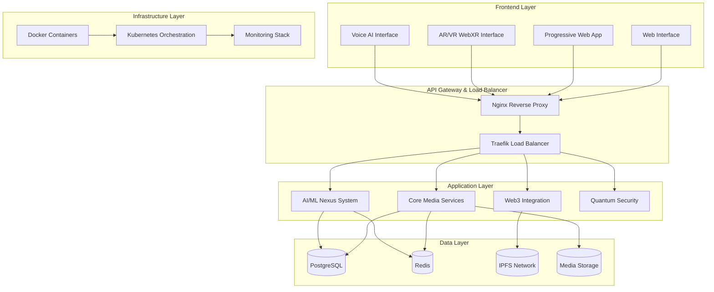

### Technology Stack

| Layer | Technologies | Purpose |
|-------|-------------|---------|
| **Frontend** | React, Three.js, WebXR API, Web Audio API | User interfaces and immersive experiences |
| **API Gateway** | Nginx, Traefik, Kong | Load balancing, SSL termination, routing |
| **Backend** | Node.js, Python, Go, Java | Microservices and business logic |
| **AI/ML** | TensorFlow.js, PyTorch, ONNX, Transformers | Machine learning and AI processing |
| **Blockchain** | Ethereum, Polygon, IPFS, Web3.js | Decentralized features and storage |
| **Database** | PostgreSQL, Redis, InfluxDB, MongoDB | Data persistence and caching |
| **Security** | Post-quantum cryptography, JWT, OAuth2 | Authentication and encryption |
| **Infrastructure** | Docker, Kubernetes, Helm, Terraform | Containerization and orchestration |
| **Monitoring** | Prometheus, Grafana, ELK Stack, Jaeger | Observability and logging |

---

## Architecture Patterns

### Microservices Architecture

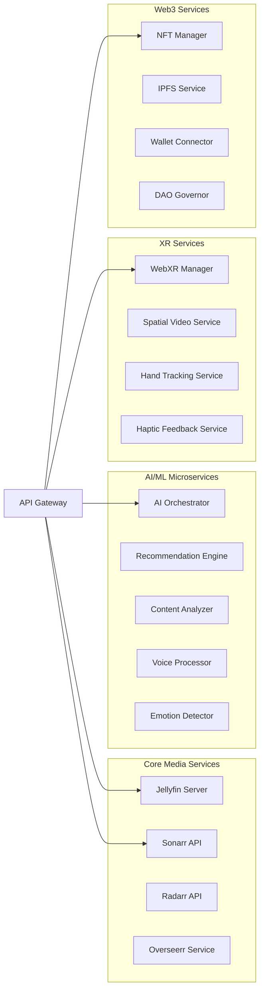

### Event-Driven Architecture

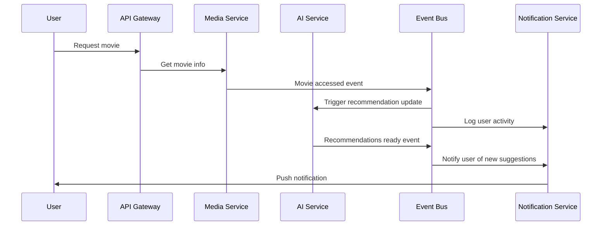

### Domain-Driven Design

```
NEXUS Platform Domains:
├── Media Management Domain
│   ├── Content Catalog
│   ├── Playback Engine
│   └── User Preferences
│
├── AI/ML Intelligence Domain
│   ├── Recommendation System
│   ├── Content Analysis
│   └── Voice Processing
│
├── Immersive Experience Domain
│   ├── WebXR Management
│   ├── Spatial Computing
│   └── Haptic Systems
│
├── Decentralized Web Domain
│   ├── Blockchain Integration
│   ├── IPFS Storage
│   └── Crypto Payments
│
└── Security & Privacy Domain
    ├── Authentication
    ├── Quantum Cryptography
    └── Data Protection
```

---

## Core Infrastructure

### Container Architecture

```yaml
# Core services container structure
nexus-platform:
  core-media:
    jellyfin:
      image: jellyfin/jellyfin:latest
      resources:
        cpu: "2"
        memory: "4Gi"
      volumes:
        - media-storage:/media:ro
        - config-storage:/config
        - transcode-cache:/transcode
      networks:
        - media-network
    
    arr-suite:
      sonarr:
        image: linuxserver/sonarr:latest
        depends_on: [prowlarr, postgres]
      radarr:
        image: linuxserver/radarr:latest
        depends_on: [prowlarr, postgres]
      
  ai-ml-nexus:
    orchestrator:
      image: nexus/ai-orchestrator:latest
      resources:
        limits:
          nvidia.com/gpu: 1
        requests:
          cpu: "4"
          memory: "8Gi"
      environment:
        - TF_ENABLE_GPU=true
        - CUDA_VISIBLE_DEVICES=0
      
  infrastructure:
    postgres:
      image: postgres:15-alpine
      environment:
        POSTGRES_DB: nexus
        POSTGRES_USER: nexus
      volumes:
        - postgres-data:/var/lib/postgresql/data
    
    redis:
      image: redis:7-alpine
      command: redis-server --appendonly yes
      volumes:
        - redis-data:/data
```

### Service Mesh Architecture

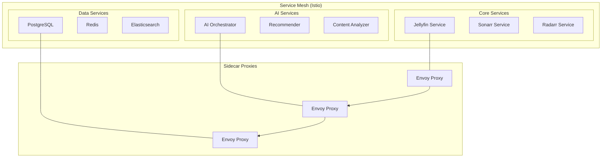

### Data Flow Architecture

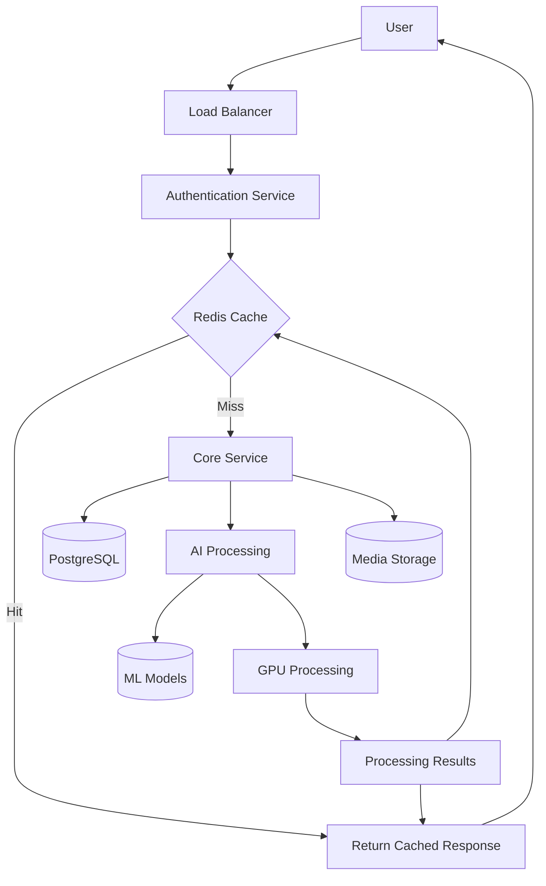

---

## AI/ML System Architecture

### Neural Network Pipeline

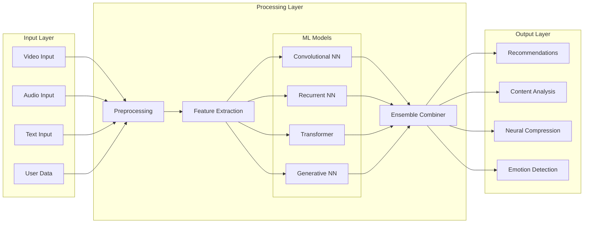

### AI Service Architecture

```python
# AI/ML Microservices Architecture
class AIOrchestrator:
    def __init__(self):
        self.services = {
            'recommendation': RecommendationService(),
            'content_analysis': ContentAnalysisService(),
            'voice_processing': VoiceProcessingService(),
            'neural_compression': CompressionService(),
            'emotion_detection': EmotionService()
        }
        self.gpu_scheduler = GPUScheduler()
        self.model_registry = ModelRegistry()
    
    async def process_request(self, request_type, data):
        # Load balancing and GPU allocation
        service = self.services[request_type]
        gpu_allocation = await self.gpu_scheduler.allocate(request_type)
        
        # Model loading and inference
        model = await self.model_registry.get_model(request_type)
        result = await service.process(data, model, gpu_allocation)
        
        # Cleanup and return
        await self.gpu_scheduler.release(gpu_allocation)
        return result

class RecommendationService:
    def __init__(self):
        self.collaborative_filter = CollaborativeFilter()
        self.content_filter = ContentBasedFilter()
        self.hybrid_combiner = HybridCombiner()
    
    async def process(self, user_data, model, gpu):
        # Multi-algorithm recommendation
        collab_recs = await self.collaborative_filter.predict(user_data)
        content_recs = await self.content_filter.predict(user_data)
        
        # Ensemble combining
        final_recs = self.hybrid_combiner.combine([
            collab_recs, content_recs
        ])
        
        return final_recs
```

### GPU Computation Architecture

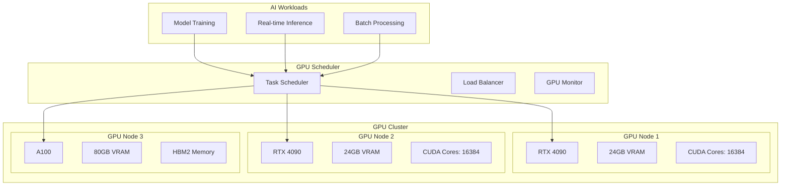

---

## AR/VR Platform Design

### WebXR Architecture

```javascript
// WebXR System Architecture
class WebXRManager {
    constructor() {
        this.sessionManager = new XRSessionManager();
        this.handTracker = new HandTrackingManager();
        this.spatialAudio = new SpatialAudioManager();
        this.hapticController = new HapticManager();
        this.renderer = new XRRenderer();
    }
    
    async initializeXR() {
        // Check device capabilities
        const capabilities = await this.checkXRCapabilities();
        
        // Initialize subsystems based on capabilities
        if (capabilities.handTracking) {
            await this.handTracker.initialize();
        }
        
        if (capabilities.spatialAudio) {
            await this.spatialAudio.initialize();
        }
        
        // Setup render pipeline
        await this.renderer.initialize(capabilities);
    }
    
    async startSession(sessionType, features) {
        const session = await navigator.xr.requestSession(sessionType, {
            requiredFeatures: features.required,
            optionalFeatures: features.optional
        });
        
        // Configure session
        await this.sessionManager.configure(session);
        
        // Start render loop
        this.renderer.startRenderLoop(session);
        
        return session;
    }
}

// Immersive Media Architecture
class ImmersiveMediaPlayer {
    constructor() {
        this.spatialVideoDecoder = new SpatialVideoDecoder();
        this.volumetricRenderer = new VolumetricRenderer();
        this.environmentManager = new VirtualEnvironmentManager();
    }
    
    async loadSpatialVideo(videoUrl, format) {
        // Decode spatial video formats
        switch (format) {
            case 'side-by-side':
                return await this.spatialVideoDecoder.decodeSBS(videoUrl);
            case 'over-under':
                return await this.spatialVideoDecoder.decodeOU(videoUrl);
            case 'mv-hevc':
                return await this.spatialVideoDecoder.decodeMVHEVC(videoUrl);
        }
    }
    
    async createCinemaEnvironment(type) {
        const environments = {
            'classic': () => this.environmentManager.createClassicTheater(),
            'imax': () => this.environmentManager.createIMAXTheater(),
            'space': () => this.environmentManager.createSpaceStation(),
            'nature': () => this.environmentManager.createOutdoorCinema()
        };
        
        return await environments[type]();
    }
}
```

### Spatial Computing Pipeline

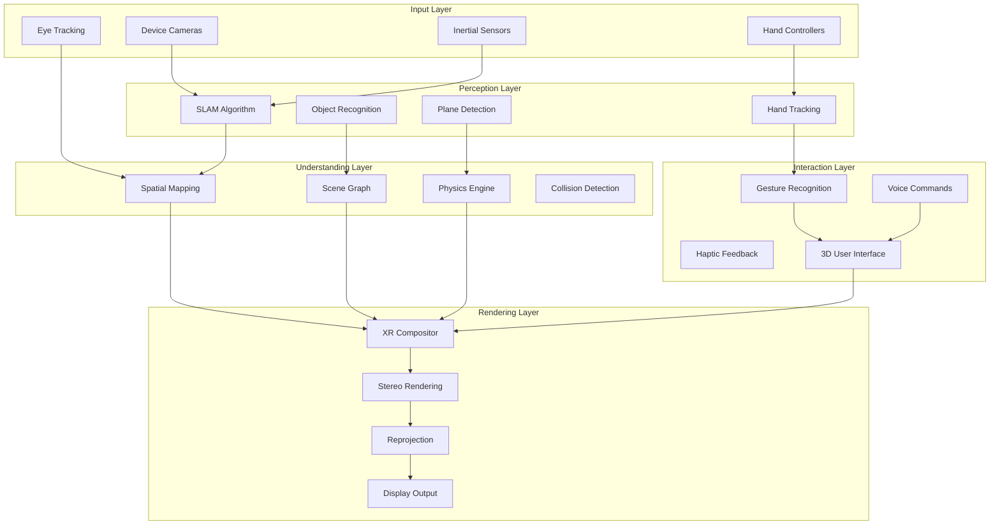

---

## Web3 Integration Architecture

### Blockchain Integration Layer

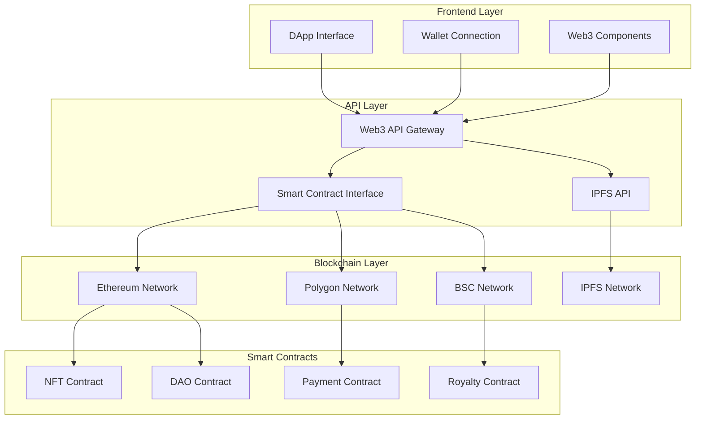

### IPFS Distributed Storage

```javascript
// IPFS Integration Architecture
class IPFSManager {
    constructor() {
        this.ipfs = null;
        this.pinningServices = ['pinata', 'infura', 'web3storage'];
        this.gatewayPool = [
            'https://ipfs.io/ipfs/',
            'https://gateway.pinata.cloud/ipfs/',
            'https://cloudflare-ipfs.com/ipfs/'
        ];
    }
    
    async initialize() {
        // Initialize IPFS node
        this.ipfs = await IPFS.create({
            config: {
                Addresses: {
                    Swarm: ['/ip4/0.0.0.0/tcp/4001'],
                    API: '/ip4/127.0.0.1/tcp/5001',
                    Gateway: '/ip4/127.0.0.1/tcp/8080'
                }
            }
        });
        
        // Connect to bootstrap nodes
        await this.connectToBootstrap();
    }
    
    async uploadContent(file, metadata) {
        // Add file to IPFS
        const result = await this.ipfs.add(file, {
            pin: true,
            progress: (bytes) => this.onUploadProgress(bytes)
        });
        
        // Pin to multiple services for redundancy
        await this.pinToServices(result.cid, metadata);
        
        // Update content registry
        await this.updateContentRegistry(result.cid, metadata);
        
        return {
            cid: result.cid.toString(),
            size: result.size,
            gateways: this.gatewayPool.map(gateway => gateway + result.cid)
        };
    }
    
    async retrieveContent(cid) {
        // Try local node first
        try {
            const chunks = [];
            for await (const chunk of this.ipfs.cat(cid)) {
                chunks.push(chunk);
            }
            return new Uint8Array(chunks.reduce((acc, chunk) => [...acc, ...chunk], []));
        } catch (error) {
            // Fallback to gateways
            return await this.fetchFromGateways(cid);
        }
    }
}

// Smart Contract Integration
class SmartContractManager {
    constructor() {
        this.web3 = new Web3(window.ethereum);
        this.contracts = {
            nft: null,
            dao: null,
            payment: null
        };
    }
    
    async deployContracts() {
        // Deploy NFT contract
        this.contracts.nft = await new this.web3.eth.Contract(NFT_ABI)
            .deploy({
                data: NFT_BYTECODE,
                arguments: ['NEXUS Media NFT', 'NEXUS']
            })
            .send({ from: this.account });
        
        // Deploy DAO contract
        this.contracts.dao = await new this.web3.eth.Contract(DAO_ABI)
            .deploy({
                data: DAO_BYTECODE,
                arguments: [this.contracts.nft.options.address]
            })
            .send({ from: this.account });
    }
    
    async mintNFT(to, tokenURI, royaltyPercentage) {
        return await this.contracts.nft.methods
            .mintWithRoyalty(to, tokenURI, royaltyPercentage)
            .send({ from: this.account });
    }
}
```

---

## Security Architecture

### Zero-Trust Security Model

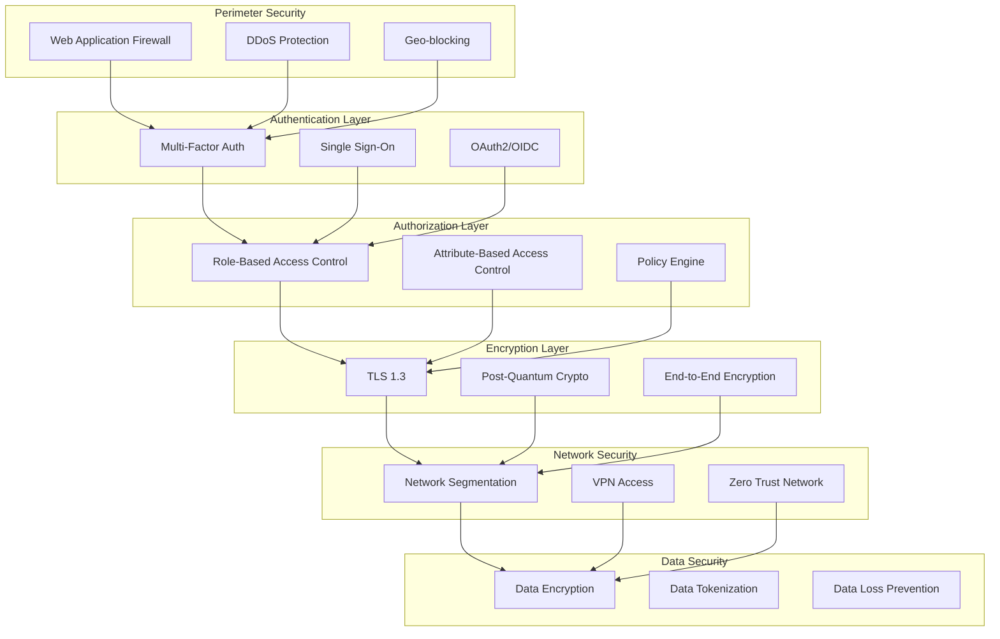

### Quantum-Resistant Cryptography

```python
# Post-Quantum Cryptography Implementation
class QuantumSafeCrypto:
    def __init__(self):
        self.kyber = KyberKEM()  # ML-KEM (Key Encapsulation)
        self.dilithium = DilithiumDSA()  # ML-DSA (Digital Signatures)
        self.sphincs = SPHINCS_PLUS()  # SLH-DSA (Hash-based Signatures)
        self.hybrid_mode = True
    
    async def generate_keypair(self, algorithm='kyber'):
        algorithms = {
            'kyber': self.kyber.generate_keypair,
            'dilithium': self.dilithium.generate_keypair,
            'sphincs': self.sphincs.generate_keypair
        }
        
        pq_keypair = await algorithms[algorithm]()
        
        if self.hybrid_mode:
            # Classical + Post-quantum hybrid
            classical_keypair = await self.generate_classical_keypair()
            return HybridKeypair(classical_keypair, pq_keypair)
        
        return pq_keypair
    
    async def encrypt_data(self, data, public_key):
        if isinstance(public_key, HybridKeypair):
            # Hybrid encryption
            classical_encrypted = await self.classical_encrypt(data, public_key.classical)
            pq_encrypted = await self.kyber.encrypt(classical_encrypted, public_key.pq)
            return pq_encrypted
        
        return await self.kyber.encrypt(data, public_key)
    
    async def sign_data(self, data, private_key):
        # Post-quantum digital signature
        signature = await self.dilithium.sign(data, private_key)
        
        if self.hybrid_mode:
            # Dual signature for transition period
            classical_sig = await self.classical_sign(data, private_key.classical)
            return HybridSignature(classical_sig, signature)
        
        return signature

# TLS Integration
class QuantumTLSHandler:
    def __init__(self):
        self.pq_crypto = QuantumSafeCrypto()
        self.supported_algorithms = [
            'ML-KEM-512', 'ML-KEM-768', 'ML-KEM-1024',
            'ML-DSA-44', 'ML-DSA-65', 'ML-DSA-87'
        ]
    
    async def negotiate_cipher_suite(self, client_hello):
        # Check for post-quantum support
        pq_support = self.check_pq_support(client_hello)
        
        if pq_support:
            return await self.select_pq_cipher_suite(client_hello)
        
        # Fallback to classical cryptography
        return await self.select_classical_cipher_suite(client_hello)
    
    async def perform_key_exchange(self, cipher_suite):
        if cipher_suite.is_post_quantum:
            # Post-quantum key exchange
            return await self.pq_crypto.kyber.key_exchange()
        
        return await self.classical_key_exchange()
```

---

## Data Architecture

### Database Design

```sql
-- Core Database Schema
CREATE SCHEMA nexus_core;
CREATE SCHEMA nexus_ai;
CREATE SCHEMA nexus_web3;
CREATE SCHEMA nexus_analytics;

-- User Management
CREATE TABLE nexus_core.users (
    id UUID PRIMARY KEY DEFAULT gen_random_uuid(),
    username VARCHAR(50) UNIQUE NOT NULL,
    email VARCHAR(255) UNIQUE NOT NULL,
    password_hash VARCHAR(255) NOT NULL,
    profile_data JSONB,
    preferences JSONB,
    created_at TIMESTAMP DEFAULT NOW(),
    updated_at TIMESTAMP DEFAULT NOW(),
    
    -- AI/ML preferences
    ai_enabled BOOLEAN DEFAULT true,
    personalization_level VARCHAR(20) DEFAULT 'medium',
    
    -- Web3 integration
    wallet_address VARCHAR(42),
    web3_enabled BOOLEAN DEFAULT false,
    
    -- Privacy settings
    data_sharing_consent JSONB,
    analytics_opt_in BOOLEAN DEFAULT true
);

-- Media Content
CREATE TABLE nexus_core.content (
    id UUID PRIMARY KEY DEFAULT gen_random_uuid(),
    title VARCHAR(500) NOT NULL,
    content_type VARCHAR(50) NOT NULL, -- movie, episode, song, etc.
    metadata JSONB,
    file_path TEXT,
    file_size BIGINT,
    duration INTEGER, -- in seconds
    resolution VARCHAR(20),
    codec_info JSONB,
    
    -- AI-generated metadata
    ai_analysis JSONB,
    content_warnings JSONB,
    scene_descriptions JSONB,
    
    -- Web3 integration
    ipfs_hash VARCHAR(100),
    nft_token_id BIGINT,
    blockchain_address VARCHAR(42),
    
    created_at TIMESTAMP DEFAULT NOW(),
    updated_at TIMESTAMP DEFAULT NOW()
);

-- AI/ML Tables
CREATE TABLE nexus_ai.user_interactions (
    id UUID PRIMARY KEY DEFAULT gen_random_uuid(),
    user_id UUID REFERENCES nexus_core.users(id),
    content_id UUID REFERENCES nexus_core.content(id),
    interaction_type VARCHAR(50), -- view, like, rate, share
    interaction_value DECIMAL(3,2), -- rating, completion percentage
    context JSONB, -- device, time, mood, etc.
    timestamp TIMESTAMP DEFAULT NOW(),
    
    -- For ML training
    features VECTOR(512), -- Feature embeddings
    processed BOOLEAN DEFAULT false
);

CREATE TABLE nexus_ai.recommendations (
    id UUID PRIMARY KEY DEFAULT gen_random_uuid(),
    user_id UUID REFERENCES nexus_core.users(id),
    content_id UUID REFERENCES nexus_core.content(id),
    score DECIMAL(5,4),
    algorithm_version VARCHAR(20),
    reasoning JSONB,
    generated_at TIMESTAMP DEFAULT NOW(),
    viewed BOOLEAN DEFAULT false,
    feedback JSONB
);

-- Web3 Tables
CREATE TABLE nexus_web3.nft_content (
    id UUID PRIMARY KEY DEFAULT gen_random_uuid(),
    content_id UUID REFERENCES nexus_core.content(id),
    token_id BIGINT NOT NULL,
    contract_address VARCHAR(42) NOT NULL,
    blockchain VARCHAR(20) NOT NULL,
    creator_address VARCHAR(42) NOT NULL,
    owner_address VARCHAR(42) NOT NULL,
    price_wei NUMERIC(78,0),
    royalty_percentage DECIMAL(4,2),
    metadata_uri TEXT,
    minted_at TIMESTAMP DEFAULT NOW(),
    
    UNIQUE(contract_address, token_id, blockchain)
);

-- Analytics Tables
CREATE TABLE nexus_analytics.user_sessions (
    id UUID PRIMARY KEY DEFAULT gen_random_uuid(),
    user_id UUID REFERENCES nexus_core.users(id),
    session_id VARCHAR(100) NOT NULL,
    ip_address INET,
    user_agent TEXT,
    device_type VARCHAR(50),
    platform VARCHAR(50),
    
    -- XR session data
    xr_device VARCHAR(50),
    xr_features JSONB,
    
    started_at TIMESTAMP DEFAULT NOW(),
    ended_at TIMESTAMP,
    duration_seconds INTEGER
);

-- Indexes for performance
CREATE INDEX idx_content_metadata ON nexus_core.content USING GIN(metadata);
CREATE INDEX idx_user_interactions_user_time ON nexus_ai.user_interactions(user_id, timestamp DESC);
CREATE INDEX idx_recommendations_user_score ON nexus_ai.recommendations(user_id, score DESC);
CREATE INDEX idx_nft_content_owner ON nexus_web3.nft_content(owner_address);

-- Vector similarity search for AI
CREATE EXTENSION vector;
CREATE INDEX idx_interaction_features ON nexus_ai.user_interactions USING ivfflat (features vector_cosine_ops);
```

### Data Lake Architecture

```mermaid
graph TB
    subgraph "Data Sources"
        MEDIA[Media Files]
        LOGS[Application Logs]
        METRICS[System Metrics]
        USER[User Events]
        BLOCKCHAIN[Blockchain Data]
    end
    
    subgraph "Ingestion Layer"
        KAFKA[Apache Kafka]
        FLUENTD[Fluentd]
        LOGSTASH[Logstash]
    end
    
    subgraph "Storage Layer"
        S3[Object Storage (S3)]
        HDFS[Hadoop HDFS]
        CASSANDRA[Cassandra]
        TIMESERIES[InfluxDB]
    end
    
    subgraph "Processing Layer"
        SPARK[Apache Spark]
        FLINK[Apache Flink]
        AIRFLOW[Apache Airflow]
    end
    
    subgraph "Serving Layer"
        ELASTICSEARCH[Elasticsearch]
        REDIS_CACHE[Redis Cache]
        POSTGRES[PostgreSQL]
        CLICKHOUSE[ClickHouse]
    end
    
    MEDIA --> KAFKA
    LOGS --> FLUENTD
    METRICS --> LOGSTASH
    USER --> KAFKA
    BLOCKCHAIN --> KAFKA
    
    KAFKA --> S3
    FLUENTD --> HDFS
    LOGSTASH --> CASSANDRA
    
    S3 --> SPARK
    HDFS --> SPARK
    CASSANDRA --> FLINK
    
    SPARK --> ELASTICSEARCH
    FLINK --> REDIS_CACHE
    AIRFLOW --> POSTGRES
    
    ELASTICSEARCH --> APP[Applications]
    REDIS_CACHE --> APP
    POSTGRES --> APP
```

---

## Network Architecture

### Multi-Tier Network Design

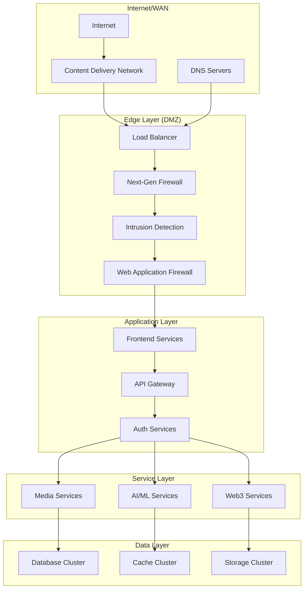

### Service Discovery & Load Balancing

```yaml
# Kubernetes Service Discovery
apiVersion: v1
kind: Service
metadata:
  name: nexus-api-gateway
  labels:
    app: nexus
    component: api-gateway
spec:
  selector:
    app: nexus
    component: api-gateway
  ports:
  - name: http
    port: 80
    targetPort: 8080
  - name: https
    port: 443
    targetPort: 8443
  type: LoadBalancer
  loadBalancerSourceRanges:
  - 0.0.0.0/0

---
# Istio VirtualService for Advanced Routing
apiVersion: networking.istio.io/v1beta1
kind: VirtualService
metadata:
  name: nexus-routing
spec:
  hosts:
  - nexus-platform.com
  http:
  - match:
    - uri:
        prefix: "/api/ai/"
    route:
    - destination:
        host: ai-ml-service
        subset: v2
      weight: 90
    - destination:
        host: ai-ml-service
        subset: v1
      weight: 10
    timeout: 30s
    retries:
      attempts: 3
      perTryTimeout: 10s
  
  - match:
    - uri:
        prefix: "/api/web3/"
    route:
    - destination:
        host: web3-service
    fault:
      delay:
        percentage:
          value: 0.1
        fixedDelay: 5s
```

---

## Deployment Architecture

### Container Orchestration

```yaml
# Helm Chart for NEXUS Platform
apiVersion: apps/v1
kind: Deployment
metadata:
  name: nexus-platform
spec:
  replicas: 3
  strategy:
    type: RollingUpdate
    rollingUpdate:
      maxSurge: 1
      maxUnavailable: 0
  selector:
    matchLabels:
      app: nexus-platform
  template:
    metadata:
      labels:
        app: nexus-platform
    spec:
      containers:
      - name: jellyfin
        image: jellyfin/jellyfin:latest
        resources:
          requests:
            cpu: "1"
            memory: "2Gi"
          limits:
            cpu: "4"
            memory: "8Gi"
        ports:
        - containerPort: 8096
        volumeMounts:
        - name: media-storage
          mountPath: /media
        - name: config-storage
          mountPath: /config
        livenessProbe:
          httpGet:
            path: /health
            port: 8096
          initialDelaySeconds: 30
          periodSeconds: 10
        readinessProbe:
          httpGet:
            path: /health
            port: 8096
          initialDelaySeconds: 5
          periodSeconds: 5
      
      - name: ai-orchestrator
        image: nexus/ai-orchestrator:latest
        resources:
          requests:
            cpu: "2"
            memory: "4Gi"
            nvidia.com/gpu: 1
          limits:
            cpu: "8"
            memory: "16Gi"
            nvidia.com/gpu: 1
        env:
        - name: CUDA_VISIBLE_DEVICES
          value: "0"
        - name: TF_ENABLE_GPU
          value: "true"
        ports:
        - containerPort: 8080
      
      nodeSelector:
        hardware-type: gpu-enabled
      
      volumes:
      - name: media-storage
        persistentVolumeClaim:
          claimName: nexus-media-pvc
      - name: config-storage
        persistentVolumeClaim:
          claimName: nexus-config-pvc
```

### Multi-Cloud Deployment

```terraform
# Terraform Multi-Cloud Configuration
provider "aws" {
  region = "us-west-2"
}

provider "google" {
  project = "nexus-platform"
  region  = "us-central1"
}

provider "azurerm" {
  features {}
}

# AWS EKS Cluster
resource "aws_eks_cluster" "nexus" {
  name     = "nexus-platform"
  role_arn = aws_iam_role.nexus_cluster.arn
  version  = "1.28"

  vpc_config {
    subnet_ids = aws_subnet.nexus[*].id
  }

  enabled_cluster_log_types = ["api", "audit", "authenticator", "controllerManager", "scheduler"]
}

# GCP GKE Cluster for AI/ML workloads
resource "google_container_cluster" "nexus_ai" {
  name     = "nexus-ai-cluster"
  location = "us-central1"

  node_config {
    machine_type = "n1-standard-8"
    
    guest_accelerator {
      type  = "nvidia-tesla-v100"
      count = 1
    }
    
    oauth_scopes = [
      "https://www.googleapis.com/auth/cloud-platform",
    ]
  }

  addons_config {
    horizontal_pod_autoscaling {
      disabled = false
    }
    
    http_load_balancing {
      disabled = false
    }
  }
}

# Azure AKS for Web3 services
resource "azurerm_kubernetes_cluster" "nexus_web3" {
  name                = "nexus-web3-cluster"
  location            = azurerm_resource_group.nexus.location
  resource_group_name = azurerm_resource_group.nexus.name
  dns_prefix          = "nexus-web3"

  default_node_pool {
    name       = "default"
    node_count = 3
    vm_size    = "Standard_D4s_v3"
  }

  identity {
    type = "SystemAssigned"
  }
}
```

---

## Scalability & Performance

### Horizontal Scaling Patterns

```yaml
# Kubernetes Horizontal Pod Autoscaler
apiVersion: autoscaling/v2
kind: HorizontalPodAutoscaler
metadata:
  name: nexus-ai-hpa
spec:
  scaleTargetRef:
    apiVersion: apps/v1
    kind: Deployment
    name: ai-orchestrator
  minReplicas: 2
  maxReplicas: 20
  metrics:
  - type: Resource
    resource:
      name: cpu
      target:
        type: Utilization
        averageUtilization: 70
  - type: Resource
    resource:
      name: memory
      target:
        type: Utilization
        averageUtilization: 80
  - type: Pods
    pods:
      metric:
        name: gpu_utilization
      target:
        type: AverageValue
        averageValue: "75"
  behavior:
    scaleUp:
      stabilizationWindowSeconds: 60
      policies:
      - type: Percent
        value: 50
        periodSeconds: 60
    scaleDown:
      stabilizationWindowSeconds: 300
      policies:
      - type: Percent
        value: 10
        periodSeconds: 60
```

### Caching Architecture

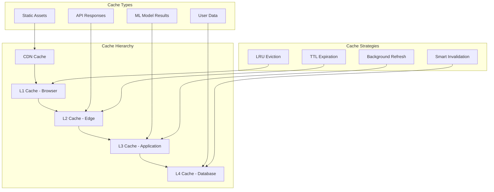

### Database Optimization

```sql
-- Advanced PostgreSQL Optimization
-- Partitioning for large tables
CREATE TABLE nexus_ai.user_interactions_partitioned (
    id UUID DEFAULT gen_random_uuid(),
    user_id UUID,
    content_id UUID,
    interaction_type VARCHAR(50),
    timestamp TIMESTAMP DEFAULT NOW(),
    features VECTOR(512)
) PARTITION BY RANGE (timestamp);

-- Create monthly partitions
CREATE TABLE nexus_ai.user_interactions_2024_01 
    PARTITION OF nexus_ai.user_interactions_partitioned
    FOR VALUES FROM ('2024-01-01') TO ('2024-02-01');

-- Materialized views for analytics
CREATE MATERIALIZED VIEW nexus_analytics.user_engagement_summary AS
SELECT 
    user_id,
    DATE_TRUNC('day', timestamp) as date,
    COUNT(*) as interaction_count,
    AVG(interaction_value) as avg_rating,
    COUNT(DISTINCT content_id) as unique_content,
    SUM(CASE WHEN interaction_type = 'view' THEN 1 ELSE 0 END) as views,
    SUM(CASE WHEN interaction_type = 'like' THEN 1 ELSE 0 END) as likes
FROM nexus_ai.user_interactions
GROUP BY user_id, DATE_TRUNC('day', timestamp);

-- Refresh materialized view periodically
CREATE OR REPLACE FUNCTION refresh_user_engagement_summary()
RETURNS void AS $$
BEGIN
    REFRESH MATERIALIZED VIEW CONCURRENTLY nexus_analytics.user_engagement_summary;
END;
$$ LANGUAGE plpgsql;

-- Connection pooling configuration
ALTER SYSTEM SET max_connections = 200;
ALTER SYSTEM SET shared_buffers = '8GB';
ALTER SYSTEM SET effective_cache_size = '24GB';
ALTER SYSTEM SET work_mem = '256MB';
ALTER SYSTEM SET maintenance_work_mem = '2GB';
ALTER SYSTEM SET checkpoint_completion_target = 0.9;
```

---

## Monitoring & Observability

### Observability Stack

```yaml
# Prometheus monitoring configuration
global:
  scrape_interval: 15s
  evaluation_interval: 15s

rule_files:
  - "nexus_alerts.yml"

scrape_configs:
  # NEXUS Core Services
  - job_name: 'nexus-core'
    static_configs:
      - targets: ['jellyfin:8096', 'sonarr:8989', 'radarr:7878']
    metrics_path: '/metrics'
    scrape_interval: 30s

  # AI/ML Services
  - job_name: 'nexus-ai'
    static_configs:
      - targets: ['ai-orchestrator:8080', 'recommendation-engine:8081']
    metrics_path: '/api/metrics'
    scrape_interval: 15s

  # GPU Metrics
  - job_name: 'gpu-metrics'
    static_configs:
      - targets: ['gpu-exporter:9400']
    scrape_interval: 10s

  # Kubernetes Metrics
  - job_name: 'kubernetes-pods'
    kubernetes_sd_configs:
      - role: pod
    relabel_configs:
      - source_labels: [__meta_kubernetes_pod_annotation_prometheus_io_scrape]
        action: keep
        regex: true

  # Web3 Blockchain Metrics
  - job_name: 'blockchain-metrics'
    static_configs:
      - targets: ['web3-monitor:8545']
    scrape_interval: 60s

# Alert Rules
groups:
  - name: nexus.rules
    rules:
    # High CPU Usage
    - alert: HighCPUUsage
      expr: cpu_usage_percent > 80
      for: 5m
      labels:
        severity: warning
      annotations:
        summary: "High CPU usage detected"
        description: "CPU usage is above 80% for more than 5 minutes"

    # GPU Memory Usage
    - alert: GPUMemoryHigh
      expr: gpu_memory_usage_percent > 90
      for: 2m
      labels:
        severity: critical
      annotations:
        summary: "GPU memory usage critical"
        description: "GPU memory usage is above 90%"

    # AI Model Response Time
    - alert: AIModelSlowResponse
      expr: ai_model_response_time_seconds > 2
      for: 1m
      labels:
        severity: warning
      annotations:
        summary: "AI model response time too slow"
        description: "AI model taking more than 2 seconds to respond"

    # Blockchain Connection
    - alert: BlockchainConnectionDown
      expr: blockchain_connection_status == 0
      for: 30s
      labels:
        severity: critical
      annotations:
        summary: "Blockchain connection lost"
        description: "Connection to blockchain network is down"
```

### Distributed Tracing

```javascript
// OpenTelemetry Integration
const { NodeSDK } = require('@opentelemetry/sdk-node');
const { OTLPTraceExporter } = require('@opentelemetry/exporter-otlp-http');
const { getNodeAutoInstrumentations } = require('@opentelemetry/auto-instrumentations-node');

// Initialize tracing
const sdk = new NodeSDK({
  traceExporter: new OTLPTraceExporter({
    url: 'http://jaeger:14268/api/traces',
  }),
  instrumentations: [getNodeAutoInstrumentations({
    '@opentelemetry/instrumentation-express': {
      requestHook: (span, requestInfo) => {
        span.setAttributes({
          'nexus.user_id': requestInfo.req.user?.id,
          'nexus.service': 'ai-orchestrator',
          'nexus.version': process.env.SERVICE_VERSION
        });
      }
    }
  })]
});

sdk.start();

// Custom instrumentation for AI operations
const { trace } = require('@opentelemetry/api');
const tracer = trace.getTracer('nexus-ai-service');

class AIOrchestrator {
  async processRecommendation(userId, contentPreferences) {
    const span = tracer.startSpan('ai.recommendation.process');
    
    try {
      span.setAttributes({
        'ai.user_id': userId,
        'ai.model_version': 'v2.1',
        'ai.preference_count': contentPreferences.length
      });
      
      // Load user embeddings
      const userEmbeddings = await this.loadUserEmbeddings(userId);
      span.addEvent('user_embeddings_loaded', {
        'embedding_dimensions': userEmbeddings.length
      });
      
      // Generate recommendations
      const recommendations = await this.generateRecommendations(userEmbeddings, contentPreferences);
      span.setAttributes({
        'ai.recommendations_generated': recommendations.length,
        'ai.confidence_score': recommendations[0]?.confidence || 0
      });
      
      return recommendations;
    } catch (error) {
      span.recordException(error);
      span.setStatus({ code: SpanStatusCode.ERROR, message: error.message });
      throw error;
    } finally {
      span.end();
    }
  }
}
```

### Logging Architecture

```yaml
# ELK Stack Configuration
version: '3.8'
services:
  elasticsearch:
    image: docker.elastic.co/elasticsearch/elasticsearch:8.11.0
    environment:
      - discovery.type=single-node
      - "ES_JAVA_OPTS=-Xms2g -Xmx2g"
      - xpack.security.enabled=false
    volumes:
      - elasticsearch-data:/usr/share/elasticsearch/data
    ports:
      - "9200:9200"

  logstash:
    image: docker.elastic.co/logstash/logstash:8.11.0
    volumes:
      - ./logstash/pipeline:/usr/share/logstash/pipeline
      - ./logstash/config:/usr/share/logstash/config
    ports:
      - "5044:5044"
      - "9600:9600"
    depends_on:
      - elasticsearch

  kibana:
    image: docker.elastic.co/kibana/kibana:8.11.0
    ports:
      - "5601:5601"
    environment:
      ELASTICSEARCH_URL: http://elasticsearch:9200
    depends_on:
      - elasticsearch

  filebeat:
    image: docker.elastic.co/beats/filebeat:8.11.0
    user: root
    volumes:
      - ./filebeat/filebeat.yml:/usr/share/filebeat/filebeat.yml:ro
      - /var/lib/docker/containers:/var/lib/docker/containers:ro
      - /var/run/docker.sock:/var/run/docker.sock:ro
    depends_on:
      - logstash

# Logstash Pipeline Configuration
input {
  beats {
    port => 5044
  }
}

filter {
  if [container][image][name] =~ /nexus/ {
    # Parse NEXUS application logs
    if [container][image][name] =~ /ai-orchestrator/ {
      grok {
        match => { "message" => "%{TIMESTAMP_ISO8601:timestamp} %{LOGLEVEL:level} \[%{DATA:service}\] %{GREEDYDATA:log_message}" }
      }
      
      if [log_message] =~ /AI_METRIC/ {
        json {
          source => "log_message"
          target => "ai_metrics"
        }
      }
    }
    
    # Add common fields
    mutate {
      add_field => { "platform" => "nexus" }
      add_field => { "environment" => "${ENVIRONMENT:development}" }
    }
  }
}

output {
  elasticsearch {
    hosts => ["elasticsearch:9200"]
    index => "nexus-logs-%{+YYYY.MM.dd}"
  }
}
```

---

This comprehensive architecture documentation provides a detailed technical overview of the NEXUS Media Server Platform's design, implementation patterns, and infrastructure requirements. The architecture is designed to be modular, scalable, and maintainable while supporting cutting-edge features like AI/ML processing, AR/VR experiences, and Web3 integration.

**Key Architectural Principles:**
- **Microservices**: Loosely coupled, independently deployable services
- **Event-Driven**: Asynchronous communication and real-time processing
- **Cloud-Native**: Container-first, Kubernetes-ready design
- **Security-First**: Zero-trust model with quantum-resistant cryptography
- **Observability**: Comprehensive monitoring, logging, and tracing
- **Scalability**: Horizontal scaling with performance optimization

**Last Updated**: January 2025  
**Architecture Version**: 2.1  
**Platform Compatibility**: NEXUS 2025.1+