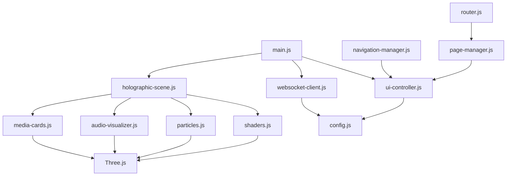

# Architecture Overview

This document describes the technical architecture of the Holographic Media Dashboard.

## 🏗️ System Architecture

### High-Level Overview

```
┌─────────────────────────────────────────────────────────────┐
│                     Browser Client                          │
├─────────────────────────────────────────────────────────────┤
│  ┌─────────────┐  ┌─────────────┐  ┌─────────────────────┐  │
│  │   WebGL     │  │    WebUI    │  │   WebSocket Client  │  │
│  │  Renderer   │  │ Components  │  │   (Real-time)       │  │
│  └─────────────┘  └─────────────┘  └─────────────────────┘  │
├─────────────────────────────────────────────────────────────┤
│  ┌─────────────┐  ┌─────────────┐  ┌─────────────────────┐  │
│  │ Three.js    │  │   GSAP      │  │   Native Web APIs   │  │
│  │ Scene Graph │  │ Animations  │  │  (Audio, WebGL)     │  │
│  └─────────────┘  └─────────────┘  └─────────────────────┘  │
└─────────────────────────────────────────────────────────────┘
                            │
                            │ WebSocket
                            ▼
┌─────────────────────────────────────────────────────────────┐
│                   Media Server                              │
├─────────────────────────────────────────────────────────────┤
│  ┌─────────────┐  ┌─────────────┐  ┌─────────────────────┐  │
│  │ WebSocket   │  │    Media    │  │    Statistics       │  │
│  │   Server    │  │  Database   │  │    Collector        │  │
│  └─────────────┘  └─────────────┘  └─────────────────────┘  │
└─────────────────────────────────────────────────────────────┘
```

## 🎨 Frontend Architecture

### Component Structure

```
Holographic Dashboard
├── Scene Manager (Three.js)
│   ├── Camera Controller
│   ├── Lighting System
│   ├── Post-Processing Pipeline
│   └── Render Loop
├── Media Card System
│   ├── 3D Card Geometry
│   ├── Texture Management
│   ├── Animation Controller
│   └── Interaction Handlers
├── Particle Systems
│   ├── Data Flow Particles
│   ├── Ambient Effects
│   └── Performance Optimization
├── Audio Visualizer
│   ├── FFT Analysis
│   ├── 3D Bar Renderer
│   └── Real-time Updates
├── UI Controllers
│   ├── Navigation Manager
│   ├── Settings Panel
│   ├── Statistics Display
│   └── Activity Feed
└── WebSocket Client
    ├── Connection Manager
    ├── Message Handler
    ├── Reconnection Logic
    └── Data Synchronization
```

### Module Dependencies



## 🔧 Core Systems

### 1. WebGL Rendering Pipeline

#### Scene Graph Structure
```javascript
Scene
├── Camera (PerspectiveCamera)
├── Lighting
│   ├── Ambient Light
│   ├── Directional Light (key)
│   └── Point Lights (accent)
├── Media Cards Group
│   ├── Card Meshes (instanced)
│   ├── Hover Effects
│   └── Click Interactions  
├── Particle Systems
│   ├── Data Flow Particles
│   ├── Background Ambient
│   └── Interactive Effects
├── Audio Visualizer
│   ├── Bar Geometry (instanced)
│   ├── Reflection Plane
│   └── Dynamic Materials
└── Post-Processing
    ├── Bloom Pass
    ├── Chromatic Aberration
    ├── Film Grain
    └── Vignette Effect
```

#### Render Loop Flow
```javascript
function renderLoop() {
    // 1. Update systems
    updateCamera();
    updateParticles(deltaTime);
    updateMediaCards(deltaTime);
    updateAudioVisualizer();
    
    // 2. Render scene
    renderer.render(scene, camera);
    
    // 3. Post-processing
    composer.render();
    
    // 4. Performance monitoring
    performanceMonitor.endFrame();
    
    // 5. Schedule next frame
    requestAnimationFrame(renderLoop);
}
```

### 2. Material System

#### Holographic Shader
```glsl
// Vertex Shader
attribute vec3 position;
attribute vec2 uv;
uniform mat4 modelViewMatrix;
uniform mat4 projectionMatrix;
uniform float time;
varying vec2 vUv;
varying vec3 vPosition;

void main() {
    vUv = uv;
    vPosition = position;
    
    // Add subtle vertex displacement
    vec3 pos = position;
    pos.z += sin(pos.x * 10.0 + time) * 0.01;
    
    gl_Position = projectionMatrix * modelViewMatrix * vec4(pos, 1.0);
}

// Fragment Shader  
uniform float time;
uniform vec3 color;
uniform float opacity;
varying vec2 vUv;
varying vec3 vPosition;

void main() {
    // Holographic scanlines
    float scanline = sin(vUv.y * 800.0 + time * 10.0) * 0.1 + 0.9;
    
    // Edge glow
    float edge = 1.0 - abs(dot(normalize(vPosition), vec3(0, 0, 1)));
    edge = pow(edge, 2.0);
    
    // Chromatic aberration
    vec3 finalColor = color;
    finalColor.r += sin(time + vUv.x * 10.0) * 0.1;
    finalColor.b += cos(time + vUv.y * 10.0) * 0.1;
    
    gl_FragColor = vec4(finalColor * scanline + edge * 0.5, opacity);
}
```

### 3. Performance Management

#### Adaptive Quality System
```javascript
class PerformanceManager {
    constructor() {
        this.targetFPS = 60;
        this.qualityLevel = 'high';
        this.frameTimeHistory = [];
    }
    
    updateQuality() {
        const avgFrameTime = this.getAverageFrameTime();
        const currentFPS = 1000 / avgFrameTime;
        
        if (currentFPS < 30 && this.qualityLevel === 'high') {
            this.setQuality('medium');
        } else if (currentFPS < 20 && this.qualityLevel === 'medium') {
            this.setQuality('low');
        } else if (currentFPS > 50 && this.qualityLevel === 'low') {
            this.setQuality('medium');
        }
    }
    
    setQuality(level) {
        switch (level) {
            case 'high':
                this.particleCount = 2000;
                this.shadowMapSize = 2048;
                this.antialias = true;
                break;
            case 'medium':
                this.particleCount = 1000;
                this.shadowMapSize = 1024;
                this.antialias = true;
                break;
            case 'low':
                this.particleCount = 500;
                this.shadowMapSize = 512;
                this.antialias = false;
                break;
        }
        
        this.updateRenderer();
    }
}
```

## 📡 Data Flow Architecture

### WebSocket Communication

```javascript
// Message Flow
Client                          Server
  │                              │
  ├─── handshake ────────────────→│
  │                              │
  │←──── welcome ─────────────────┤
  │                              │
  ├─── request-stats ────────────→│
  │                              │
  │←──── stats-update ────────────┤
  │                              │
  │←──── activity ────────────────┤ (real-time)
  │                              │
  │←──── media-update ────────────┤ (when changed)
```

### State Management

```javascript
class StateManager {
    constructor() {
        this.state = {
            connection: {
                status: 'disconnected',
                lastPing: null,
                reconnectAttempts: 0
            },
            media: {
                library: [],
                currentlyPlaying: null,
                queue: []
            },
            statistics: {
                system: {},
                users: {},
                bandwidth: {}
            },
            ui: {
                currentPage: 'dashboard',
                sidebarOpen: false,
                effectsEnabled: true
            }
        };
        
        this.subscribers = new Map();
    }
    
    subscribe(key, callback) {
        if (!this.subscribers.has(key)) {
            this.subscribers.set(key, []);
        }
        this.subscribers.get(key).push(callback);
    }
    
    setState(key, value) {
        const oldValue = this.getState(key);
        this.setDeepValue(this.state, key, value);
        
        // Notify subscribers
        const callbacks = this.subscribers.get(key) || [];
        callbacks.forEach(callback => callback(value, oldValue));
    }
}
```

## 🎮 Interaction System

### Event Handling Pipeline

```javascript
// Input Event Flow
User Input
    │
    ▼
Input Manager
    │
    ├── Mouse Events ────→ Camera Controller
    │                      └── Orbit Controls
    │
    ├── Touch Events ────→ Mobile Controller
    │                      └── Gesture Recognition
    │
    ├── Keyboard ────────→ Hotkey Manager
    │                      └── Action Dispatcher
    │
    └── Raycasting ─────→ Object Selection
                           └── Media Card Interaction
```

### 3D Object Interaction

```javascript
class InteractionManager {
    constructor(scene, camera, renderer) {
        this.raycaster = new THREE.Raycaster();
        this.mouse = new THREE.Vector2();
        this.hoveredObject = null;
        this.selectedObject = null;
        
        this.setupEventListeners();
    }
    
    onMouseMove(event) {
        // Update mouse coordinates
        this.mouse.x = (event.clientX / window.innerWidth) * 2 - 1;
        this.mouse.y = -(event.clientY / window.innerHeight) * 2 + 1;
        
        // Raycast for hover detection
        this.raycaster.setFromCamera(this.mouse, this.camera);
        const intersects = this.raycaster.intersectObjects(this.interactableObjects);
        
        if (intersects.length > 0) {
            const object = intersects[0].object;
            this.handleHover(object);
        } else {
            this.clearHover();
        }
    }
    
    handleHover(object) {
        if (this.hoveredObject !== object) {
            this.clearHover();
            this.hoveredObject = object;
            
            // Animate hover effect
            gsap.to(object.scale, {
                x: 1.1, y: 1.1, z: 1.1,
                duration: 0.3,
                ease: "power2.out"
            });
            
            // Update cursor
            document.body.style.cursor = 'pointer';
        }
    }
}
```

## 🎵 Audio System Architecture

### Web Audio API Integration

```javascript
class AudioVisualizer {
    constructor() {
        this.audioContext = new (window.AudioContext || window.webkitAudioContext)();
        this.analyser = this.audioContext.createAnalyser();
        this.analyser.fftSize = 256;
        this.bufferLength = this.analyser.frequencyBinCount;
        this.dataArray = new Uint8Array(this.bufferLength);
        
        this.setupVisualization();
    }
    
    connectSource(source) {
        // Connect audio source to analyser
        if (source.connect) {
            source.connect(this.analyser);
        } else {
            // Handle media element
            const sourceNode = this.audioContext.createMediaElementSource(source);
            sourceNode.connect(this.analyser);
            this.analyser.connect(this.audioContext.destination);
        }
    }
    
    updateVisualization() {
        this.analyser.getByteFrequencyData(this.dataArray);
        
        // Update 3D bars based on frequency data
        this.bars.forEach((bar, index) => {
            const value = this.dataArray[index] / 255;
            const targetHeight = value * this.maxBarHeight;
            
            // Smooth animation
            bar.scale.y += (targetHeight - bar.scale.y) * 0.1;
            
            // Color based on frequency
            const hue = (index / this.bufferLength) * 360;
            bar.material.color.setHSL(hue / 360, 0.8, 0.5 + value * 0.5);
        });
    }
}
```

## 📱 Responsive Design System

### Breakpoint Management

```javascript
const BREAKPOINTS = {
    mobile: 768,
    tablet: 1024,
    desktop: 1200,
    widescreen: 1600
};

class ResponsiveManager {
    constructor() {
        this.currentBreakpoint = this.getCurrentBreakpoint();
        this.setupResizeHandler();
    }
    
    getCurrentBreakpoint() {
        const width = window.innerWidth;
        
        if (width <= BREAKPOINTS.mobile) return 'mobile';
        if (width <= BREAKPOINTS.tablet) return 'tablet';
        if (width <= BREAKPOINTS.desktop) return 'desktop';
        return 'widescreen';
    }
    
    updateLayout() {
        const breakpoint = this.getCurrentBreakpoint();
        
        if (breakpoint !== this.currentBreakpoint) {
            this.currentBreakpoint = breakpoint;
            
            // Adjust 3D scene for screen size
            this.adjustCameraFOV();
            this.updateMediaCardLayout();
            this.adjustParticleCount();
            this.updateUIScale();
        }
    }
    
    adjustParticleCount() {
        switch (this.currentBreakpoint) {
            case 'mobile':
                this.particleSystem.setCount(300);
                break;
            case 'tablet':
                this.particleSystem.setCount(600);
                break;
            default:
                this.particleSystem.setCount(1000);
        }
    }
}
```

## 🔐 Security Architecture

### Content Security Policy

```javascript
const CSP_POLICY = {
    'default-src': "'self'",
    'script-src': [
        "'self'",
        "'unsafe-eval'", // Required for Three.js
        "https://cdnjs.cloudflare.com"
    ],
    'style-src': [
        "'self'",
        "'unsafe-inline'" // Required for dynamic styles
    ],
    'img-src': [
        "'self'",
        "data:",
        "https:"
    ],
    'connect-src': [
        "'self'",
        "ws:",
        "wss:"
    ],
    'worker-src': [
        "'self'",
        "blob:"
    ],
    'font-src': [
        "'self'",
        "https://fonts.gstatic.com"
    ]
};
```

### Input Sanitization

```javascript
class SecurityManager {
    static sanitizeInput(input) {
        if (typeof input !== 'string') return input;
        
        return input
            .replace(/</g, '&lt;')
            .replace(/>/g, '&gt;')
            .replace(/"/g, '&quot;')
            .replace(/'/g, '&#x27;')
            .replace(/\//g, '&#x2F;');
    }
    
    static validateWebSocketMessage(message) {
        try {
            const data = JSON.parse(message);
            
            // Validate message structure
            if (!data.type || typeof data.type !== 'string') {
                throw new Error('Invalid message type');
            }
            
            // Sanitize string values
            this.sanitizeObjectStrings(data);
            
            return data;
        } catch (error) {
            console.warn('Invalid WebSocket message:', error);
            return null;
        }
    }
}
```

## 🚀 Build System

### Asset Pipeline

```
Source Files
    │
    ▼
Development Build
    ├── ES6+ Transpilation
    ├── CSS Preprocessing  
    ├── Asset Optimization
    └── Development Server
    │
    ▼
Production Build
    ├── Code Minification
    ├── Bundle Splitting
    ├── Tree Shaking
    ├── Asset Hashing
    └── Compression (Gzip/Brotli)
```

### Performance Budgets

```javascript
const PERFORMANCE_BUDGETS = {
    // File sizes (gzipped)
    javascript: {
        main: '150KB',
        vendor: '200KB',
        total: '350KB'
    },
    css: {
        main: '50KB',
        vendor: '20KB'
    },
    images: {
        total: '500KB'
    },
    
    // Runtime performance
    metrics: {
        firstContentfulPaint: '1.5s',
        largestContentfulPaint: '2.5s',
        firstInputDelay: '100ms',
        cumulativeLayoutShift: '0.1'
    }
};
```

## 📊 Monitoring & Analytics

### Performance Metrics Collection

```javascript
class PerformanceTracker {
    constructor() {
        this.metrics = {
            fps: [],
            frameTime: [],
            memoryUsage: [],
            renderCalls: [],
            triangleCount: []
        };
        
        this.startTime = performance.now();
    }
    
    collectMetrics() {
        const info = renderer.info;
        
        this.metrics.fps.push(this.getCurrentFPS());
        this.metrics.frameTime.push(this.getFrameTime());
        this.metrics.renderCalls.push(info.render.calls);
        this.metrics.triangleCount.push(info.render.triangles);
        
        // Memory usage (if available)
        if (performance.memory) {
            this.metrics.memoryUsage.push({
                used: performance.memory.usedJSHeapSize,
                total: performance.memory.totalJSHeapSize
            });
        }
    }
    
    getAnalytics() {
        return {
            averageFPS: this.average(this.metrics.fps),
            p95FrameTime: this.percentile(this.metrics.frameTime, 95),
            maxMemoryUsage: Math.max(...this.metrics.memoryUsage.map(m => m.used)),
            averageTriangles: this.average(this.metrics.triangleCount)
        };
    }
}
```

This architecture ensures scalability, maintainability, and optimal performance across different devices and network conditions.