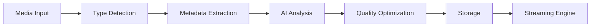

# Omega Media Server Architecture

## Overview

Omega Media Server is a revolutionary all-in-one media server solution that runs from a single Docker container while providing the functionality of 30+ separate applications. Built with 2025's latest technologies, it combines ease of use with enterprise-grade features.

## Core Design Principles

### 1. Single Container Architecture
Unlike traditional media server setups that require multiple containers orchestrated through Docker Compose, Omega runs everything in a single container using:
- **Docker-in-Docker**: For internal service isolation
- **K3s**: Lightweight Kubernetes for service orchestration
- **S6-Overlay**: For process supervision and management

### 2. Progressive Enhancement
- Basic features work immediately upon startup
- Advanced features can be enabled through the web UI
- No manual configuration files needed
- Intelligent defaults based on system detection

### 3. AI-First Design
Every component integrates AI capabilities:
- **Content Analysis**: Automatic tagging, scene detection, face recognition
- **Recommendations**: Collaborative and content-based filtering
- **Voice Control**: Natural language processing for commands
- **Predictive Optimization**: Resource allocation, caching, transcoding

## Technical Architecture

### Layer 1: Base System
```
Alpine Linux (Custom Kernel)
├── Hardware Acceleration Drivers
├── Real-time Kernel Patches
├── Network Optimizations
└── Security Hardening
```

### Layer 2: Container Runtime
```
Docker-in-Docker + K3s
├── Service Isolation
├── Resource Management
├── Auto-scaling
└── Health Monitoring
```

### Layer 3: Core Services
```
Infrastructure Services
├── Traefik (Reverse Proxy)
├── PostgreSQL (Database)
├── Redis (Cache/Queue)
├── MinIO (Object Storage)
└── RabbitMQ (Message Queue)
```

### Layer 4: Application Services
```
Media Applications
├── Streaming Servers
│   ├── Jellyfin
│   ├── Plex (Optional)
│   └── Custom 8K Engine
├── Automation Suite
│   ├── Radarr (Movies)
│   ├── Sonarr (TV)
│   ├── Lidarr (Music)
│   ├── Readarr (Books)
│   └── Prowlarr (Indexers)
├── Specialized Services
│   ├── PhotoPrism (Photos)
│   ├── Navidrome (Music)
│   ├── Calibre-Web (Books)
│   └── Audiobookshelf (Audiobooks)
└── Support Services
    ├── Tdarr (Transcoding)
    ├── Bazarr (Subtitles)
    └── Overseerr (Requests)
```

### Layer 5: Intelligence Layer
```
AI/ML Pipeline
├── TensorFlow Serving
├── PyTorch Models
├── Whisper (Speech)
├── CLIP (Vision)
└── Custom Models
    ├── Recommendation Engine
    ├── Quality Predictor
    ├── Scene Analyzer
    └── Bandwidth Optimizer
```

### Layer 6: API & Interface Layer
```
User Interfaces
├── Web Dashboard (React)
├── GraphQL API
├── REST API
├── WebSocket (Real-time)
└── gRPC (Internal)
```

## Key Innovations

### 1. Unified Media Pipeline
All media types flow through a single processing pipeline:



### 2. Intelligent Resource Management
- **Dynamic Allocation**: CPU/GPU resources allocated based on real-time demand
- **Predictive Scaling**: Anticipates load based on usage patterns
- **Quality Adaptation**: Automatic bitrate and resolution adjustment
- **Storage Tiering**: Hot/cold data separation with intelligent caching

### 3. AI-Powered Features

#### Content Understanding
- Scene detection and chapter creation
- Face recognition for photos and videos
- Object detection for content tagging
- Audio fingerprinting for music matching

#### Recommendation System
- Collaborative filtering across all users
- Content-based similarity matching
- Temporal pattern analysis (time-of-day preferences)
- Cross-media recommendations

#### Automation
- Natural language automation rules
- Predictive downloading based on viewing patterns
- Automatic quality selection
- Smart subtitle matching

### 4. Security Architecture

#### Zero-Trust Model
- No implicit trust between services
- mTLS for internal communication
- JWT tokens with short expiration
- Service mesh security policies

#### Defense in Depth
1. **Network**: WireGuard VPN, Firewall, IDS/IPS
2. **Application**: OAuth2, 2FA, Session management
3. **Data**: Encryption at rest (LUKS) and in transit (TLS 1.3)
4. **Monitoring**: Real-time threat detection, Anomaly detection

## Performance Optimizations

### 1. Streaming Performance
- **8K Support**: Hardware-accelerated decoding/encoding
- **Adaptive Streaming**: HLS/DASH with multiple quality levels
- **P2P Delivery**: Peer-assisted streaming for popular content
- **Edge Caching**: Distributed cache nodes support

### 2. AI Performance
- **Model Optimization**: Quantized models for faster inference
- **Batch Processing**: Efficient GPU utilization
- **Distributed Inference**: Multi-GPU support
- **Caching**: Inference result caching

### 3. Storage Efficiency
- **Deduplication**: Block-level dedup for space savings
- **Compression**: Automatic format optimization
- **Tiering**: SSD cache for hot data
- **Predictive Prefetch**: ML-based cache warming

## Scalability

### Horizontal Scaling
- Additional Omega instances can form a cluster
- Shared storage backend (NFS/Ceph/GlusterFS)
- Distributed transcoding workload
- Synchronized user database

### Vertical Scaling
- Automatic resource detection and utilization
- Multi-GPU support for transcoding and AI
- NUMA-aware memory allocation
- CPU affinity for critical services

## Monitoring & Observability

### Metrics Collection
- Prometheus for time-series metrics
- Grafana for visualization
- Custom dashboards for each service
- AI-powered anomaly detection

### Logging
- Centralized logging with ELK stack
- Structured logging with correlation IDs
- Log aggregation and analysis
- Automated alert generation

### Tracing
- OpenTelemetry for distributed tracing
- Request flow visualization
- Performance bottleneck identification
- Service dependency mapping

## Future Roadmap

### Near Term (Q1-Q2 2025)
- Blockchain integration for content rights
- Quantum-resistant encryption
- AR/VR streaming support
- Neural codec support

### Long Term (2025-2026)
- Holographic display support
- Brain-computer interface integration
- Fully autonomous content curation
- Distributed edge computing mesh

## Conclusion

Omega Media Server represents a paradigm shift in home media server design. By combining all services into a single, intelligent container with progressive enhancement and AI-first design, it provides an unmatched user experience while maintaining the flexibility and power that enthusiasts demand.