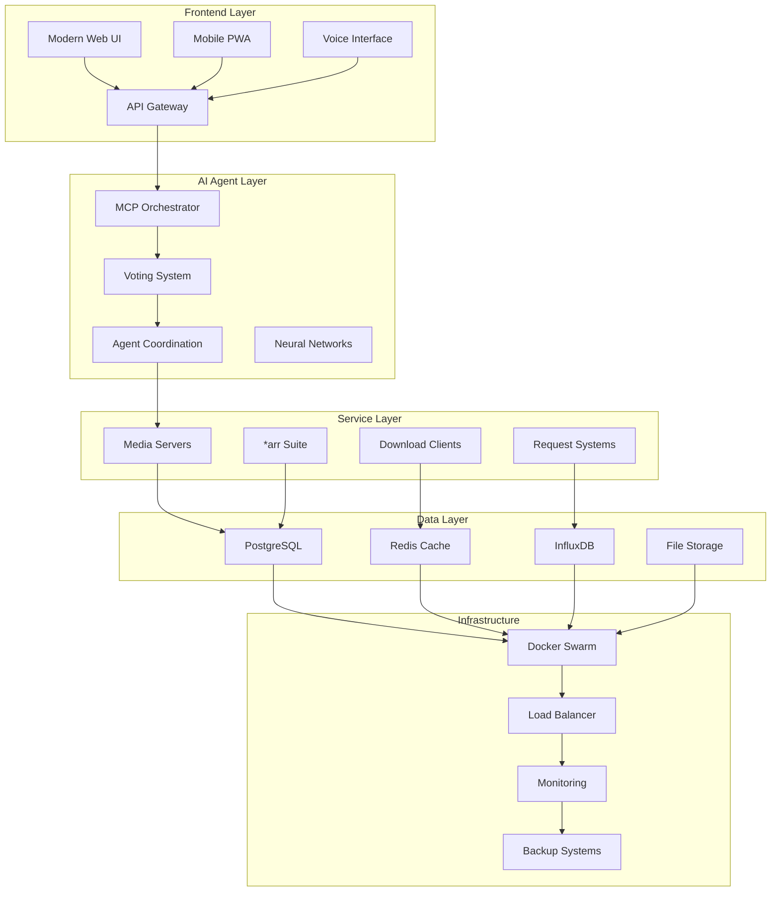

# 🏗️ Ultimate Media Server 2025 - Technical Architecture Guide

## 📋 Table of Contents
1. [System Overview](#system-overview)
2. [Architecture Patterns](#architecture-patterns)
3. [Service Layer](#service-layer)
4. [Data Architecture](#data-architecture)
5. [AI Integration](#ai-integration)
6. [Network Architecture](#network-architecture)
7. [Security Architecture](#security-architecture)
8. [Performance Architecture](#performance-architecture)
9. [Deployment Architecture](#deployment-architecture)
10. [Monitoring Architecture](#monitoring-architecture)

---

## 🌐 System Overview

### High-Level Architecture



### Core Components

#### 1. Frontend Layer
- **Modern Web UI**: Glassmorphic design with real-time updates
- **Mobile PWA**: Offline-capable progressive web application
- **Voice Interface**: Natural language processing with "Hey MediaFlow" activation
- **API Gateway**: Unified entry point with rate limiting and authentication

#### 2. AI Agent Layer
- **MCP Orchestrator**: Manages 5 specialized AI agents with democratic voting
- **Voting System**: 70% consensus threshold for intelligent decision making
- **Agent Coordination**: Real-time collaboration between specialized agents
- **Neural Networks**: Machine learning models for recommendations and optimization

#### 3. Service Layer
- **Media Servers**: Jellyfin (primary), Plex, Emby for content streaming
- ***arr Suite**: Sonarr, Radarr, Lidarr, Prowlarr for content automation
- **Download Clients**: qBittorrent, SABnzbd with VPN integration
- **Request Systems**: Overseerr, Jellyseerr for user content requests

#### 4. Data Layer
- **PostgreSQL**: Primary database for structured data
- **Redis Cache**: High-performance caching and session storage
- **InfluxDB**: Time-series data for metrics and monitoring
- **File Storage**: Distributed storage for media files and backups

---

## 🎯 Architecture Patterns

### Microservices Architecture

```yaml
# Service Decomposition
Services:
  Core:
    - api-gateway
    - mcp-orchestrator
    - voting-system
    - notification-service
  
  Media:
    - jellyfin-service
    - plex-service
    - metadata-service
    - transcoding-service
  
  Automation:
    - sonarr-service
    - radarr-service
    - prowlarr-service
    - download-manager
  
  Data:
    - user-service
    - content-service
    - analytics-service
    - backup-service
```

### Event-Driven Architecture

```javascript
// Event Flow Example
const eventFlow = {
  "content.requested": {
    triggers: ["search.initiated", "agents.consulted"],
    handlers: ["sonarr.search", "radarr.search"],
    outcomes: ["download.queued", "user.notified"]
  },
  
  "download.completed": {
    triggers: ["file.moved", "metadata.extracted"],
    handlers: ["library.refresh", "user.notified"],
    outcomes: ["content.available", "recommendations.updated"]
  },
  
  "agent.vote.cast": {
    triggers: ["question.submitted"],
    handlers: ["consensus.checked", "action.executed"],
    outcomes: ["decision.made", "learning.updated"]
  }
};
```

### CQRS (Command Query Responsibility Segregation)

```typescript
// Command Side - Write Operations
interface MediaCommand {
  execute(): Promise<void>;
}

class AddMovieCommand implements MediaCommand {
  constructor(
    private readonly movieData: MovieData,
    private readonly repository: MovieRepository
  ) {}

  async execute(): Promise<void> {
    const movie = new Movie(this.movieData);
    await this.repository.save(movie);
    
    // Publish event
    await this.eventBus.publish(
      new MovieAddedEvent(movie.id, movie.title)
    );
  }
}

// Query Side - Read Operations
interface MediaQuery {
  execute(): Promise<any>;
}

class GetMovieRecommendationsQuery implements MediaQuery {
  constructor(
    private readonly userId: string,
    private readonly readModel: MovieReadModel
  ) {}

  async execute(): Promise<Movie[]> {
    return await this.readModel.getRecommendations(this.userId);
  }
}
```

---

## 🔧 Service Layer

### Service Mesh Configuration

```yaml
# istio-config.yaml
apiVersion: networking.istio.io/v1alpha3
kind: VirtualService
metadata:
  name: mediaserver-routing
spec:
  hosts:
  - mediaserver.local
  http:
  - match:
    - uri:
        prefix: "/api/"
    route:
    - destination:
        host: api-gateway
        port:
          number: 3000
  - match:
    - uri:
        prefix: "/jellyfin/"
    route:
    - destination:
        host: jellyfin
        port:
          number: 8096
  - match:
    - uri:
        prefix: "/ai/"
    route:
    - destination:
        host: mcp-orchestrator
        port:
          number: 8090
```

### Container Orchestration

```dockerfile
# Multi-stage build for optimized containers
FROM node:20-alpine AS builder
WORKDIR /app
COPY package*.json ./
RUN npm ci --only=production

FROM node:20-alpine AS runtime
WORKDIR /app

# Security: Non-root user
RUN addgroup -g 1001 -S nodejs
RUN adduser -S mediaserver -u 1001

# Copy application
COPY --from=builder --chown=mediaserver:nodejs /app/node_modules ./node_modules
COPY --chown=mediaserver:nodejs . .

# Health check
HEALTHCHECK --interval=30s --timeout=10s --start-period=60s --retries=3 \
  CMD curl -f http://localhost:3000/health || exit 1

USER mediaserver
EXPOSE 3000

CMD ["node", "server.js"]
```

### Service Discovery

```javascript
// service-discovery.js
class ServiceDiscovery {
  constructor() {
    this.services = new Map();
    this.healthChecks = new Map();
  }

  async registerService(name, config) {
    this.services.set(name, {
      ...config,
      registeredAt: Date.now(),
      healthy: false
    });

    // Start health checking
    this.startHealthCheck(name);
  }

  async discoverService(name) {
    const service = this.services.get(name);
    if (!service || !service.healthy) {
      throw new Error(`Service ${name} not available`);
    }
    return service;
  }

  async startHealthCheck(name) {
    const service = this.services.get(name);
    
    setInterval(async () => {
      try {
        const response = await fetch(`${service.url}/health`);
        service.healthy = response.ok;
        service.lastHealthCheck = Date.now();
      } catch (error) {
        service.healthy = false;
        console.error(`Health check failed for ${name}:`, error);
      }
    }, 30000); // 30 second intervals
  }
}
```

---

## 🗄️ Data Architecture

### Database Schema Design

```sql
-- Core Tables
CREATE TABLE users (
    id UUID PRIMARY KEY DEFAULT gen_random_uuid(),
    username VARCHAR(50) UNIQUE NOT NULL,
    email VARCHAR(255) UNIQUE NOT NULL,
    password_hash VARCHAR(255) NOT NULL,
    preferences JSONB DEFAULT '{}',
    created_at TIMESTAMP DEFAULT CURRENT_TIMESTAMP,
    updated_at TIMESTAMP DEFAULT CURRENT_TIMESTAMP
);

CREATE TABLE media_items (
    id UUID PRIMARY KEY DEFAULT gen_random_uuid(),
    type VARCHAR(20) NOT NULL, -- 'movie', 'tv_show', 'episode'
    title VARCHAR(255) NOT NULL,
    year INTEGER,
    imdb_id VARCHAR(20),
    tmdb_id INTEGER,
    metadata JSONB DEFAULT '{}',
    file_path TEXT,
    file_size BIGINT,
    quality VARCHAR(20),
    created_at TIMESTAMP DEFAULT CURRENT_TIMESTAMP,
    updated_at TIMESTAMP DEFAULT CURRENT_TIMESTAMP
);

CREATE TABLE user_activity (
    id UUID PRIMARY KEY DEFAULT gen_random_uuid(),
    user_id UUID REFERENCES users(id),
    media_id UUID REFERENCES media_items(id),
    activity_type VARCHAR(20) NOT NULL, -- 'watched', 'rated', 'requested'
    metadata JSONB DEFAULT '{}',
    timestamp TIMESTAMP DEFAULT CURRENT_TIMESTAMP
);

CREATE TABLE agent_decisions (
    id UUID PRIMARY KEY DEFAULT gen_random_uuid(),
    question TEXT NOT NULL,
    context JSONB DEFAULT '{}',
    votes JSONB NOT NULL, -- {"agent_name": {"vote": "yes", "confidence": 0.8}}
    consensus VARCHAR(10), -- 'yes', 'no', 'neutral'
    confidence DECIMAL(3,2),
    action_taken TEXT,
    created_at TIMESTAMP DEFAULT CURRENT_TIMESTAMP
);

-- Indexes for performance
CREATE INDEX idx_media_items_type ON media_items(type);
CREATE INDEX idx_media_items_year ON media_items(year);
CREATE INDEX idx_user_activity_user_id ON user_activity(user_id);
CREATE INDEX idx_user_activity_timestamp ON user_activity(timestamp);
CREATE INDEX idx_agent_decisions_created_at ON agent_decisions(created_at);
```

### Data Partitioning Strategy

```sql
-- Partition user_activity by month for performance
CREATE TABLE user_activity_2025_01 PARTITION OF user_activity
    FOR VALUES FROM ('2025-01-01') TO ('2025-02-01');

CREATE TABLE user_activity_2025_02 PARTITION OF user_activity
    FOR VALUES FROM ('2025-02-01') TO ('2025-03-01');

-- Automatic partition creation
CREATE OR REPLACE FUNCTION create_monthly_partition()
RETURNS void AS $$
DECLARE
    start_date DATE;
    end_date DATE;
    table_name TEXT;
BEGIN
    start_date := date_trunc('month', CURRENT_DATE + INTERVAL '1 month');
    end_date := start_date + INTERVAL '1 month';
    table_name := 'user_activity_' || to_char(start_date, 'YYYY_MM');
    
    EXECUTE format('CREATE TABLE %I PARTITION OF user_activity FOR VALUES FROM (%L) TO (%L)',
                   table_name, start_date, end_date);
END;
$$ LANGUAGE plpgsql;

-- Schedule partition creation
SELECT cron.schedule('create-partition', '0 0 25 * *', 'SELECT create_monthly_partition();');
```

### Caching Strategy

```javascript
// redis-client.js
class RedisClient {
  constructor() {
    this.client = redis.createClient({
      host: process.env.REDIS_HOST || 'localhost',
      port: process.env.REDIS_PORT || 6379,
      password: process.env.REDIS_PASSWORD,
      retry_strategy: (options) => {
        if (options.error && options.error.code === 'ECONNREFUSED') {
          return new Error('Redis server refused connection');
        }
        if (options.total_retry_time > 1000 * 60 * 60) {
          return new Error('Retry time exhausted');
        }
        if (options.attempt > 10) {
          return undefined;
        }
        return Math.min(options.attempt * 100, 3000);
      }
    });
  }

  // Multi-level caching
  async get(key, options = {}) {
    const { ttl = 3600, fallback } = options;
    
    // L1: Memory cache (if available)
    if (this.memoryCache && this.memoryCache.has(key)) {
      return this.memoryCache.get(key);
    }
    
    // L2: Redis cache
    const cached = await this.client.get(key);
    if (cached) {
      const data = JSON.parse(cached);
      
      // Store in L1 cache
      if (this.memoryCache) {
        this.memoryCache.set(key, data, { ttl: 300 }); // 5 min L1 TTL
      }
      
      return data;
    }
    
    // L3: Fallback to source
    if (fallback) {
      const data = await fallback();
      await this.set(key, data, ttl);
      return data;
    }
    
    return null;
  }

  async set(key, value, ttl = 3600) {
    const serialized = JSON.stringify(value);
    
    // Store in Redis
    await this.client.setex(key, ttl, serialized);
    
    // Store in L1 cache
    if (this.memoryCache) {
      this.memoryCache.set(key, value, { ttl: Math.min(ttl, 300) });
    }
  }

  // Cache patterns
  async cacheAside(key, fetcher, ttl = 3600) {
    return this.get(key, { ttl, fallback: fetcher });
  }

  async writeThrough(key, value, ttl = 3600) {
    // Write to cache and database simultaneously
    await Promise.all([
      this.set(key, value, ttl),
      this.persistToDatabase(key, value)
    ]);
  }

  async writeBehind(key, value, ttl = 3600) {
    // Write to cache immediately, database later
    await this.set(key, value, ttl);
    
    // Queue for background database write
    this.writeQueue.push({ key, value, timestamp: Date.now() });
  }
}
```

---

## 🤖 AI Integration

### MCP Server Architecture

```typescript
// mcp-server-base.ts
abstract class MCPServerBase {
  protected tools: Map<string, Tool> = new Map();
  protected resources: Map<string, Resource> = new Map();
  
  constructor(
    protected name: string,
    protected version: string,
    protected port: number
  ) {}

  abstract initialize(): Promise<void>;
  
  // HTTP transport layer
  setupHTTPTransport() {
    const app = express();
    app.use(express.json());
    app.use(cors());
    app.use(helmet());
    
    // Health check
    app.get('/health', (req, res) => {
      res.json({ status: 'healthy', server: this.name, version: this.version });
    });
    
    // Server info
    app.get('/info', (req, res) => {
      res.json({
        name: this.name,
        version: this.version,
        tools: Array.from(this.tools.keys()),
        resources: Array.from(this.resources.keys())
      });
    });
    
    // Tool execution
    app.post('/call/:toolName', async (req, res) => {
      try {
        const tool = this.tools.get(req.params.toolName);
        if (!tool) {
          return res.status(404).json({ error: 'Tool not found' });
        }
        
        const result = await tool.execute(req.body.arguments || {});
        res.json({ result });
      } catch (error) {
        res.status(500).json({ error: error.message });
      }
    });
    
    // Server-Sent Events for real-time updates
    app.get('/events', (req, res) => {
      res.writeHead(200, {
        'Content-Type': 'text/event-stream',
        'Cache-Control': 'no-cache',
        'Connection': 'keep-alive'
      });
      
      const clientId = Date.now();
      this.addSSEClient(clientId, res);
      
      req.on('close', () => {
        this.removeSSEClient(clientId);
      });
    });
    
    app.listen(this.port, () => {
      console.log(`${this.name} MCP server listening on port ${this.port}`);
    });
  }
  
  // SSE client management
  private sseClients: Map<number, Response> = new Map();
  
  addSSEClient(id: number, res: Response) {
    this.sseClients.set(id, res);
    res.write(`data: ${JSON.stringify({ type: 'connected', server: this.name })}\n\n`);
  }
  
  removeSSEClient(id: number) {
    this.sseClients.delete(id);
  }
  
  broadcastEvent(event: any) {
    const data = `data: ${JSON.stringify(event)}\n\n`;
    this.sseClients.forEach(client => {
      try {
        client.write(data);
      } catch (error) {
        console.error('Error broadcasting to SSE client:', error);
      }
    });
  }
}
```

### Agent Voting System

```typescript
// voting-system.ts
interface AgentVote {
  agent: string;
  vote: 'yes' | 'no' | 'neutral';
  confidence: number; // 0-1
  reasoning: string;
  timestamp: Date;
}

interface VotingQuestion {
  id: string;
  question: string;
  context: Record<string, any>;
  requiredConsensus: number; // 0-1
  timeout: number; // milliseconds
}

class VotingSystem {
  private activeVotes: Map<string, {
    question: VotingQuestion;
    votes: AgentVote[];
    startTime: Date;
  }> = new Map();
  
  private agents: Map<string, Agent> = new Map();
  
  async submitQuestion(question: VotingQuestion): Promise<string> {
    const votingSession = {
      question,
      votes: [],
      startTime: new Date()
    };
    
    this.activeVotes.set(question.id, votingSession);
    
    // Notify all agents
    await this.notifyAgents(question);
    
    // Set timeout
    setTimeout(() => {
      this.processTimeout(question.id);
    }, question.timeout);
    
    return question.id;
  }
  
  async castVote(questionId: string, vote: AgentVote): Promise<void> {
    const session = this.activeVotes.get(questionId);
    if (!session) {
      throw new Error('Voting session not found');
    }
    
    // Remove any existing vote from this agent
    session.votes = session.votes.filter(v => v.agent !== vote.agent);
    
    // Add new vote
    session.votes.push(vote);
    
    // Check for consensus
    await this.checkConsensus(questionId);
  }
  
  private async checkConsensus(questionId: string): Promise<void> {
    const session = this.activeVotes.get(questionId);
    if (!session) return;
    
    const { question, votes } = session;
    const totalAgents = this.agents.size;
    
    // Check if we have enough votes
    if (votes.length < totalAgents * 0.6) { // At least 60% participation
      return;
    }
    
    // Calculate consensus
    const yesVotes = votes.filter(v => v.vote === 'yes');
    const noVotes = votes.filter(v => v.vote === 'no');
    const neutralVotes = votes.filter(v => v.vote === 'neutral');
    
    const yesPercentage = yesVotes.length / votes.length;
    const noPercentage = noVotes.length / votes.length;
    
    let decision: 'yes' | 'no' | 'no_consensus' = 'no_consensus';
    let confidence = 0;
    
    if (yesPercentage >= question.requiredConsensus) {
      decision = 'yes';
      confidence = this.calculateConfidence(yesVotes);
    } else if (noPercentage >= question.requiredConsensus) {
      decision = 'no';
      confidence = this.calculateConfidence(noVotes);
    }
    
    // Execute decision
    await this.executeDecision(questionId, decision, confidence, votes);
    
    // Clean up
    this.activeVotes.delete(questionId);
  }
  
  private calculateConfidence(votes: AgentVote[]): number {
    if (votes.length === 0) return 0;
    
    // Weighted average of confidence scores
    const totalConfidence = votes.reduce((sum, vote) => sum + vote.confidence, 0);
    return totalConfidence / votes.length;
  }
  
  private async executeDecision(
    questionId: string,
    decision: string,
    confidence: number,
    votes: AgentVote[]
  ): Promise<void> {
    const session = this.activeVotes.get(questionId);
    if (!session) return;
    
    const result = {
      questionId,
      question: session.question.question,
      decision,
      confidence,
      votes,
      timestamp: new Date()
    };
    
    // Store decision in database
    await this.storeDecision(result);
    
    // Notify stakeholders
    await this.notifyDecision(result);
    
    // Execute any automated actions
    if (decision === 'yes' && confidence > 0.7) {
      await this.executeAutomatedAction(session.question.context);
    }
  }
  
  private async notifyAgents(question: VotingQuestion): Promise<void> {
    const promises = Array.from(this.agents.values()).map(agent => 
      agent.requestVote(question).catch(error => 
        console.error(`Failed to notify agent ${agent.name}:`, error)
      )
    );
    
    await Promise.allSettled(promises);
  }
}
```

### Machine Learning Pipeline

```python
# ml/pipeline.py
import pandas as pd
import numpy as np
from sklearn.model_selection import train_test_split
from sklearn.ensemble import RandomForestClassifier
from sklearn.metrics import accuracy_score, classification_report
import joblib
import mlflow
import mlflow.sklearn
from typing import Dict, List, Tuple

class MLPipeline:
    def __init__(self, model_name: str):
        self.model_name = model_name
        self.model = None
        self.feature_columns = []
        self.target_column = None
        
    def prepare_data(self, df: pd.DataFrame, target_col: str) -> Tuple[np.ndarray, np.ndarray]:
        """Prepare data for training"""
        # Handle missing values
        df_clean = df.fillna(df.mean(numeric_only=True))
        
        # Encode categorical variables
        categorical_columns = df_clean.select_dtypes(include=['object']).columns
        df_encoded = pd.get_dummies(df_clean, columns=categorical_columns, drop_first=True)
        
        # Separate features and target
        X = df_encoded.drop(columns=[target_col])
        y = df_encoded[target_col]
        
        self.feature_columns = X.columns.tolist()
        self.target_column = target_col
        
        return X.values, y.values
    
    def train(self, X: np.ndarray, y: np.ndarray, test_size: float = 0.2) -> Dict:
        """Train the model"""
        X_train, X_test, y_train, y_test = train_test_split(
            X, y, test_size=test_size, random_state=42, stratify=y
        )
        
        # Start MLflow run
        with mlflow.start_run(run_name=f"{self.model_name}_training"):
            # Initialize model
            self.model = RandomForestClassifier(
                n_estimators=100,
                max_depth=10,
                min_samples_split=5,
                min_samples_leaf=2,
                random_state=42
            )
            
            # Train model
            self.model.fit(X_train, y_train)
            
            # Make predictions
            y_pred = self.model.predict(X_test)
            
            # Calculate metrics
            accuracy = accuracy_score(y_test, y_pred)
            report = classification_report(y_test, y_pred, output_dict=True)
            
            # Log parameters and metrics
            mlflow.log_param("model_type", "RandomForest")
            mlflow.log_param("n_estimators", 100)
            mlflow.log_param("max_depth", 10)
            mlflow.log_metric("accuracy", accuracy)
            mlflow.log_metric("precision", report['weighted avg']['precision'])
            mlflow.log_metric("recall", report['weighted avg']['recall'])
            mlflow.log_metric("f1_score", report['weighted avg']['f1-score'])
            
            # Log model
            mlflow.sklearn.log_model(
                self.model, 
                "model",
                registered_model_name=self.model_name
            )
            
            return {
                "accuracy": accuracy,
                "classification_report": report,
                "feature_importance": dict(zip(
                    self.feature_columns, 
                    self.model.feature_importances_
                ))
            }
    
    def predict(self, X: np.ndarray) -> np.ndarray:
        """Make predictions"""
        if self.model is None:
            raise ValueError("Model not trained yet")
        return self.model.predict(X)
    
    def predict_proba(self, X: np.ndarray) -> np.ndarray:
        """Get prediction probabilities"""
        if self.model is None:
            raise ValueError("Model not trained yet")
        return self.model.predict_proba(X)
    
    def save_model(self, filepath: str):
        """Save model to disk"""
        if self.model is None:
            raise ValueError("Model not trained yet")
            
        model_data = {
            'model': self.model,
            'feature_columns': self.feature_columns,
            'target_column': self.target_column,
            'model_name': self.model_name
        }
        
        joblib.dump(model_data, filepath)
    
    def load_model(self, filepath: str):
        """Load model from disk"""
        model_data = joblib.load(filepath)
        
        self.model = model_data['model']
        self.feature_columns = model_data['feature_columns']
        self.target_column = model_data['target_column']
        self.model_name = model_data['model_name']
    
    def explain_prediction(self, X: np.ndarray, index: int = 0) -> Dict:
        """Explain a single prediction using SHAP or feature importance"""
        if self.model is None:
            raise ValueError("Model not trained yet")
            
        # Get feature importance for this prediction
        feature_values = X[index]
        feature_importance = self.model.feature_importances_
        
        # Create explanation
        explanation = []
        for i, (feature, value, importance) in enumerate(
            zip(self.feature_columns, feature_values, feature_importance)
        ):
            explanation.append({
                'feature': feature,
                'value': value,
                'importance': importance,
                'contribution': value * importance
            })
        
        # Sort by contribution
        explanation.sort(key=lambda x: abs(x['contribution']), reverse=True)
        
        return {
            'prediction': self.predict(X[index:index+1])[0],
            'probability': self.predict_proba(X[index:index+1])[0].tolist(),
            'explanation': explanation[:10]  # Top 10 features
        }
```

---

## 🌐 Network Architecture

### Load Balancing Strategy

```nginx
# nginx.conf - Advanced load balancing
upstream jellyfin_backend {
    # Weighted round-robin with health checks
    server jellyfin-1:8096 weight=3 max_fails=3 fail_timeout=30s;
    server jellyfin-2:8096 weight=2 max_fails=3 fail_timeout=30s;
    server jellyfin-3:8096 weight=1 max_fails=3 fail_timeout=30s backup;
    
    # Connection pooling
    keepalive 32;
    keepalive_requests 1000;
    keepalive_timeout 60s;
}

upstream api_backend {
    # Least connections for API requests
    least_conn;
    server api-1:3000 max_fails=2 fail_timeout=10s;
    server api-2:3000 max_fails=2 fail_timeout=10s;
    server api-3:3000 max_fails=2 fail_timeout=10s;
}

upstream websocket_backend {
    # IP hash for sticky sessions (WebSocket)
    ip_hash;
    server ws-1:3001;
    server ws-2:3001;
    server ws-3:3001;
}

# Rate limiting zones
limit_req_zone $binary_remote_addr zone=api:10m rate=100r/m;
limit_req_zone $binary_remote_addr zone=auth:10m rate=5r/m;
limit_req_zone $binary_remote_addr zone=download:10m rate=10r/m;

server {
    listen 443 ssl http2;
    server_name mediaserver.local;
    
    # SSL configuration
    ssl_certificate /etc/ssl/certs/mediaserver.crt;
    ssl_certificate_key /etc/ssl/private/mediaserver.key;
    ssl_protocols TLSv1.2 TLSv1.3;
    ssl_ciphers ECDHE-RSA-AES128-GCM-SHA256:ECDHE-RSA-AES256-GCM-SHA384;
    ssl_prefer_server_ciphers off;
    
    # Security headers
    add_header Strict-Transport-Security "max-age=63072000; includeSubDomains; preload";
    add_header X-Frame-Options DENY;
    add_header X-Content-Type-Options nosniff;
    add_header X-XSS-Protection "1; mode=block";
    
    # Compression
    gzip on;
    gzip_vary on;
    gzip_min_length 10240;
    gzip_proxied expired no-cache no-store private must-revalidate auth;
    gzip_types text/plain text/css text/xml text/javascript 
               application/javascript application/xml+rss application/json;
    
    # API endpoints with rate limiting
    location /api/ {
        limit_req zone=api burst=20 nodelay;
        proxy_pass http://api_backend;
        proxy_set_header Host $host;
        proxy_set_header X-Real-IP $remote_addr;
        proxy_set_header X-Forwarded-For $proxy_add_x_forwarded_for;
        proxy_set_header X-Forwarded-Proto $scheme;
    }
    
    # Authentication endpoints with stricter rate limiting
    location /api/auth/ {
        limit_req zone=auth burst=3 nodelay;
        proxy_pass http://api_backend;
        proxy_set_header Host $host;
        proxy_set_header X-Real-IP $remote_addr;
        proxy_set_header X-Forwarded-For $proxy_add_x_forwarded_for;
        proxy_set_header X-Forwarded-Proto $scheme;
    }
    
    # WebSocket endpoints
    location /ws/ {
        proxy_pass http://websocket_backend;
        proxy_http_version 1.1;
        proxy_set_header Upgrade $http_upgrade;
        proxy_set_header Connection "upgrade";
        proxy_set_header Host $host;
        proxy_set_header X-Real-IP $remote_addr;
        proxy_set_header X-Forwarded-For $proxy_add_x_forwarded_for;
        proxy_set_header X-Forwarded-Proto $scheme;
        
        # WebSocket specific timeouts
        proxy_read_timeout 86400s;
        proxy_send_timeout 86400s;
    }
    
    # Media streaming with caching
    location /jellyfin/ {
        proxy_pass http://jellyfin_backend;
        proxy_set_header Host $host;
        proxy_set_header X-Real-IP $remote_addr;
        proxy_set_header X-Forwarded-For $proxy_add_x_forwarded_for;
        proxy_set_header X-Forwarded-Proto $scheme;
        
        # Streaming optimizations
        proxy_buffering off;
        proxy_request_buffering off;
        proxy_max_temp_file_size 0;
        
        # Cache static assets
        location ~* \.(css|js|png|jpg|jpeg|gif|ico|svg)$ {
            expires 1y;
            add_header Cache-Control "public, immutable";
        }
    }
    
    # Static file serving with aggressive caching
    location /static/ {
        alias /var/www/static/;
        expires 1y;
        add_header Cache-Control "public, immutable";
        
        # Serve WebP images when supported
        location ~* \.(png|jpg|jpeg)$ {
            add_header Vary Accept;
            try_files $uri$webp_suffix $uri =404;
        }
    }
}

# Health check endpoint for load balancer
server {
    listen 8080;
    location /health {
        access_log off;
        return 200 "healthy\n";
        add_header Content-Type text/plain;
    }
}
```

### CDN Integration

```javascript
// cdn-manager.js
class CDNManager {
  constructor() {
    this.providers = {
      cloudflare: new CloudflareProvider(),
      aws: new AWSCloudFrontProvider(),
      azure: new AzureCDNProvider()
    };
    
    this.activeProvider = process.env.CDN_PROVIDER || 'cloudflare';
  }
  
  async uploadAsset(filePath, contentType, metadata = {}) {
    const provider = this.providers[this.activeProvider];
    
    // Optimize based on content type
    const optimizedFile = await this.optimizeContent(filePath, contentType);
    
    // Upload to CDN
    const cdnUrl = await provider.upload(optimizedFile, {
      contentType,
      metadata: {
        ...metadata,
        'cache-control': this.getCacheControl(contentType),
        'x-content-type-override': contentType
      }
    });
    
    // Update CDN mappings
    await this.updateCDNMapping(filePath, cdnUrl);
    
    return cdnUrl;
  }
  
  async optimizeContent(filePath, contentType) {
    switch (contentType) {
      case 'image/jpeg':
      case 'image/png':
        return await this.optimizeImage(filePath);
      case 'video/mp4':
        return await this.optimizeVideo(filePath);
      case 'text/css':
      case 'application/javascript':
        return await this.minifyAsset(filePath);
      default:
        return filePath;
    }
  }
  
  async optimizeImage(filePath) {
    const sharp = require('sharp');
    const path = require('path');
    
    const outputPath = path.join(
      path.dirname(filePath),
      'optimized_' + path.basename(filePath)
    );
    
    await sharp(filePath)
      .resize(1920, 1080, { 
        fit: 'inside',
        withoutEnlargement: true 
      })
      .jpeg({ 
        quality: 85, 
        progressive: true 
      })
      .toFile(outputPath);
    
    return outputPath;
  }
  
  getCacheControl(contentType) {
    const cacheStrategies = {
      'image/': 'public, max-age=31536000, immutable', // 1 year
      'video/': 'public, max-age=31536000, immutable', // 1 year
      'text/css': 'public, max-age=31536000, immutable', // 1 year
      'application/javascript': 'public, max-age=31536000, immutable', // 1 year
      'text/html': 'public, max-age=3600', // 1 hour
      'application/json': 'public, max-age=300' // 5 minutes
    };
    
    for (const [type, cacheControl] of Object.entries(cacheStrategies)) {
      if (contentType.startsWith(type)) {
        return cacheControl;
      }
    }
    
    return 'public, max-age=3600'; // Default 1 hour
  }
}
```

---

## 🔒 Security Architecture

### Zero Trust Network Model

```yaml
# zero-trust-policy.yaml
apiVersion: security.istio.io/v1beta1
kind: AuthorizationPolicy
metadata:
  name: mediaserver-authz
  namespace: mediaserver
spec:
  rules:
  # Public endpoints
  - to:
    - operation:
        methods: ["GET"]
        paths: ["/health", "/status"]
  
  # Authenticated API access
  - to:
    - operation:
        methods: ["GET", "POST"]
        paths: ["/api/*"]
    when:
    - key: request.auth.claims[sub]
      values: ["*"]
  
  # Admin-only operations
  - to:
    - operation:
        methods: ["PUT", "DELETE"]
        paths: ["/api/admin/*"]
    when:
    - key: request.auth.claims[role]
      values: ["admin"]
  
  # Inter-service communication
  - to:
    - operation:
        methods: ["*"]
    from:
    - source:
        principals: ["cluster.local/ns/mediaserver/sa/mediaserver-service"]
---
apiVersion: security.istio.io/v1beta1
kind: PeerAuthentication
metadata:
  name: mediaserver-mtls
  namespace: mediaserver
spec:
  mtls:
    mode: STRICT
```

### Secrets Management

```javascript
// secrets-manager.js
const { SecretManagerServiceClient } = require('@google-cloud/secret-manager');
const AWS = require('aws-sdk');
const { DefaultAzureCredential } = require('@azure/identity');
const { SecretClient } = require('@azure/keyvault-secrets');

class SecretsManager {
  constructor(provider = 'vault') {
    this.provider = provider;
    this.clients = {};
    this.cache = new Map();
    this.initializeProvider();
  }
  
  initializeProvider() {
    switch (this.provider) {
      case 'gcp':
        this.clients.gcp = new SecretManagerServiceClient();
        break;
      case 'aws':
        this.clients.aws = new AWS.SecretsManager({
          region: process.env.AWS_REGION || 'us-east-1'
        });
        break;
      case 'azure':
        const credential = new DefaultAzureCredential();
        this.clients.azure = new SecretClient(
          process.env.AZURE_KEYVAULT_URL,
          credential
        );
        break;
      case 'vault':
        this.clients.vault = require('node-vault')({
          apiVersion: 'v1',
          endpoint: process.env.VAULT_ADDR || 'http://localhost:8200',
          token: process.env.VAULT_TOKEN
        });
        break;
    }
  }
  
  async getSecret(secretName, version = 'latest') {
    const cacheKey = `${secretName}:${version}`;
    
    // Check cache first
    if (this.cache.has(cacheKey)) {
      const cached = this.cache.get(cacheKey);
      if (Date.now() - cached.timestamp < 300000) { // 5 min cache
        return cached.value;
      }
    }
    
    let secretValue;
    
    try {
      switch (this.provider) {
        case 'gcp':
          const [gcpResponse] = await this.clients.gcp.accessSecretVersion({
            name: `projects/${process.env.GCP_PROJECT}/secrets/${secretName}/versions/${version}`
          });
          secretValue = gcpResponse.payload.data.toString();
          break;
          
        case 'aws':
          const awsResponse = await this.clients.aws.getSecretValue({
            SecretId: secretName,
            VersionStage: version === 'latest' ? 'AWSCURRENT' : version
          }).promise();
          secretValue = awsResponse.SecretString;
          break;
          
        case 'azure':
          const azureResponse = await this.clients.azure.getSecret(secretName, { version });
          secretValue = azureResponse.value;
          break;
          
        case 'vault':
          const vaultResponse = await this.clients.vault.read(`secret/data/${secretName}`);
          secretValue = vaultResponse.data.data.value;
          break;
          
        default:
          throw new Error(`Unsupported secrets provider: ${this.provider}`);
      }
      
      // Cache the secret
      this.cache.set(cacheKey, {
        value: secretValue,
        timestamp: Date.now()
      });
      
      return secretValue;
      
    } catch (error) {
      console.error(`Failed to retrieve secret ${secretName}:`, error);
      throw error;
    }
  }
  
  async setSecret(secretName, secretValue, metadata = {}) {
    try {
      switch (this.provider) {
        case 'gcp':
          await this.clients.gcp.addSecretVersion({
            parent: `projects/${process.env.GCP_PROJECT}/secrets/${secretName}`,
            payload: {
              data: Buffer.from(secretValue)
            }
          });
          break;
          
        case 'aws':
          await this.clients.aws.putSecretValue({
            SecretId: secretName,
            SecretString: secretValue
          }).promise();
          break;
          
        case 'azure':
          await this.clients.azure.setSecret(secretName, secretValue);
          break;
          
        case 'vault':
          await this.clients.vault.write(`secret/data/${secretName}`, {
            data: { value: secretValue, ...metadata }
          });
          break;
      }
      
      // Invalidate cache
      const keysToDelete = Array.from(this.cache.keys())
        .filter(key => key.startsWith(`${secretName}:`));
      keysToDelete.forEach(key => this.cache.delete(key));
      
    } catch (error) {
      console.error(`Failed to set secret ${secretName}:`, error);
      throw error;
    }
  }
  
  async rotateSecret(secretName, generator) {
    try {
      // Generate new secret
      const newSecret = await generator();
      
      // Test new secret (if test function provided)
      if (generator.test) {
        await generator.test(newSecret);
      }
      
      // Store new secret
      await this.setSecret(secretName, newSecret, {
        rotated_at: new Date().toISOString(),
        rotated_by: 'system'
      });
      
      console.log(`Successfully rotated secret: ${secretName}`);
      
    } catch (error) {
      console.error(`Failed to rotate secret ${secretName}:`, error);
      throw error;
    }
  }
  
  // Automatic secret rotation
  scheduleRotation(secretName, generator, intervalDays = 30) {
    const intervalMs = intervalDays * 24 * 60 * 60 * 1000;
    
    setInterval(async () => {
      try {
        await this.rotateSecret(secretName, generator);
      } catch (error) {
        console.error(`Scheduled rotation failed for ${secretName}:`, error);
      }
    }, intervalMs);
  }
}

// Usage example
const secretsManager = new SecretsManager('vault');

// Get database password
const dbPassword = await secretsManager.getSecret('postgres-password');

// Rotate API key every 30 days
secretManager.scheduleRotation('openai-api-key', async () => {
  // Generate new API key logic here
  return generateNewAPIKey();
}, 30);
```

---

## 📊 Performance Architecture

### Performance Monitoring Stack

```yaml
# monitoring-stack.yaml
apiVersion: v1
kind: ConfigMap
metadata:
  name: prometheus-config
data:
  prometheus.yml: |
    global:
      scrape_interval: 15s
      evaluation_interval: 15s
    
    rule_files:
      - "alert_rules.yml"
    
    scrape_configs:
      # Application metrics
      - job_name: 'mediaserver-api'
        static_configs:
          - targets: ['api-service:3000']
        metrics_path: /metrics
        scrape_interval: 5s
      
      # Container metrics
      - job_name: 'cadvisor'
        static_configs:
          - targets: ['cadvisor:8080']
        scrape_interval: 10s
      
      # Node metrics
      - job_name: 'node-exporter'
        static_configs:
          - targets: ['node-exporter:9100']
        scrape_interval: 10s
      
      # Custom application metrics
      - job_name: 'jellyfin-exporter'
        static_configs:
          - targets: ['jellyfin-exporter:9090']
        scrape_interval: 30s
      
      # Database metrics
      - job_name: 'postgres-exporter'
        static_configs:
          - targets: ['postgres-exporter:9187']
        scrape_interval: 10s
      
      # Redis metrics
      - job_name: 'redis-exporter'
        static_configs:
          - targets: ['redis-exporter:9121']
        scrape_interval: 10s
    
    alerting:
      alertmanagers:
        - static_configs:
            - targets: ['alertmanager:9093']
  
  alert_rules.yml: |
    groups:
      - name: mediaserver.rules
        rules:
          # High CPU usage
          - alert: HighCPUUsage
            expr: 100 - (avg by(instance) (irate(node_cpu_seconds_total{mode="idle"}[5m])) * 100) > 80
            for: 5m
            labels:
              severity: warning
            annotations:
              summary: "High CPU usage detected"
              description: "CPU usage is above 80% for more than 5 minutes"
          
          # High memory usage
          - alert: HighMemoryUsage
            expr: (node_memory_MemTotal_bytes - node_memory_MemAvailable_bytes) / node_memory_MemTotal_bytes * 100 > 85
            for: 5m
            labels:
              severity: warning
            annotations:
              summary: "High memory usage detected"
              description: "Memory usage is above 85% for more than 5 minutes"
          
          # Disk space low
          - alert: DiskSpaceLow
            expr: (node_filesystem_avail_bytes / node_filesystem_size_bytes) * 100 < 10
            for: 2m
            labels:
              severity: critical
            annotations:
              summary: "Disk space critically low"
              description: "Disk space is below 10%"
          
          # Service down
          - alert: ServiceDown
            expr: up == 0
            for: 1m
            labels:
              severity: critical
            annotations:
              summary: "Service is down"
              description: "{{ $labels.job }} service is not responding"
          
          # High response time
          - alert: HighResponseTime
            expr: histogram_quantile(0.95, rate(http_request_duration_seconds_bucket[5m])) > 1
            for: 5m
            labels:
              severity: warning
            annotations:
              summary: "High response time detected"
              description: "95th percentile response time is above 1 second"
---
apiVersion: apps/v1
kind: Deployment
metadata:
  name: prometheus
spec:
  replicas: 1
  selector:
    matchLabels:
      app: prometheus
  template:
    metadata:
      labels:
        app: prometheus
    spec:
      containers:
      - name: prometheus
        image: prom/prometheus:latest
        ports:
        - containerPort: 9090
        volumeMounts:
        - name: config
          mountPath: /etc/prometheus
        - name: storage
          mountPath: /prometheus
        args:
          - '--config.file=/etc/prometheus/prometheus.yml'
          - '--storage.tsdb.path=/prometheus'
          - '--web.console.libraries=/etc/prometheus/console_libraries'
          - '--web.console.templates=/etc/prometheus/consoles'
          - '--storage.tsdb.retention.time=15d'
          - '--web.enable-lifecycle'
      volumes:
      - name: config
        configMap:
          name: prometheus-config
      - name: storage
        persistentVolumeClaim:
          claimName: prometheus-storage
```

### Custom Metrics Collection

```javascript
// metrics-collector.js
const prometheus = require('prom-client');
const express = require('express');
const { createProxyMiddleware } = require('http-proxy-middleware');

class MetricsCollector {
  constructor() {
    // Create a Registry
    this.register = new prometheus.Registry();
    
    // Add default metrics
    prometheus.collectDefaultMetrics({ register: this.register });
    
    // Custom metrics
    this.httpDuration = new prometheus.Histogram({
      name: 'http_request_duration_seconds',
      help: 'Duration of HTTP requests in seconds',
      labelNames: ['method', 'route', 'status_code'],
      buckets: [0.1, 0.3, 0.5, 0.7, 1, 3, 5, 7, 10]
    });
    
    this.httpRequests = new prometheus.Counter({
      name: 'http_requests_total',
      help: 'Total number of HTTP requests',
      labelNames: ['method', 'route', 'status_code']
    });
    
    this.activeUsers = new prometheus.Gauge({
      name: 'active_users_total',
      help: 'Number of currently active users',
      labelNames: ['service']
    });
    
    this.mediaLibrarySize = new prometheus.Gauge({
      name: 'media_library_size_bytes',
      help: 'Total size of media library in bytes',
      labelNames: ['type'] // movie, tv, music
    });
    
    this.downloadSpeed = new prometheus.Gauge({
      name: 'download_speed_bytes_per_second',
      help: 'Current download speed in bytes per second'
    });
    
    this.streamingSessions = new prometheus.Gauge({
      name: 'streaming_sessions_active',
      help: 'Number of active streaming sessions',
      labelNames: ['quality', 'client_type']
    });
    
    this.agentVotes = new prometheus.Counter({
      name: 'agent_votes_total',
      help: 'Total number of agent votes cast',
      labelNames: ['agent', 'vote_type']
    });
    
    this.agentConsensus = new prometheus.Histogram({
      name: 'agent_consensus_time_seconds',
      help: 'Time taken to reach consensus in seconds',
      buckets: [1, 5, 10, 30, 60, 300]
    });
    
    // Register custom metrics
    this.register.registerMetric(this.httpDuration);
    this.register.registerMetric(this.httpRequests);
    this.register.registerMetric(this.activeUsers);
    this.register.registerMetric(this.mediaLibrarySize);
    this.register.registerMetric(this.downloadSpeed);
    this.register.registerMetric(this.streamingSessions);
    this.register.registerMetric(this.agentVotes);
    this.register.registerMetric(this.agentConsensus);
  }
  
  // Middleware for HTTP metrics
  httpMetricsMiddleware() {
    return (req, res, next) => {
      const start = Date.now();
      
      res.on('finish', () => {
        const duration = (Date.now() - start) / 1000;
        const route = req.route ? req.route.path : req.path;
        
        this.httpDuration
          .labels(req.method, route, res.statusCode)
          .observe(duration);
        
        this.httpRequests
          .labels(req.method, route, res.statusCode)
          .inc();
      });
      
      next();
    };
  }
  
  // Update media library metrics
  updateMediaLibraryMetrics(stats) {
    this.mediaLibrarySize.labels('movie').set(stats.movies.totalSize);
    this.mediaLibrarySize.labels('tv').set(stats.tvShows.totalSize);
    this.mediaLibrarySize.labels('music').set(stats.music.totalSize);
  }
  
  // Update streaming session metrics
  updateStreamingMetrics(sessions) {
    // Reset gauges
    this.streamingSessions.reset();
    
    // Group sessions by quality and client type
    const grouped = sessions.reduce((acc, session) => {
      const key = `${session.quality}_${session.clientType}`;
      acc[key] = (acc[key] || 0) + 1;
      return acc;
    }, {});
    
    // Set gauge values
    Object.entries(grouped).forEach(([key, count]) => {
      const [quality, clientType] = key.split('_');
      this.streamingSessions.labels(quality, clientType).set(count);
    });
  }
  
  // Record agent vote
  recordAgentVote(agent, voteType) {
    this.agentVotes.labels(agent, voteType).inc();
  }
  
  // Record consensus time
  recordConsensusTime(duration) {
    this.agentConsensus.observe(duration);
  }
  
  // Get metrics endpoint
  getMetricsHandler() {
    return async (req, res) => {
      res.set('Content-Type', this.register.contentType);
      res.end(await this.register.metrics());
    };
  }
  
  // Start metrics collection
  startCollection() {
    // Collect media library stats every 5 minutes
    setInterval(async () => {
      try {
        const stats = await this.collectMediaLibraryStats();
        this.updateMediaLibraryMetrics(stats);
      } catch (error) {
        console.error('Error collecting media library stats:', error);
      }
    }, 5 * 60 * 1000);
    
    // Collect streaming stats every 30 seconds
    setInterval(async () => {
      try {
        const sessions = await this.collectStreamingSessions();
        this.updateStreamingMetrics(sessions);
      } catch (error) {
        console.error('Error collecting streaming stats:', error);
      }
    }, 30 * 1000);
    
    // Collect download speed every 10 seconds
    setInterval(async () => {
      try {
        const speed = await this.collectDownloadSpeed();
        this.downloadSpeed.set(speed);
      } catch (error) {
        console.error('Error collecting download speed:', error);
      }
    }, 10 * 1000);
  }
  
  async collectMediaLibraryStats() {
    // Implement actual collection logic here
    // This would connect to Jellyfin/Plex APIs
    return {
      movies: { totalSize: 1024 * 1024 * 1024 * 500 }, // 500GB
      tvShows: { totalSize: 1024 * 1024 * 1024 * 1000 }, // 1TB
      music: { totalSize: 1024 * 1024 * 1024 * 100 } // 100GB
    };
  }
  
  async collectStreamingSessions() {
    // Implement actual collection logic here
    return [
      { quality: '1080p', clientType: 'web' },
      { quality: '4K', clientType: 'tv' },
      { quality: '720p', clientType: 'mobile' }
    ];
  }
  
  async collectDownloadSpeed() {
    // Implement actual collection logic here
    return 1024 * 1024 * 10; // 10 MB/s
  }
}

// Usage
const metricsCollector = new MetricsCollector();
metricsCollector.startCollection();

const app = express();
app.use(metricsCollector.httpMetricsMiddleware());
app.get('/metrics', metricsCollector.getMetricsHandler());

module.exports = { MetricsCollector, metricsCollector };
```

---

## 🚀 Deployment Architecture

### Kubernetes Deployment Strategy

```yaml
# kubernetes/namespace.yaml
apiVersion: v1
kind: Namespace
metadata:
  name: mediaserver
  labels:
    name: mediaserver
---
# kubernetes/configmap.yaml
apiVersion: v1
kind: ConfigMap
metadata:
  name: mediaserver-config
  namespace: mediaserver
data:
  API_PORT: "3000"
  NODE_ENV: "production"
  LOG_LEVEL: "info"
  DATABASE_HOST: "postgres-service"
  REDIS_HOST: "redis-service"
  JELLYFIN_URL: "http://jellyfin-service:8096"
---
# kubernetes/secret.yaml
apiVersion: v1
kind: Secret
metadata:
  name: mediaserver-secrets
  namespace: mediaserver
type: Opaque
data:
  DATABASE_PASSWORD: <base64-encoded-password>
  JWT_SECRET: <base64-encoded-secret>
  OPENAI_API_KEY: <base64-encoded-key>
---
# kubernetes/deployment.yaml
apiVersion: apps/v1
kind: Deployment
metadata:
  name: mediaserver-api
  namespace: mediaserver
  labels:
    app: mediaserver-api
spec:
  replicas: 3
  strategy:
    type: RollingUpdate
    rollingUpdate:
      maxSurge: 1
      maxUnavailable: 0
  selector:
    matchLabels:
      app: mediaserver-api
  template:
    metadata:
      labels:
        app: mediaserver-api
    spec:
      containers:
      - name: api
        image: mediaserver/api:latest
        ports:
        - containerPort: 3000
        env:
        - name: DATABASE_PASSWORD
          valueFrom:
            secretKeyRef:
              name: mediaserver-secrets
              key: DATABASE_PASSWORD
        - name: JWT_SECRET
          valueFrom:
            secretKeyRef:
              name: mediaserver-secrets
              key: JWT_SECRET
        envFrom:
        - configMapRef:
            name: mediaserver-config
        resources:
          requests:
            memory: "256Mi"
            cpu: "100m"
          limits:
            memory: "512Mi"
            cpu: "500m"
        livenessProbe:
          httpGet:
            path: /health
            port: 3000
          initialDelaySeconds: 30
          periodSeconds: 10
        readinessProbe:
          httpGet:
            path: /ready
            port: 3000
          initialDelaySeconds: 5
          periodSeconds: 5
        volumeMounts:
        - name: config-volume
          mountPath: /app/config
        - name: logs-volume
          mountPath: /app/logs
      volumes:
      - name: config-volume
        configMap:
          name: mediaserver-config
      - name: logs-volume
        emptyDir: {}
      securityContext:
        runAsNonRoot: true
        runAsUser: 1000
        fsGroup: 1000
---
# kubernetes/service.yaml
apiVersion: v1
kind: Service
metadata:
  name: mediaserver-api-service
  namespace: mediaserver
spec:
  selector:
    app: mediaserver-api
  ports:
  - name: http
    port: 80
    targetPort: 3000
    protocol: TCP
  type: ClusterIP
---
# kubernetes/ingress.yaml
apiVersion: networking.k8s.io/v1
kind: Ingress
metadata:
  name: mediaserver-ingress
  namespace: mediaserver
  annotations:
    kubernetes.io/ingress.class: "nginx"
    cert-manager.io/cluster-issuer: "letsencrypt-prod"
    nginx.ingress.kubernetes.io/rate-limit: "100"
    nginx.ingress.kubernetes.io/rate-limit-window: "1m"
    nginx.ingress.kubernetes.io/ssl-redirect: "true"
spec:
  tls:
  - hosts:
    - mediaserver.example.com
    secretName: mediaserver-tls
  rules:
  - host: mediaserver.example.com
    http:
      paths:
      - path: /api
        pathType: Prefix
        backend:
          service:
            name: mediaserver-api-service
            port:
              number: 80
      - path: /
        pathType: Prefix
        backend:
          service:
            name: mediaserver-frontend-service
            port:
              number: 80
---
# kubernetes/hpa.yaml
apiVersion: autoscaling/v2
kind: HorizontalPodAutoscaler
metadata:
  name: mediaserver-api-hpa
  namespace: mediaserver
spec:
  scaleTargetRef:
    apiVersion: apps/v1
    kind: Deployment
    name: mediaserver-api
  minReplicas: 3
  maxReplicas: 10
  metrics:
  - type: Resource
    resource:
      name: cpu
      target:
        type: Utilization
        averageUtilization: 70
  - type: Resource
    resource:
      name: memory
      target:
        type: Utilization
        averageUtilization: 80
  behavior:
    scaleDown:
      stabilizationWindowSeconds: 300
      policies:
      - type: Percent
        value: 10
        periodSeconds: 60
    scaleUp:
      stabilizationWindowSeconds: 60
      policies:
      - type: Percent
        value: 50
        periodSeconds: 60
```

### Helm Chart Structure

```yaml
# helm/mediaserver/Chart.yaml
apiVersion: v2
name: mediaserver
description: Ultimate Media Server 2025 Helm Chart
type: application
version: 2.0.0
appVersion: "2.0.0"
keywords:
  - media
  - streaming
  - automation
  - ai
home: https://github.com/ultimate-media-server
sources:
  - https://github.com/ultimate-media-server/2025
maintainers:
  - name: MediaServer Team
    email: team@mediaserver.dev
dependencies:
  - name: postgresql
    version: "12.1.9"
    repository: "https://charts.bitnami.com/bitnami"
    condition: postgresql.enabled
  - name: redis
    version: "17.4.3"
    repository: "https://charts.bitnami.com/bitnami"
    condition: redis.enabled
  - name: prometheus
    version: "15.18.0"
    repository: "https://prometheus-community.github.io/helm-charts"
    condition: monitoring.enabled
---
# helm/mediaserver/values.yaml
# Default values for mediaserver
replicaCount: 3

image:
  repository: mediaserver/api
  pullPolicy: IfNotPresent
  tag: "latest"

imagePullSecrets: []
nameOverride: ""
fullnameOverride: ""

serviceAccount:
  create: true
  annotations: {}
  name: ""

podAnnotations: {}

podSecurityContext:
  fsGroup: 1000

securityContext:
  capabilities:
    drop:
    - ALL
  readOnlyRootFilesystem: true
  runAsNonRoot: true
  runAsUser: 1000

service:
  type: ClusterIP
  port: 80
  targetPort: 3000

ingress:
  enabled: true
  className: "nginx"
  annotations:
    cert-manager.io/cluster-issuer: letsencrypt-prod
    nginx.ingress.kubernetes.io/rate-limit: "100"
  hosts:
    - host: mediaserver.local
      paths:
        - path: /
          pathType: Prefix
  tls:
    - secretName: mediaserver-tls
      hosts:
        - mediaserver.local

resources:
  limits:
    cpu: 500m
    memory: 512Mi
  requests:
    cpu: 100m
    memory: 256Mi

autoscaling:
  enabled: true
  minReplicas: 3
  maxReplicas: 10
  targetCPUUtilizationPercentage: 70
  targetMemoryUtilizationPercentage: 80

nodeSelector: {}

tolerations: []

affinity:
  podAntiAffinity:
    preferredDuringSchedulingIgnoredDuringExecution:
    - weight: 100
      podAffinityTerm:
        labelSelector:
          matchExpressions:
          - key: app.kubernetes.io/name
            operator: In
            values:
            - mediaserver
        topologyKey: kubernetes.io/hostname

# Application configuration
config:
  nodeEnv: production
  logLevel: info
  apiPort: 3000
  
# Database configuration
postgresql:
  enabled: true
  auth:
    postgresPassword: "changeMe"
    database: "mediaserver"
  primary:
    persistence:
      enabled: true
      size: 20Gi
    resources:
      requests:
        memory: 256Mi
        cpu: 100m
      limits:
        memory: 512Mi
        cpu: 500m

# Redis configuration
redis:
  enabled: true
  auth:
    enabled: false
  master:
    persistence:
      enabled: true
      size: 8Gi
    resources:
      requests:
        memory: 128Mi
        cpu: 50m
      limits:
        memory: 256Mi
        cpu: 200m

# Monitoring configuration
monitoring:
  enabled: true
  prometheus:
    enabled: true
  grafana:
    enabled: true
    adminPassword: "admin"

# Jellyfin configuration
jellyfin:
  enabled: true
  image:
    repository: jellyfin/jellyfin
    tag: "latest"
  service:
    type: ClusterIP
    port: 8096
  persistence:
    config:
      enabled: true
      size: 10Gi
    media:
      enabled: true
      size: 1Ti
      storageClass: "fast-ssd"

# AI Agent configuration
ai:
  enabled: true
  openaiApiKey: ""
  agentCount: 6
  consensusThreshold: 0.7
  
# Secrets (use external secret management in production)
secrets:
  jwtSecret: ""
  databasePassword: ""
  openaiApiKey: ""
```

---

*This technical architecture guide provides a comprehensive overview of the Ultimate Media Server 2025 system design. For implementation details and code examples, refer to the source code repository.*