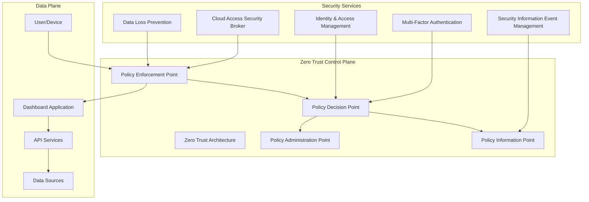
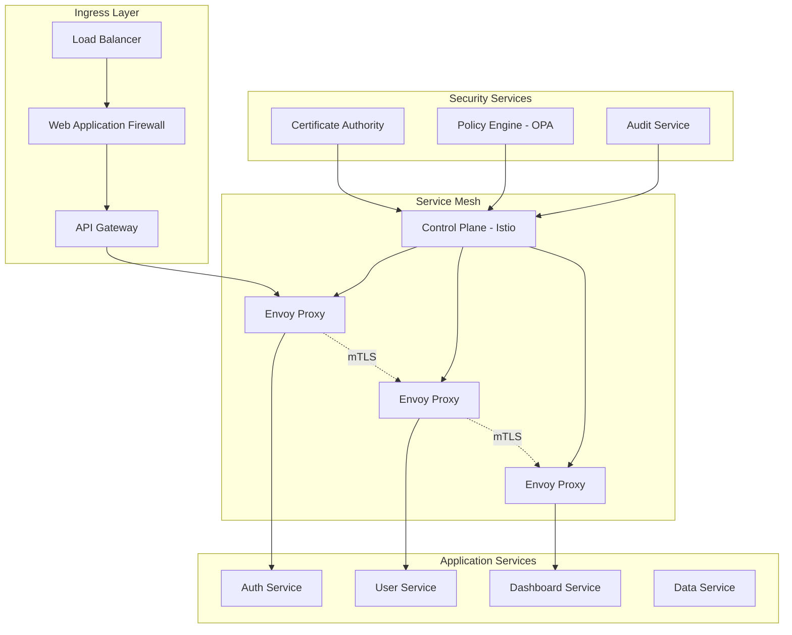
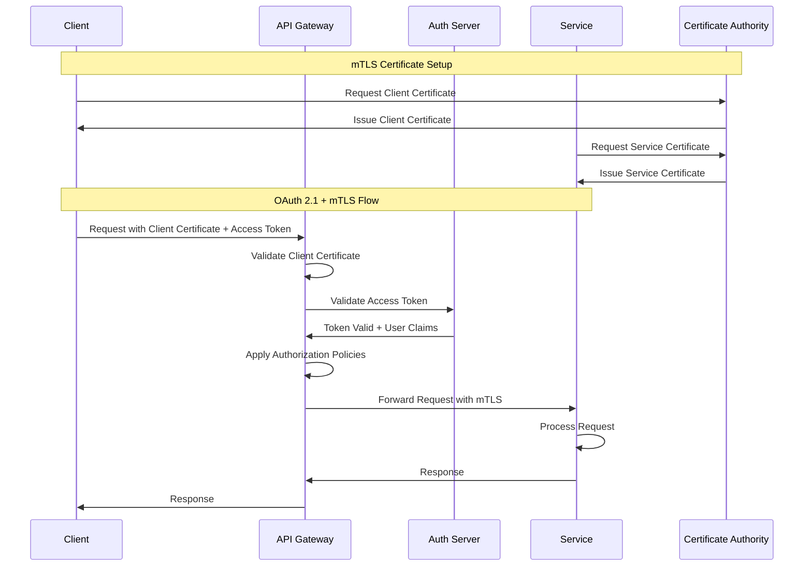
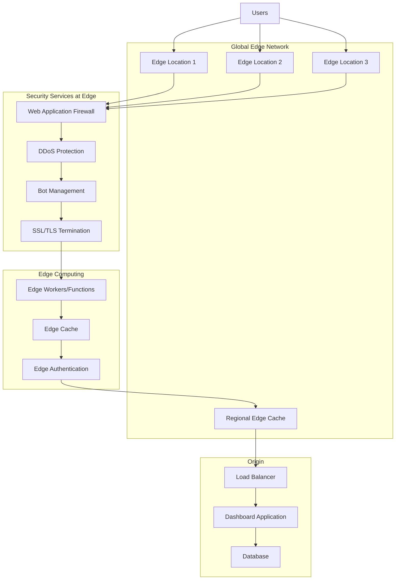
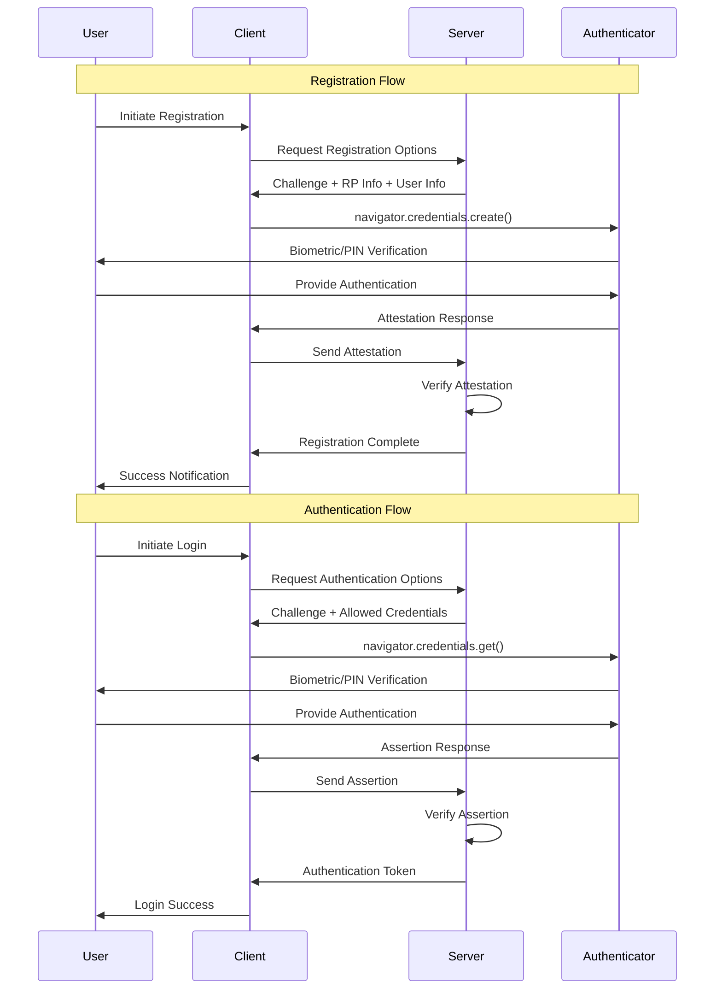
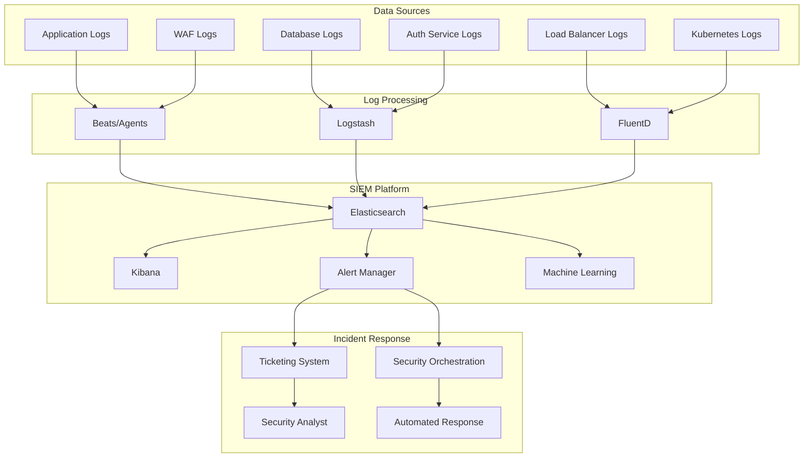
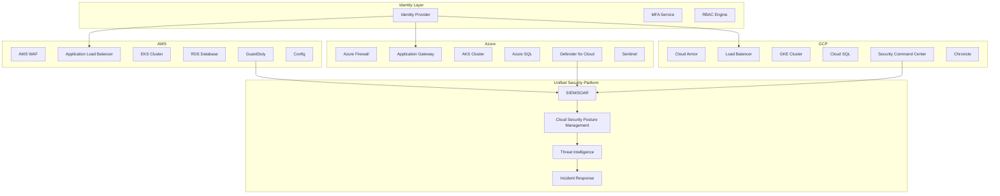

# Security Architecture Patterns for Dashboard Applications - 2025

## Table of Contents
1. [Zero-Trust Architecture Framework](#zero-trust-architecture-framework)
2. [Microservices Security Patterns](#microservices-security-patterns)
3. [API Gateway Security Architecture](#api-gateway-security-architecture)
4. [Edge Security Implementation](#edge-security-implementation)
5. [Container Security Orchestration](#container-security-orchestration)
6. [Authentication & Authorization Flows](#authentication--authorization-flows)
7. [Security Monitoring & Incident Response](#security-monitoring--incident-response)
8. [Integration Patterns](#integration-patterns)
9. [Implementation Guidelines](#implementation-guidelines)

---

## Zero-Trust Architecture Framework

### Core Architectural Principles



### Implementation Architecture

```yaml
zero_trust_architecture:
  identity_layer:
    identity_provider:
      type: "Multi-provider federation"
      providers: 
        - azure_ad
        - okta
        - ping_identity
      protocols:
        - oidc
        - saml2
        - oauth2.1
    
    device_trust:
      certificate_authority: "Internal CA"
      device_registration: "MDM/MAM integrated"
      health_attestation: "Continuous validation"
      compliance_checks:
        - encryption_enabled
        - patch_level_current
        - antivirus_active
        - jailbreak_detection
  
  network_layer:
    micro_segmentation:
      implementation: "Software-defined perimeter"
      encryption: "WireGuard/IPSec"
      inspection: "Deep packet inspection"
    
    dns_security:
      provider: "Cloudflare for Teams"
      filtering: 
        - malware_protection
        - phishing_protection
        - content_filtering
      analytics: "DNS query monitoring"
  
  application_layer:
    api_gateway:
      provider: "Kong/Istio Service Mesh"
      authentication: "OAuth 2.1 + mTLS"
      authorization: "OPA (Open Policy Agent)"
      rate_limiting: "Per-user/Per-API limits"
    
    service_mesh:
      implementation: "Istio"
      features:
        - automatic_mtls
        - traffic_management
        - security_policies
        - observability
  
  data_layer:
    classification:
      levels: ["Public", "Internal", "Confidential", "Restricted"]
      labeling: "Automatic classification"
      protection: "Rights management"
    
    encryption:
      at_rest: "AES-256 with customer-managed keys"
      in_transit: "TLS 1.3 minimum"
      in_use: "Homomorphic encryption for analytics"
```

### Policy Framework

```json
{
  "zero_trust_policies": {
    "device_trust": {
      "minimum_requirements": {
        "os_version": "latest_3_versions",
        "encryption": "full_disk_encryption",
        "security_software": "enterprise_endpoint_protection",
        "compliance_score": "> 80"
      },
      "conditional_access": {
        "location_based": {
          "trusted_locations": ["corporate_networks", "approved_countries"],
          "risk_assessment": "high_risk_locations_require_mfa"
        },
        "behavior_based": {
          "anomaly_detection": "ml_based_user_behavior",
          "impossible_travel": "geographic_impossibility_check"
        }
      }
    },
    "application_access": {
      "authorization_model": "RBAC + ABAC hybrid",
      "session_management": {
        "timeout": "8_hours_standard, 1_hour_privileged",
        "concurrent_sessions": "3_max_per_user",
        "re_authentication": "sensitive_operations"
      }
    }
  }
}
```

---

## Microservices Security Patterns

### Service Mesh Security Architecture



### Service-to-Service Authentication Pattern

```yaml
service_mesh_security:
  identity_framework:
    service_identity: "SPIFFE/SPIRE"
    certificate_management:
      rotation_period: "24_hours"
      ca_hierarchy: "Intermediate_CA_per_cluster"
      distribution: "Automatic_via_control_plane"
  
  communication_security:
    inter_service:
      protocol: "mTLS_mandatory"
      cipher_suites: ["TLS_AES_256_GCM_SHA384", "TLS_CHACHA20_POLY1305_SHA256"]
      verification: "Certificate_and_SVID_validation"
    
    external_communication:
      ingress: "TLS_termination_at_gateway"
      egress: "Controlled_via_service_entries"
      monitoring: "All_external_calls_logged"
  
  authorization_policies:
    default_policy: "DENY_ALL"
    service_specific:
      auth_service:
        allowed_callers: ["api_gateway", "user_service"]
        required_claims: ["service_account", "namespace"]
      
      user_service:
        allowed_callers: ["auth_service", "dashboard_service"]
        data_access_controls: "Row_level_security"
      
      dashboard_service:
        allowed_callers: ["api_gateway"]
        rate_limits: "100_requests_per_minute_per_user"
```

### Backend for Frontend (BFF) Security Pattern

```typescript
// BFF Security Implementation
class SecurityMiddleware {
  private jwtValidator: JWTValidator;
  private sessionManager: SessionManager;
  private rateLimiter: RateLimiter;

  async authenticate(request: Request): Promise<AuthContext> {
    // Validate session token
    const sessionToken = this.extractSessionToken(request);
    const session = await this.sessionManager.validateSession(sessionToken);
    
    if (!session.isValid) {
      throw new UnauthorizedError('Invalid session');
    }

    // Check for token refresh requirement
    if (session.requiresRefresh) {
      const newTokens = await this.refreshTokens(session.refreshToken);
      session.accessToken = newTokens.accessToken;
      session.refreshToken = newTokens.refreshToken;
    }

    return {
      userId: session.userId,
      roles: session.roles,
      permissions: session.permissions,
      sessionId: session.id
    };
  }

  async authorize(authContext: AuthContext, resource: string, action: string): Promise<boolean> {
    // Implement RBAC + ABAC authorization
    const policy = await this.policyEngine.getPolicy(resource, action);
    return await this.policyEngine.evaluate(policy, authContext);
  }

  async auditLog(request: Request, response: Response, authContext: AuthContext): Promise<void> {
    const auditEvent = {
      timestamp: new Date().toISOString(),
      userId: authContext.userId,
      sessionId: authContext.sessionId,
      action: `${request.method} ${request.path}`,
      sourceIP: request.ip,
      userAgent: request.headers['user-agent'],
      responseStatus: response.statusCode,
      resourceAccessed: request.path,
      sensitiveDataAccessed: this.detectSensitiveData(response)
    };
    
    await this.auditService.log(auditEvent);
  }
}
```

---

## API Gateway Security Architecture

### OAuth 2.1 + mTLS Implementation



### API Gateway Configuration

```yaml
api_gateway_security:
  authentication:
    oauth2:
      version: "OAuth 2.1"
      flows:
        authorization_code: 
          pkce_required: true
          state_parameter: "mandatory"
        client_credentials:
          mtls_required: true
          scope_validation: "strict"
    
    mtls:
      certificate_validation: "strict"
      ca_certificates: "trusted_ca_bundle"
      client_certificate_header: "X-Client-Cert"
      revocation_check: "OCSP_stapling"
  
  authorization:
    policy_engine: "Open Policy Agent"
    policies:
      rate_limiting:
        default: "1000_requests_per_minute"
        authenticated: "5000_requests_per_minute"
        premium: "10000_requests_per_minute"
      
      resource_access:
        dashboard_read: ["user", "admin", "viewer"]
        dashboard_write: ["admin", "editor"]
        system_admin: ["admin"]
  
  security_headers:
    response_headers:
      - "Strict-Transport-Security: max-age=31536000; includeSubDomains"
      - "X-Frame-Options: DENY"
      - "X-Content-Type-Options: nosniff"
      - "Content-Security-Policy: default-src 'self'"
      - "Referrer-Policy: strict-origin-when-cross-origin"
```

### Policy as Code Implementation

```rego
# OPA Policy for API Gateway Authorization
package api.authz

import rego.v1

# Default deny
default allow := false

# Allow if user has required role for the resource
allow if {
    input.method == "GET"
    input.path[0] == "dashboard"
    input.user.roles[_] == "viewer"
}

allow if {
    input.method == "POST"
    input.path[0] == "dashboard"
    input.user.roles[_] == "editor"
}

allow if {
    input.method == "DELETE"
    input.path[0] == "dashboard"
    input.user.roles[_] == "admin"
}

# Rate limiting policy
rate_limit_exceeded if {
    input.user.role == "free"
    input.request_count > 100
}

rate_limit_exceeded if {
    input.user.role == "premium"
    input.request_count > 1000
}

# Audit requirements
audit_required if {
    input.path[0] == "admin"
}

audit_required if {
    input.method in ["POST", "PUT", "DELETE"]
}

# Risk-based authentication
high_risk_request if {
    input.user.location != input.user.usual_location
    input.user.device != input.user.usual_device
}

mfa_required if {
    high_risk_request
    input.path[0] == "admin"
}
```

---

## Edge Security Implementation

### CDN Security Architecture



### Edge Security Configuration

```javascript
// Cloudflare Worker - Edge Security Implementation
export default {
  async fetch(request, env, ctx) {
    const security = new EdgeSecurity(env);
    
    try {
      // Security checks at edge
      await security.validateRequest(request);
      await security.checkRateLimit(request);
      await security.detectBots(request);
      await security.geoBlock(request);
      
      // Authentication at edge
      const authResult = await security.authenticateRequest(request);
      if (!authResult.valid) {
        return security.unauthorizedResponse();
      }
      
      // Modify request with security context
      const secureRequest = security.addSecurityHeaders(request, authResult);
      
      // Forward to origin with security context
      const response = await fetch(secureRequest);
      
      // Add security headers to response
      return security.addResponseHeaders(response);
      
    } catch (error) {
      // Log security incident
      await security.logIncident(request, error);
      return security.errorResponse(error);
    }
  }
};

class EdgeSecurity {
  constructor(env) {
    this.env = env;
    this.rateLimiter = new RateLimiter(env.KV);
    this.botDetector = new BotDetector(env.AI);
    this.geoBlocker = new GeoBlocker(env.GEO_DATA);
  }
  
  async validateRequest(request) {
    // Check for malicious patterns
    const url = new URL(request.url);
    const suspiciousPatterns = [
      /(\.\.|\/etc\/|\/proc\/)/,
      /<script|javascript:|data:/i,
      /(\bunion\b|\bselect\b|\binsert\b|\bdelete\b|\bdrop\b)/i
    ];
    
    for (const pattern of suspiciousPatterns) {
      if (pattern.test(url.pathname) || pattern.test(url.search)) {
        throw new SecurityError('Malicious request pattern detected');
      }
    }
  }
  
  async checkRateLimit(request) {
    const clientIP = request.headers.get('CF-Connecting-IP');
    const key = `rate_limit:${clientIP}`;
    
    const current = await this.env.KV.get(key);
    const count = current ? parseInt(current) : 0;
    
    if (count > 100) { // 100 requests per minute
      throw new SecurityError('Rate limit exceeded');
    }
    
    await this.env.KV.put(key, (count + 1).toString(), { expirationTtl: 60 });
  }
  
  async detectBots(request) {
    const userAgent = request.headers.get('User-Agent');
    const clientIP = request.headers.get('CF-Connecting-IP');
    
    // Use AI model for bot detection
    const botScore = await this.env.AI.run('@cf/meta/llama-2-7b-chat-int8', {
      messages: [{
        role: 'user',
        content: `Analyze this request for bot activity. User-Agent: ${userAgent}, IP: ${clientIP}`
      }]
    });
    
    if (botScore.confidence > 0.8) {
      throw new SecurityError('Bot activity detected');
    }
  }
  
  addSecurityHeaders(request, authResult) {
    const headers = new Headers(request.headers);
    headers.set('X-User-ID', authResult.userId);
    headers.set('X-User-Roles', JSON.stringify(authResult.roles));
    headers.set('X-Security-Context', JSON.stringify({
      authenticated: true,
      sessionId: authResult.sessionId,
      trustScore: authResult.trustScore
    }));
    
    return new Request(request.url, {
      method: request.method,
      headers: headers,
      body: request.body
    });
  }
  
  addResponseHeaders(response) {
    const headers = new Headers(response.headers);
    headers.set('Strict-Transport-Security', 'max-age=31536000; includeSubDomains; preload');
    headers.set('X-Frame-Options', 'DENY');
    headers.set('X-Content-Type-Options', 'nosniff');
    headers.set('Referrer-Policy', 'strict-origin-when-cross-origin');
    headers.set('Permissions-Policy', 'camera=(), microphone=(), geolocation=()');
    
    return new Response(response.body, {
      status: response.status,
      statusText: response.statusText,
      headers: headers
    });
  }
}
```

---

## Container Security Orchestration

### Kubernetes Security Architecture

```yaml
apiVersion: v1
kind: Namespace
metadata:
  name: dashboard-prod
  labels:
    security.policy: "strict"
    data.classification: "confidential"
---
apiVersion: networking.k8s.io/v1
kind: NetworkPolicy
metadata:
  name: dashboard-network-policy
  namespace: dashboard-prod
spec:
  podSelector:
    matchLabels:
      app: dashboard
  policyTypes:
  - Ingress
  - Egress
  ingress:
  - from:
    - namespaceSelector:
        matchLabels:
          name: api-gateway
    - podSelector:
        matchLabels:
          app: api-gateway
    ports:
    - protocol: TCP
      port: 8080
  egress:
  - to:
    - namespaceSelector:
        matchLabels:
          name: database
    ports:
    - protocol: TCP
      port: 5432
---
apiVersion: apps/v1
kind: Deployment
metadata:
  name: dashboard-app
  namespace: dashboard-prod
spec:
  replicas: 3
  selector:
    matchLabels:
      app: dashboard
  template:
    metadata:
      labels:
        app: dashboard
      annotations:
        seccomp.security.alpha.kubernetes.io/pod: runtime/default
    spec:
      serviceAccountName: dashboard-service-account
      securityContext:
        runAsNonRoot: true
        runAsUser: 10001
        fsGroup: 10001
        seccompProfile:
          type: RuntimeDefault
      containers:
      - name: dashboard
        image: dashboard:1.0.0-secure
        securityContext:
          allowPrivilegeEscalation: false
          readOnlyRootFilesystem: true
          runAsNonRoot: true
          runAsUser: 10001
          capabilities:
            drop:
            - ALL
        ports:
        - containerPort: 8080
          name: http
        resources:
          requests:
            memory: "256Mi"
            cpu: "250m"
          limits:
            memory: "512Mi"
            cpu: "500m"
        livenessProbe:
          httpGet:
            path: /health
            port: 8080
          initialDelaySeconds: 30
          periodSeconds: 10
        readinessProbe:
          httpGet:
            path: /ready
            port: 8080
          initialDelaySeconds: 5
          periodSeconds: 5
        volumeMounts:
        - name: tmp
          mountPath: /tmp
        - name: cache
          mountPath: /app/cache
        env:
        - name: DATABASE_URL
          valueFrom:
            secretKeyRef:
              name: database-credentials
              key: url
        - name: JWT_SECRET
          valueFrom:
            secretKeyRef:
              name: jwt-secrets
              key: secret
      volumes:
      - name: tmp
        emptyDir: {}
      - name: cache
        emptyDir:
          sizeLimit: 1Gi
---
apiVersion: v1
kind: ServiceAccount
metadata:
  name: dashboard-service-account
  namespace: dashboard-prod
---
apiVersion: rbac.authorization.k8s.io/v1
kind: Role
metadata:
  namespace: dashboard-prod
  name: dashboard-role
rules:
- apiGroups: [""]
  resources: ["secrets"]
  verbs: ["get"]
- apiGroups: [""]
  resources: ["configmaps"]
  verbs: ["get", "list"]
---
apiVersion: rbac.authorization.k8s.io/v1
kind: RoleBinding
metadata:
  name: dashboard-role-binding
  namespace: dashboard-prod
subjects:
- kind: ServiceAccount
  name: dashboard-service-account
  namespace: dashboard-prod
roleRef:
  kind: Role
  name: dashboard-role
  apiGroup: rbac.authorization.k8s.io
```

### Container Image Security Scanning

```yaml
# Dockerfile Security Best Practices
FROM node:18-alpine AS base
# Use specific version and minimal base image

# Create non-root user
RUN addgroup -g 10001 -S appgroup && \
    adduser -u 10001 -S appuser -G appgroup

# Install security updates
RUN apk update && apk upgrade && \
    apk add --no-cache dumb-init && \
    rm -rf /var/cache/apk/*

FROM base AS dependencies
WORKDIR /app
# Copy only package files first for better caching
COPY package*.json ./
RUN npm ci --only=production && npm cache clean --force

FROM base AS runtime
WORKDIR /app

# Copy application code
COPY --from=dependencies /app/node_modules ./node_modules
COPY --chown=appuser:appgroup . .

# Remove sensitive files
RUN rm -rf .git .gitignore Dockerfile* README.md docs/ tests/

# Use non-root user
USER appuser

# Use dumb-init for proper signal handling
ENTRYPOINT ["dumb-init", "--"]
CMD ["node", "server.js"]

# Security labels
LABEL security.scan.enabled="true"
LABEL security.non-root="true"
LABEL security.readonly-rootfs="true"
```

### Security Scanning Pipeline

```yaml
# GitHub Actions Security Scanning
name: Container Security Scan
on:
  push:
    branches: [main]
  pull_request:
    branches: [main]

jobs:
  security-scan:
    runs-on: ubuntu-latest
    steps:
    - uses: actions/checkout@v4
    
    - name: Build Docker image
      run: docker build -t dashboard:${{ github.sha }} .
    
    - name: Run Trivy vulnerability scanner
      uses: aquasecurity/trivy-action@master
      with:
        image-ref: 'dashboard:${{ github.sha }}'
        format: 'sarif'
        output: 'trivy-results.sarif'
        severity: 'CRITICAL,HIGH'
        exit-code: '1'
    
    - name: Upload Trivy scan results
      uses: github/codeql-action/upload-sarif@v2
      if: always()
      with:
        sarif_file: 'trivy-results.sarif'
    
    - name: Run Snyk to check for vulnerabilities
      uses: snyk/actions/docker@master
      env:
        SNYK_TOKEN: ${{ secrets.SNYK_TOKEN }}
      with:
        image: dashboard:${{ github.sha }}
        args: --severity-threshold=high --fail-on=upgradable
    
    - name: Run Docker Bench Security
      run: |
        docker run --rm --net host --pid host --userns host --cap-add audit_control \
          -e DOCKER_CONTENT_TRUST=$DOCKER_CONTENT_TRUST \
          -v /etc:/etc:ro \
          -v /usr/bin/containerd:/usr/bin/containerd:ro \
          -v /usr/bin/runc:/usr/bin/runc:ro \
          -v /usr/lib/systemd:/usr/lib/systemd:ro \
          -v /var/lib:/var/lib:ro \
          -v /var/run/docker.sock:/var/run/docker.sock:ro \
          --label docker_bench_security \
          docker/docker-bench-security
```

---

## Authentication & Authorization Flows

### WebAuthn/FIDO2 Implementation



### WebAuthn Server Implementation

```typescript
// WebAuthn Registration Handler
export class WebAuthnService {
  private rpID = 'dashboard.example.com';
  private rpName = 'Dashboard Application';
  private origin = 'https://dashboard.example.com';

  async generateRegistrationOptions(userId: string, userName: string): Promise<PublicKeyCredentialCreationOptions> {
    const user = await this.userService.getUser(userId);
    const existingCredentials = await this.credentialService.getCredentials(userId);

    const options: PublicKeyCredentialCreationOptions = {
      rp: {
        name: this.rpName,
        id: this.rpID,
      },
      user: {
        id: Buffer.from(userId),
        name: userName,
        displayName: user.displayName,
      },
      challenge: crypto.randomBytes(32),
      pubKeyCredParams: [
        { alg: -7, type: 'public-key' }, // ES256
        { alg: -257, type: 'public-key' }, // RS256
      ],
      timeout: 60000,
      attestation: 'direct',
      excludeCredentials: existingCredentials.map(cred => ({
        id: cred.credentialID,
        type: 'public-key',
        transports: cred.transports,
      })),
      authenticatorSelection: {
        authenticatorAttachment: 'platform',
        userVerification: 'required',
        residentKey: 'preferred',
      },
    };

    // Store challenge for verification
    await this.sessionService.storeChallenge(userId, options.challenge);

    return options;
  }

  async verifyRegistration(userId: string, response: AuthenticatorAttestationResponse): Promise<boolean> {
    try {
      const storedChallenge = await this.sessionService.getChallenge(userId);
      
      const verification = await verifyRegistrationResponse({
        response,
        expectedChallenge: storedChallenge,
        expectedOrigin: this.origin,
        expectedRPID: this.rpID,
        requireUserVerification: true,
      });

      if (verification.verified && verification.registrationInfo) {
        // Store credential
        await this.credentialService.storeCredential({
          userId,
          credentialID: verification.registrationInfo.credentialID,
          credentialPublicKey: verification.registrationInfo.credentialPublicKey,
          counter: verification.registrationInfo.counter,
          transports: response.transports,
          createdAt: new Date(),
        });

        // Clear challenge
        await this.sessionService.clearChallenge(userId);

        return true;
      }

      return false;
    } catch (error) {
      console.error('Registration verification failed:', error);
      return false;
    }
  }

  async generateAuthenticationOptions(userId?: string): Promise<PublicKeyCredentialRequestOptions> {
    let allowCredentials: PublicKeyCredentialDescriptor[] = [];

    if (userId) {
      const userCredentials = await this.credentialService.getCredentials(userId);
      allowCredentials = userCredentials.map(cred => ({
        id: cred.credentialID,
        type: 'public-key',
        transports: cred.transports,
      }));
    }

    const options: PublicKeyCredentialRequestOptions = {
      challenge: crypto.randomBytes(32),
      timeout: 60000,
      rpId: this.rpID,
      allowCredentials,
      userVerification: 'required',
    };

    // Store challenge for verification
    const sessionId = crypto.randomUUID();
    await this.sessionService.storeAuthChallenge(sessionId, options.challenge);

    return { ...options, sessionId };
  }

  async verifyAuthentication(sessionId: string, response: AuthenticatorAssertionResponse): Promise<AuthResult> {
    try {
      const storedChallenge = await this.sessionService.getAuthChallenge(sessionId);
      const credential = await this.credentialService.getCredentialByID(response.credentialId);

      if (!credential) {
        throw new Error('Credential not found');
      }

      const verification = await verifyAuthenticationResponse({
        response,
        expectedChallenge: storedChallenge,
        expectedOrigin: this.origin,
        expectedRPID: this.rpID,
        authenticator: {
          credentialID: credential.credentialID,
          credentialPublicKey: credential.credentialPublicKey,
          counter: credential.counter,
        },
        requireUserVerification: true,
      });

      if (verification.verified) {
        // Update counter
        await this.credentialService.updateCounter(
          credential.credentialID,
          verification.authenticationInfo.newCounter
        );

        // Generate session token
        const token = await this.tokenService.generateToken({
          userId: credential.userId,
          sessionId,
          authMethod: 'webauthn',
          credentialId: credential.credentialID,
        });

        // Clear challenge
        await this.sessionService.clearAuthChallenge(sessionId);

        return {
          success: true,
          userId: credential.userId,
          token,
          sessionId,
        };
      }

      return { success: false, error: 'Authentication failed' };
    } catch (error) {
      console.error('Authentication verification failed:', error);
      return { success: false, error: error.message };
    }
  }
}
```

### Multi-Factor Authentication Flow

```typescript
// MFA Implementation with Risk-Based Authentication
export class MFAService {
  async assessRiskLevel(authContext: AuthContext): Promise<RiskLevel> {
    const factors = [
      await this.checkDeviceReputation(authContext.deviceFingerprint),
      await this.checkLocationAnomaly(authContext.ipAddress, authContext.userId),
      await this.checkBehaviorPattern(authContext.userId, authContext.userAgent),
      await this.checkTimeAnomaly(authContext.userId),
    ];

    const riskScore = factors.reduce((total, factor) => total + factor.score, 0) / factors.length;

    if (riskScore >= 0.8) return RiskLevel.HIGH;
    if (riskScore >= 0.5) return RiskLevel.MEDIUM;
    return RiskLevel.LOW;
  }

  async requireMFA(userId: string, riskLevel: RiskLevel): Promise<MFARequirement> {
    const user = await this.userService.getUser(userId);
    const availableMethods = await this.getMFAMethods(userId);

    switch (riskLevel) {
      case RiskLevel.HIGH:
        return {
          required: true,
          methods: availableMethods.filter(m => m.strength >= MFAStrength.STRONG),
          allowRememberDevice: false,
          sessionTimeout: 3600, // 1 hour
        };
      
      case RiskLevel.MEDIUM:
        return {
          required: true,
          methods: availableMethods,
          allowRememberDevice: true,
          sessionTimeout: 28800, // 8 hours
        };
      
      case RiskLevel.LOW:
        return {
          required: user.mfaRequired,
          methods: availableMethods,
          allowRememberDevice: true,
          sessionTimeout: 86400, // 24 hours
        };
    }
  }

  async verifyMFA(userId: string, method: MFAMethod, credential: string): Promise<boolean> {
    switch (method.type) {
      case 'TOTP':
        return await this.verifyTOTP(userId, credential);
      
      case 'SMS':
        return await this.verifySMS(userId, credential);
      
      case 'WEBAUTHN':
        return await this.webauthnService.verifyAuthentication(userId, credential);
      
      case 'HARDWARE_TOKEN':
        return await this.verifyHardwareToken(userId, credential);
      
      default:
        throw new Error(`Unsupported MFA method: ${method.type}`);
    }
  }

  private async verifyTOTP(userId: string, token: string): Promise<boolean> {
    const secret = await this.secretService.getUserTOTPSecret(userId);
    const isValid = authenticator.verify({
      token,
      secret,
      window: 2, // Allow 2-step window for clock drift
    });

    if (isValid) {
      // Prevent token reuse
      await this.tokenHistoryService.recordUsedToken(userId, token);
    }

    return isValid;
  }

  private async checkLocationAnomaly(ipAddress: string, userId: string): Promise<RiskFactor> {
    const currentLocation = await this.geoService.getLocation(ipAddress);
    const userLocations = await this.userLocationService.getRecentLocations(userId, 90); // 90 days

    if (userLocations.length === 0) {
      return { score: 0.3, reason: 'No location history' };
    }

    const distances = userLocations.map(loc => 
      this.calculateDistance(currentLocation, loc)
    );
    const minDistance = Math.min(...distances);

    // Impossible travel detection
    const lastLocation = userLocations[0];
    const timeDiff = (Date.now() - lastLocation.timestamp) / 1000 / 3600; // hours
    const maxPossibleDistance = timeDiff * 1000; // Assuming 1000 km/h max speed

    if (minDistance > maxPossibleDistance) {
      return { score: 1.0, reason: 'Impossible travel detected' };
    }

    // Distance-based risk
    if (minDistance > 5000) return { score: 0.8, reason: 'Very unusual location' };
    if (minDistance > 1000) return { score: 0.5, reason: 'Unusual location' };
    if (minDistance > 100) return { score: 0.2, reason: 'Different city' };
    
    return { score: 0.0, reason: 'Normal location' };
  }
}
```

---

## Security Monitoring & Incident Response

### SIEM Integration Architecture



### Security Event Schema

```json
{
  "security_event_schema": {
    "version": "1.0",
    "event": {
      "id": "uuid",
      "timestamp": "ISO8601",
      "type": "authentication|authorization|data_access|system|network",
      "severity": "low|medium|high|critical",
      "source": {
        "service": "service_name",
        "component": "component_name",
        "host": "hostname",
        "ip": "ip_address"
      }
    },
    "user": {
      "id": "user_id",
      "email": "user_email",
      "roles": ["role1", "role2"],
      "session_id": "session_id"
    },
    "request": {
      "method": "HTTP_method",
      "url": "request_url",
      "user_agent": "user_agent",
      "ip": "client_ip",
      "headers": {}
    },
    "response": {
      "status_code": "http_status",
      "content_length": "bytes",
      "duration": "milliseconds"
    },
    "security": {
      "threat_detected": "boolean",
      "threat_type": "sql_injection|xss|brute_force|anomaly",
      "confidence": "0.0-1.0",
      "blocked": "boolean",
      "rule_id": "security_rule_id"
    },
    "metadata": {
      "tags": ["tag1", "tag2"],
      "custom_fields": {}
    }
  }
}
```

### Automated Incident Response

```yaml
# SOAR Playbook Configuration
incident_response_playbooks:
  authentication_anomaly:
    trigger:
      event_type: "authentication"
      conditions:
        - failed_attempts > 5
        - time_window: 300 # 5 minutes
        - user_risk_score > 0.7
    
    actions:
      - name: "Block User Session"
        type: "api_call"
        endpoint: "https://auth.service/api/v1/sessions/block"
        payload:
          user_id: "${event.user.id}"
          session_id: "${event.user.session_id}"
          reason: "Authentication anomaly detected"
      
      - name: "Notify Security Team"
        type: "notification"
        channels: ["slack", "email", "pagerduty"]
        template: "auth_anomaly_template"
        urgency: "high"
      
      - name: "Collect Additional Context"
        type: "enrichment"
        sources:
          - user_behavior_analytics
          - threat_intelligence
          - device_reputation
      
      - name: "Create Security Incident"
        type: "ticket"
        system: "servicenow"
        priority: "P2"
        assignment_group: "security_operations"

  data_exfiltration:
    trigger:
      event_type: "data_access"
      conditions:
        - data_volume > 10MB
        - time_window: 60 # 1 minute
        - unusual_access_pattern: true
    
    actions:
      - name: "Immediate Session Termination"
        type: "api_call"
        endpoint: "https://auth.service/api/v1/sessions/terminate"
        payload:
          user_id: "${event.user.id}"
          force: true
      
      - name: "Network Isolation"
        type: "firewall_rule"
        action: "block"
        source_ip: "${event.request.ip}"
        duration: 3600 # 1 hour
      
      - name: "Critical Alert"
        type: "notification"
        channels: ["pagerduty", "sms"]
        template: "data_exfiltration_template"
        urgency: "critical"
      
      - name: "Forensic Data Collection"
        type: "data_collection"
        sources:
          - application_logs
          - database_logs
          - network_traffic
        retention: "90_days"

  privilege_escalation:
    trigger:
      event_type: "authorization"
      conditions:
        - attempted_privilege_escalation: true
        - success: false
        - attempts > 3
    
    actions:
      - name: "Lock User Account"
        type: "api_call"
        endpoint: "https://iam.service/api/v1/users/lock"
        payload:
          user_id: "${event.user.id}"
          reason: "Privilege escalation attempt"
      
      - name: "Review User Permissions"
        type: "access_review"
        scope: "user_permissions"
        reviewer: "security_team"
        due_date: "+24h"
      
      - name: "Security Investigation"
        type: "investigation"
        priority: "high"
        assigned_to: "security_analyst"
        evidence:
          - event_logs
          - user_activity_history
          - system_access_logs
```

### Threat Detection Rules

```yaml
# Sigma Rules for Dashboard Security
detection_rules:
  dashboard_sql_injection:
    title: "SQL Injection Attempt in Dashboard"
    description: "Detects SQL injection patterns in dashboard requests"
    logsource:
      service: "dashboard-api"
      category: "webserver"
    detection:
      selection:
        request_path|contains:
          - "' OR '1'='1"
          - "'; DROP TABLE"
          - "UNION SELECT"
          - "' AND SLEEP("
          - "' OR SLEEP("
        http_status: 
          - 400
          - 500
      condition: selection
    fields:
      - client_ip
      - user_agent
      - request_path
      - user_id
    falsepositives:
      - "Legitimate database queries in application logic"
    level: high

  dashboard_xss_attempt:
    title: "Cross-Site Scripting Attempt"
    description: "Detects XSS patterns in dashboard inputs"
    logsource:
      service: "dashboard-api"
      category: "webserver"
    detection:
      selection:
        request_body|contains:
          - "<script"
          - "javascript:"
          - "onclick="
          - "onerror="
          - "onload="
        content_type: "application/json"
      condition: selection
    fields:
      - client_ip
      - user_id
      - request_body
      - session_id
    level: medium

  dashboard_brute_force:
    title: "Dashboard Brute Force Attack"
    description: "Detects brute force attempts against dashboard login"
    logsource:
      service: "auth-service"
      category: "authentication"
    detection:
      selection:
        event_type: "login_failed"
        time_window: 300 # 5 minutes
      count:
        source_ip: ">= 10"
      condition: selection and count
    fields:
      - source_ip
      - user_agent
      - attempted_username
      - failure_reason
    level: high

  dashboard_data_exfiltration:
    title: "Unusual Data Access Pattern"
    description: "Detects potential data exfiltration from dashboard"
    logsource:
      service: "dashboard-api"
      category: "data_access"
    detection:
      selection:
        event_type: "data_export"
        data_volume: "> 50MB"
        time_window: 300 # 5 minutes
      user_behavior:
        previous_exports: "< 3" # User rarely exports data
        off_hours: true # Outside business hours
      condition: selection and user_behavior
    fields:
      - user_id
      - data_type
      - export_size
      - destination
    level: high
```

---

## Integration Patterns

### Multi-Cloud Security Integration



### Security Orchestration Integration

```typescript
// Multi-Cloud Security Orchestration
export class SecurityOrchestrator {
  private cloudProviders: Map<string, CloudSecurityProvider>;
  private siemConnector: SIEMConnector;
  private incidentManager: IncidentManager;

  constructor() {
    this.cloudProviders = new Map([
      ['aws', new AWSSecurityProvider()],
      ['azure', new AzureSecurityProvider()],
      ['gcp', new GCPSecurityProvider()],
    ]);
    this.siemConnector = new SIEMConnector();
    this.incidentManager = new IncidentManager();
  }

  async handleSecurityEvent(event: SecurityEvent): Promise<void> {
    // Enrich event with threat intelligence
    const enrichedEvent = await this.enrichEvent(event);
    
    // Assess risk level
    const riskAssessment = await this.assessRisk(enrichedEvent);
    
    // Execute response across all cloud providers
    if (riskAssessment.level >= RiskLevel.HIGH) {
      await this.executeEmergencyResponse(enrichedEvent);
    } else if (riskAssessment.level >= RiskLevel.MEDIUM) {
      await this.executeStandardResponse(enrichedEvent);
    }
    
    // Log to SIEM
    await this.siemConnector.sendEvent(enrichedEvent);
    
    // Create incident if necessary
    if (riskAssessment.level >= RiskLevel.HIGH) {
      await this.incidentManager.createIncident({
        title: `Security Event: ${event.type}`,
        severity: this.mapRiskToSeverity(riskAssessment.level),
        description: enrichedEvent.description,
        affectedSystems: enrichedEvent.affectedSystems,
        evidence: enrichedEvent.evidence,
      });
    }
  }

  private async executeEmergencyResponse(event: SecurityEvent): Promise<void> {
    const responses: Promise<void>[] = [];

    // Block traffic across all cloud providers
    if (event.sourceIP) {
      for (const [cloudName, provider] of this.cloudProviders) {
        responses.push(
          provider.blockIP(event.sourceIP, {
            duration: 3600, // 1 hour
            reason: `Security event: ${event.type}`,
            scope: 'global',
          })
        );
      }
    }

    // Terminate suspicious sessions
    if (event.userId) {
      responses.push(
        this.authService.terminateAllSessions(event.userId)
      );
    }

    // Isolate affected resources
    if (event.affectedResources) {
      for (const resource of event.affectedResources) {
        const provider = this.cloudProviders.get(resource.cloudProvider);
        if (provider) {
          responses.push(
            provider.isolateResource(resource.id, {
              networkIsolation: true,
              accessRevocation: true,
              alerting: true,
            })
          );
        }
      }
    }

    // Execute all responses in parallel
    await Promise.all(responses);
  }

  private async enrichEvent(event: SecurityEvent): Promise<EnrichedSecurityEvent> {
    const enrichments = await Promise.all([
      this.threatIntelService.lookupIP(event.sourceIP),
      this.userBehaviorService.getUserProfile(event.userId),
      this.assetInventoryService.getAssetContext(event.resourceId),
      this.vulnerabilityService.getVulnerabilityContext(event.resourceId),
    ]);

    return {
      ...event,
      threatIntelligence: enrichments[0],
      userProfile: enrichments[1],
      assetContext: enrichments[2],
      vulnerabilityContext: enrichments[3],
      enrichmentTimestamp: new Date().toISOString(),
    };
  }

  async synchronizeSecurityPolicies(): Promise<void> {
    const masterPolicies = await this.policyService.getMasterPolicies();
    
    const syncTasks = Array.from(this.cloudProviders.entries()).map(
      async ([cloudName, provider]) => {
        const cloudSpecificPolicies = this.translatePolicies(
          masterPolicies,
          cloudName
        );
        
        await provider.updateSecurityPolicies(cloudSpecificPolicies);
        
        return {
          cloud: cloudName,
          status: 'success',
          policiesUpdated: cloudSpecificPolicies.length,
        };
      }
    );
    
    const results = await Promise.all(syncTasks);
    
    // Log synchronization results
    await this.auditService.logPolicySync({
      timestamp: new Date().toISOString(),
      results,
      masterPolicyVersion: masterPolicies.version,
    });
  }
}

// AWS Security Provider Implementation
class AWSSecurityProvider implements CloudSecurityProvider {
  private wafClient: WAFv2Client;
  private ec2Client: EC2Client;
  private guarddutycClient: GuardDutyClient;

  async blockIP(ip: string, options: BlockIPOptions): Promise<void> {
    // Update WAF IP set
    await this.wafClient.send(new UpdateIPSetCommand({
      Id: process.env.AWS_WAF_IP_SET_ID,
      Addresses: [ip],
      Description: options.reason,
    }));

    // Update Security Groups
    const securityGroups = await this.getRelevantSecurityGroups();
    for (const sgId of securityGroups) {
      await this.ec2Client.send(new AuthorizeSecurityGroupIngressCommand({
        GroupId: sgId,
        IpPermissions: [{
          IpProtocol: '-1',
          IpRanges: [{
            CidrIp: `${ip}/32`,
            Description: `BLOCKED: ${options.reason}`,
          }],
        }],
      }));
    }
  }

  async isolateResource(resourceId: string, options: IsolationOptions): Promise<void> {
    if (options.networkIsolation) {
      // Create isolation security group
      const isolationSG = await this.createIsolationSecurityGroup(resourceId);
      
      // Apply to EC2 instances
      await this.ec2Client.send(new ModifyInstanceAttributeCommand({
        InstanceId: resourceId,
        Groups: [isolationSG.GroupId],
      }));
    }

    if (options.accessRevocation) {
      // Revoke IAM permissions temporarily
      await this.revokeInstanceRole(resourceId);
    }
  }

  async updateSecurityPolicies(policies: SecurityPolicy[]): Promise<void> {
    for (const policy of policies) {
      switch (policy.type) {
        case 'waf':
          await this.updateWAFRules(policy);
          break;
        case 'network':
          await this.updateNetworkACLs(policy);
          break;
        case 'iam':
          await this.updateIAMPolicies(policy);
          break;
      }
    }
  }
}
```

---

## Implementation Guidelines

### Security Architecture Decision Framework

```yaml
architecture_decisions:
  authentication:
    decision_matrix:
      low_risk_applications:
        recommended: "OAuth 2.1 + OIDC"
        alternatives: ["SAML 2.0", "JWT with refresh tokens"]
        avoid: ["Basic authentication", "Session cookies only"]
      
      high_risk_applications:
        recommended: "WebAuthn + OAuth 2.1"
        alternatives: ["FIDO2 + SAML", "Certificate-based authentication"]
        avoid: ["Password-only", "SMS-based MFA"]
      
      legacy_integration:
        recommended: "SAML 2.0 bridge to OAuth 2.1"
        alternatives: ["Protocol translation gateway"]
        migrate_to: "WebAuthn + OAuth 2.1"

  authorization:
    models:
      rbac:
        use_cases: ["Simple role hierarchies", "Clear organizational structure"]
        implementation: "Database-backed with caching"
        scaling: "Horizontal with read replicas"
      
      abac:
        use_cases: ["Complex policies", "Dynamic attributes", "Fine-grained control"]
        implementation: "Policy engine (OPA/Rego)"
        scaling: "Distributed policy evaluation"
      
      hybrid_rbac_abac:
        use_cases: ["Enterprise applications", "Compliance requirements"]
        implementation: "Role-based foundation with attribute policies"
        scaling: "Federated policy engines"

  network_security:
    deployment_patterns:
      cloud_native:
        recommended: "Service mesh + API gateway"
        components: ["Istio/Linkerd", "Kong/Ambassador", "Envoy proxy"]
        benefits: ["Automatic mTLS", "Policy enforcement", "Observability"]
      
      hybrid_cloud:
        recommended: "VPN mesh + centralized gateway"
        components: ["WireGuard", "API gateway", "Identity federation"]
        benefits: ["Consistent policies", "Encrypted communication"]
      
      on_premises:
        recommended: "DMZ + internal segmentation"
        components: ["Hardware firewalls", "Network segmentation", "IDS/IPS"]
        benefits: ["Physical security", "Network isolation"]

  data_protection:
    classification_scheme:
      public:
        encryption: "Optional"
        access_control: "Public read"
        retention: "No specific requirements"
      
      internal:
        encryption: "TLS in transit"
        access_control: "Employee access only"
        retention: "7 years standard"
      
      confidential:
        encryption: "AES-256 at rest + TLS 1.3 in transit"
        access_control: "Need-to-know basis"
        retention: "Compliance-driven"
      
      restricted:
        encryption: "AES-256 + customer-managed keys"
        access_control: "Explicit approval required"
        retention: "Minimal retention period"
```

### Security Testing Framework

```yaml
security_testing_strategy:
  static_analysis:
    tools:
      - name: "SonarQube"
        languages: ["JavaScript", "TypeScript", "Python", "Java"]
        rules: ["OWASP Top 10", "CWE", "SANS Top 25"]
        integration: "CI/CD pipeline"
      
      - name: "Semgrep"
        focus: "Custom security rules"
        rules: ["API security", "Authentication flaws", "Business logic"]
        integration: "Pre-commit hooks"
    
    thresholds:
      critical: 0
      high: 0
      medium: 5
      low: 10

  dynamic_analysis:
    web_application:
      tools: ["OWASP ZAP", "Burp Suite Professional"]
      tests:
        - "SQL injection"
        - "Cross-site scripting (XSS)"
        - "Cross-site request forgery (CSRF)"
        - "Authentication bypass"
        - "Authorization flaws"
        - "Session management"
      frequency: "Every release"
    
    api_security:
      tools: ["Postman Security Tests", "REST Assured"]
      tests:
        - "Authentication mechanisms"
        - "Authorization boundaries"
        - "Input validation"
        - "Rate limiting"
        - "Data exposure"
      frequency: "Continuous integration"

  penetration_testing:
    internal_testing:
      frequency: "Quarterly"
      scope: ["Web application", "API endpoints", "Infrastructure"]
      methodology: "OWASP Testing Guide"
    
    external_testing:
      frequency: "Annually"
      scope: ["Full application stack", "Infrastructure", "Social engineering"]
      methodology: "NIST SP 800-115"
    
    red_team_exercises:
      frequency: "Bi-annually"
      scope: ["End-to-end attack scenarios", "Physical security", "Personnel"]
      methodology: "MITRE ATT&CK framework"

  compliance_validation:
    frameworks:
      - name: "SOC 2 Type II"
        frequency: "Annually"
        scope: ["Security", "Availability", "Confidentiality"]
      
      - name: "ISO 27001"
        frequency: "Tri-annually"
        scope: ["Information Security Management System"]
      
      - name: "PCI DSS"
        frequency: "Annually"
        scope: ["Payment card data handling"]
        requirements: ["Quarterly ASV scans", "Annual penetration testing"]
```

### Performance vs Security Trade-offs

```yaml
performance_security_optimization:
  authentication:
    high_performance:
      approach: "JWT with short expiry + refresh tokens"
      caching: "Redis session cache"
      validation: "Local JWT validation"
      trade_offs:
        pros: ["Low latency", "Reduced database load", "Stateless"]
        cons: ["Token revocation complexity", "Larger token size"]
    
    high_security:
      approach: "Database session validation + MFA"
      caching: "Minimal caching"
      validation: "Real-time database lookup"
      trade_offs:
        pros: ["Immediate revocation", "Audit trail", "Session control"]
        cons: ["Higher latency", "Database load", "Network dependency"]
    
    balanced:
      approach: "Cached session validation + risk-based MFA"
      caching: "5-minute cache with invalidation"
      validation: "Cached with real-time critical checks"
      trade_offs:
        pros: ["Good performance", "Security flexibility", "Scalable"]
        cons: ["Complex implementation", "Cache management overhead"]

  encryption:
    high_performance:
      algorithms: ["ChaCha20-Poly1305", "AES-GCM"]
      key_size: "256-bit"
      hardware_acceleration: "AES-NI when available"
      implementation: "Optimized libraries (OpenSSL)"
    
    high_security:
      algorithms: ["AES-256-GCM", "XChaCha20-Poly1305"]
      key_size: "256-bit minimum"
      key_derivation: "Argon2id"
      implementation: "Constant-time operations"
    
    quantum_resistant:
      algorithms: ["CRYSTALS-Kyber", "CRYSTALS-Dilithium"]
      key_size: "Post-quantum recommended sizes"
      migration_strategy: "Hybrid classical/post-quantum"
      timeline: "2025-2030 transition period"

  monitoring:
    real_time:
      latency_impact: "< 1ms per request"
      data_collection: "Minimal metadata only"
      storage: "Time-series database"
      retention: "30 days for hot data"
    
    comprehensive:
      latency_impact: "2-5ms per request"
      data_collection: "Full request/response logging"
      storage: "Elasticsearch cluster"
      retention: "2 years with tiered storage"
    
    compliance_focused:
      latency_impact: "5-10ms per request"
      data_collection: "Full audit trail with checksums"
      storage: "Immutable log storage"
      retention: "7+ years with legal hold capability"
```

### Deployment Architecture Templates

```yaml
deployment_architectures:
  startup_saas:
    description: "Cost-effective security for early-stage SaaS"
    components:
      authentication: "Auth0 or Okta"
      authorization: "Simple RBAC"
      network_security: "Cloudflare + AWS ALB"
      data_protection: "RDS encryption + S3 encryption"
      monitoring: "CloudWatch + basic alerting"
    
    estimated_cost: "$500-2000/month"
    security_level: "Medium"
    scalability: "Up to 10k users"
    compliance: "SOC 2 Type I ready"

  enterprise_application:
    description: "Full enterprise security stack"
    components:
      authentication: "ADFS/Azure AD + WebAuthn"
      authorization: "Hybrid RBAC/ABAC with OPA"
      network_security: "WAF + DDoS + Service Mesh"
      data_protection: "HSM + CASB + DLP"
      monitoring: "SIEM + SOAR + 24/7 SOC"
    
    estimated_cost: "$10k-50k/month"
    security_level: "High"
    scalability: "100k+ users"
    compliance: "SOC 2 Type II, ISO 27001, FedRAMP"

  financial_services:
    description: "Regulated financial services security"
    components:
      authentication: "PKI certificates + Hardware tokens"
      authorization: "Attribute-based with compliance rules"
      network_security: "Defense in depth + Network segmentation"
      data_protection: "FIPS 140-2 Level 3 + Tokenization"
      monitoring: "Real-time fraud detection + Compliance reporting"
    
    estimated_cost: "$50k-200k/month"
    security_level: "Critical"
    scalability: "Mission critical"
    compliance: "PCI DSS, SOX, FFIEC, Basel III"

  healthcare_platform:
    description: "HIPAA-compliant healthcare security"
    components:
      authentication: "Multi-factor + Role-based access"
      authorization: "Purpose-based access control"
      network_security: "VPN + End-to-end encryption"
      data_protection: "PHI encryption + Access logging"
      monitoring: "Audit logging + Breach detection"
    
    estimated_cost: "$5k-25k/month"
    security_level: "High"
    scalability: "Healthcare organization size"
    compliance: "HIPAA, HITECH, FDA if applicable"
```

---

## Conclusion

This comprehensive security architecture framework provides enterprise-ready patterns for dashboard applications in 2025. The implementation focuses on:

### Key Success Factors

1. **Zero-Trust Foundation**: Never trust, always verify with continuous authentication and authorization
2. **Defense in Depth**: Multiple security layers with redundancy and failover capabilities
3. **Automated Response**: AI-driven threat detection with orchestrated incident response
4. **Compliance by Design**: Built-in compliance with major frameworks (SOC 2, ISO 27001, PCI DSS)
5. **Performance Optimization**: Security controls that enhance rather than hinder user experience

### Implementation Roadmap

**Phase 1 (Months 1-3)**: Foundation
- Zero-trust architecture assessment and planning
- Basic authentication and authorization implementation
- Essential security monitoring and logging

**Phase 2 (Months 4-6)**: Advanced Security
- WebAuthn/FIDO2 passwordless authentication
- Service mesh security with mTLS
- Advanced threat detection and response

**Phase 3 (Months 7-12)**: Optimization
- AI-driven security analytics
- Automated compliance reporting
- Performance optimization and scaling

This architecture enables organizations to build secure, scalable, and compliant dashboard applications that protect against current and emerging threats while maintaining excellent user experience and system performance.