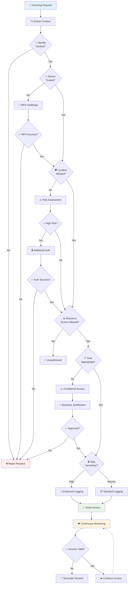
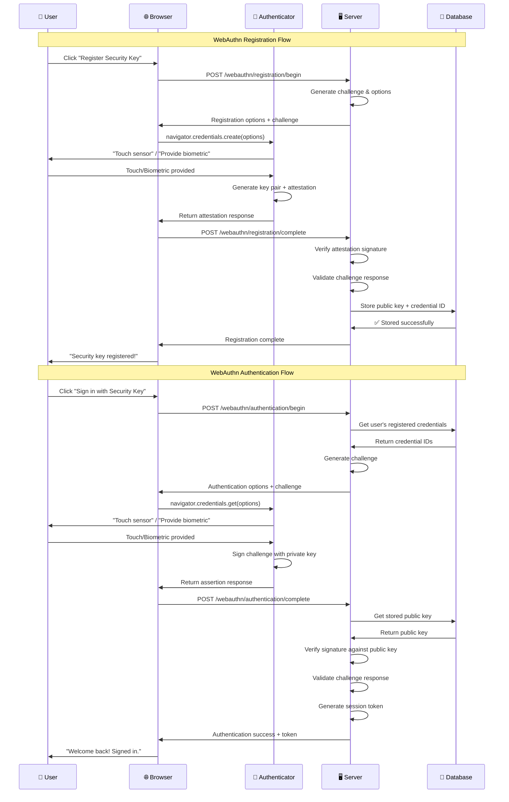
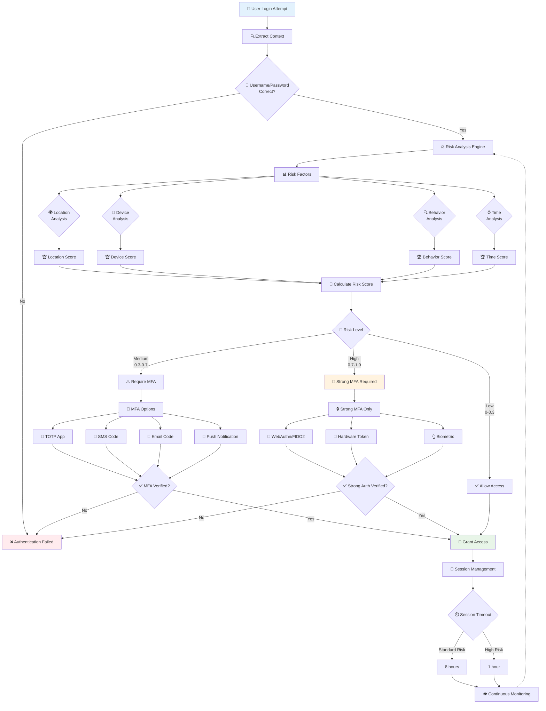
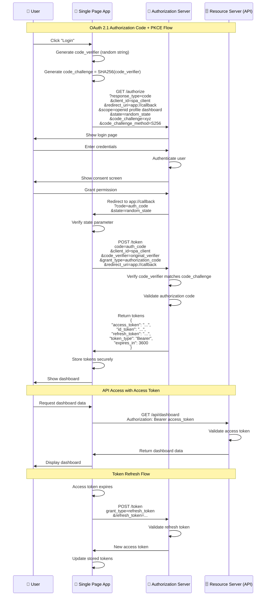
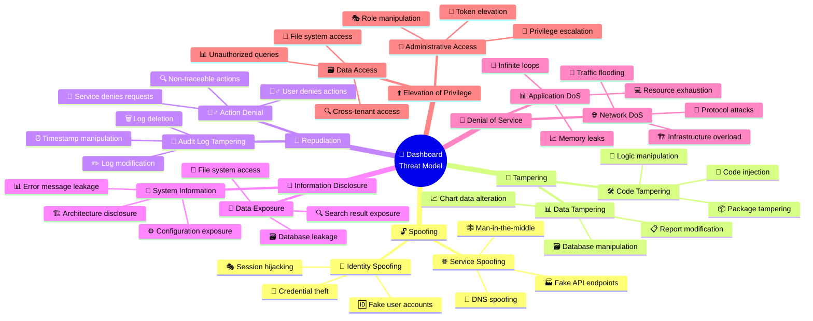
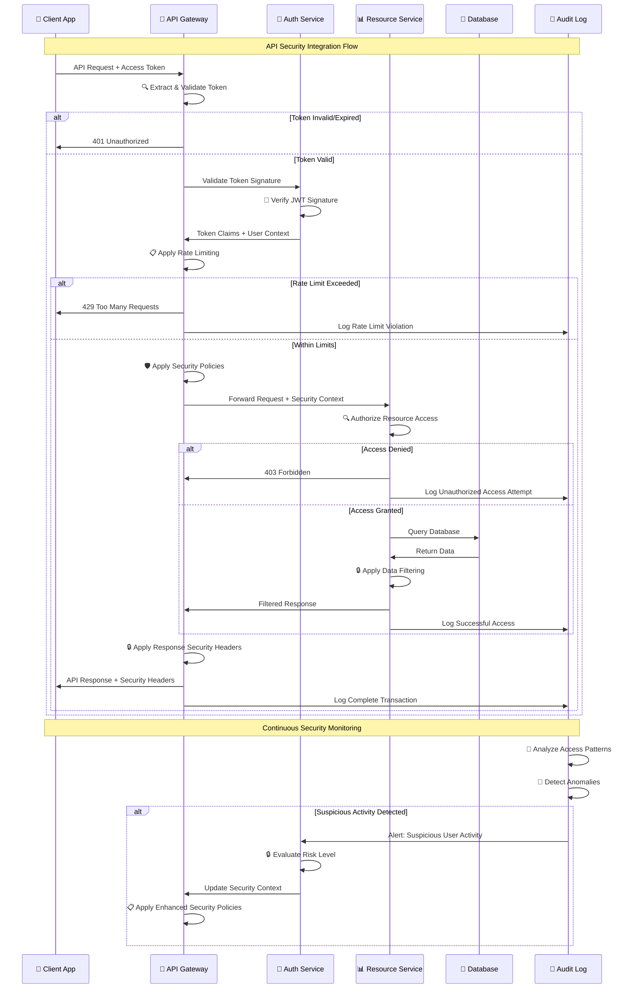
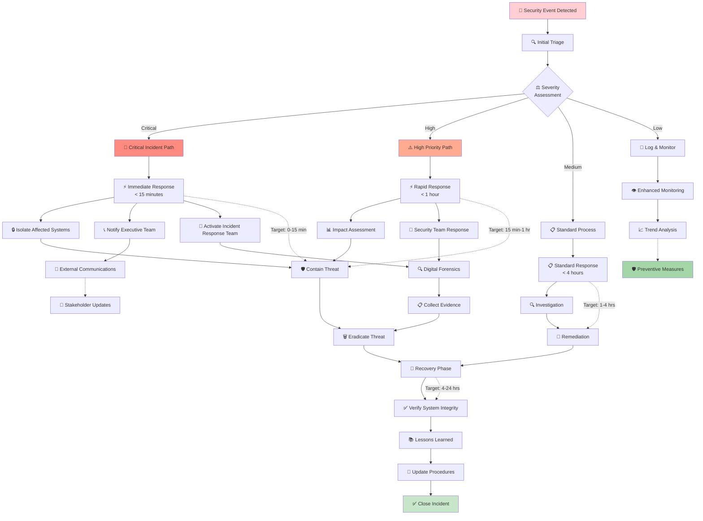
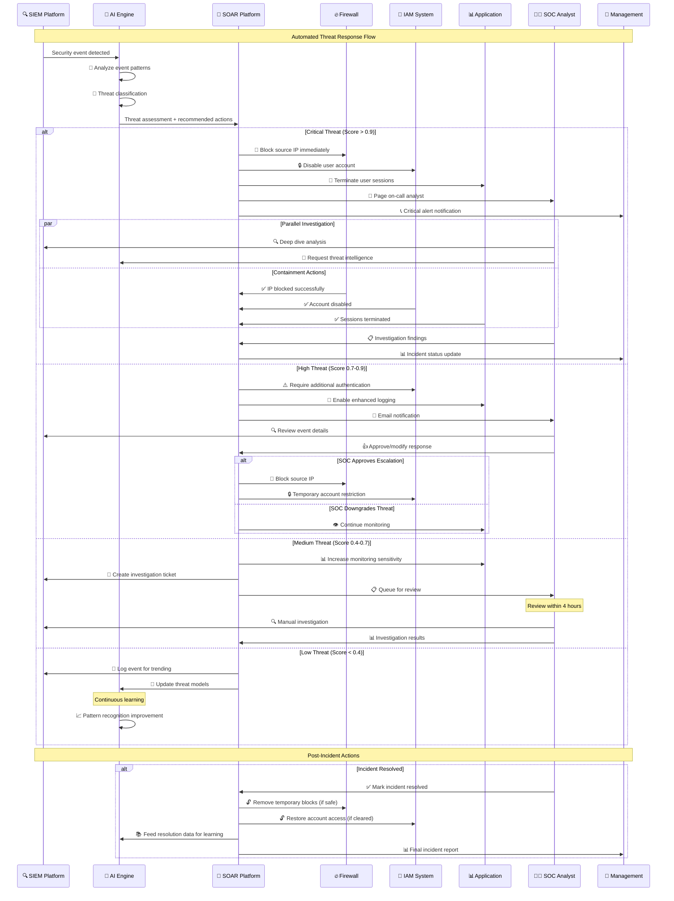

# Security Architecture Visual Diagrams & Implementation Guides

## Table of Contents
1. [Zero-Trust Architecture Diagrams](#zero-trust-architecture-diagrams)
2. [Authentication Flow Visualizations](#authentication-flow-visualizations)
3. [Threat Model Diagrams](#threat-model-diagrams)
4. [Security Integration Patterns](#security-integration-patterns)
5. [Monitoring & Response Workflows](#monitoring--response-workflows)
6. [Implementation Checklists](#implementation-checklists)

---

## Zero-Trust Architecture Diagrams

### High-Level Zero-Trust Dashboard Architecture

```mermaid
graph TB
    subgraph "User Access Layer"
        USER[👤 User]
        DEVICE[📱 Device]
        BROWSER[🌐 Browser]
    end
    
    subgraph "Identity & Access Layer"
        IDP[🏢 Identity Provider<br/>Azure AD / Okta]
        MFA[🔐 Multi-Factor Auth<br/>FIDO2 / TOTP]
        CIAM[👥 Customer IAM<br/>Auth0 / Cognito]
    end
    
    subgraph "Network Security Layer"
        CDN[☁️ CDN + WAF<br/>Cloudflare / AWS]
        LB[⚖️ Load Balancer<br/>ALB / NLB]
        VPN[🔒 Zero Trust VPN<br/>Tailscale / ZeroTier]
    end
    
    subgraph "Application Security Layer"
        GATEWAY[🚪 API Gateway<br/>Kong / Ambassador]
        MESH[🕸️ Service Mesh<br/>Istio / Linkerd]
        WAF_APP[🛡️ App-Level WAF<br/>ModSecurity]
    end
    
    subgraph "Dashboard Services"
        AUTH_SVC[🔑 Auth Service]
        USER_SVC[👤 User Service]
        DASH_SVC[📊 Dashboard Service]
        DATA_SVC[💾 Data Service]
        NOTIF_SVC[📬 Notification Service]
    end
    
    subgraph "Data Protection Layer"
        ENCRYPT[🔐 Encryption Engine<br/>Vault / HSM]
        DLP[🛡️ Data Loss Prevention<br/>Varonis / Forcepoint]
        BACKUP[💾 Secure Backup<br/>Veeam / Commvault]
    end
    
    subgraph "Monitoring & Response"
        SIEM[🔍 SIEM<br/>Splunk / QRadar]
        SOAR[🤖 SOAR<br/>Phantom / Demisto]
        SOC[👨‍💻 Security Operations<br/>24/7 Monitoring]
    end
    
    USER --> DEVICE
    DEVICE --> BROWSER
    BROWSER --> CDN
    
    BROWSER -.->|Authentication| IDP
    IDP --> MFA
    MFA --> CIAM
    
    CDN --> LB
    LB --> VPN
    VPN --> GATEWAY
    
    GATEWAY --> MESH
    MESH --> WAF_APP
    
    WAF_APP --> AUTH_SVC
    WAF_APP --> USER_SVC
    WAF_APP --> DASH_SVC
    WAF_APP --> DATA_SVC
    WAF_APP --> NOTIF_SVC
    
    AUTH_SVC -.-> ENCRYPT
    DATA_SVC -.-> DLP
    ALL_SERVICES -.-> BACKUP[All Services]
    
    ALL_SERVICES --> SIEM
    SIEM --> SOAR
    SOAR --> SOC
    
    style USER fill:#e1f5fe
    style IDP fill:#f3e5f5
    style GATEWAY fill:#e8f5e8
    style SIEM fill:#fff3e0
```



### Zero-Trust Policy Decision Flow



### Micro-Segmentation Network Architecture

```mermaid
graph TB
    subgraph "DMZ Zone"
        LB[Load Balancer]
        WAF[Web App Firewall]
        PROXY[Reverse Proxy]
    end
    
    subgraph "Application Zone"
        subgraph "Frontend Tier"
            FE1[Frontend Pod 1]
            FE2[Frontend Pod 2]
            FE3[Frontend Pod 3]
        end
        
        subgraph "API Tier"
            API1[API Pod 1]
            API2[API Pod 2]
            API3[API Pod 3]
        end
        
        subgraph "Service Tier"
            AUTH[Auth Service]
            USER[User Service]
            DASH[Dashboard Service]
            NOTIF[Notification Service]
        end
    end
    
    subgraph "Data Zone"
        subgraph "Database Tier"
            DB_PRIMARY[(Primary DB)]
            DB_REPLICA[(Read Replica)]
            CACHE[(Redis Cache)]
        end
        
        subgraph "Storage Tier"
            S3[Object Storage]
            BACKUP[Backup Storage]
        end
    end
    
    subgraph "Management Zone"
        MONITOR[Monitoring]
        LOGGING[Logging]
        SECRETS[Secret Management]
    end
    
    subgraph "Security Policies"
        FW_RULE1[🔥 DMZ → App<br/>HTTPS:443 only]
        FW_RULE2[🔥 App → Data<br/>DB:5432, Redis:6379]
        FW_RULE3[🔥 All → Mgmt<br/>Logs & Metrics]
        FW_RULE4[🚫 Data → External<br/>DENY ALL]
    end
    
    %% Network flows
    INTERNET[🌐 Internet] --> LB
    LB --> WAF
    WAF --> PROXY
    PROXY --> FE1
    PROXY --> FE2
    PROXY --> FE3
    
    FE1 --> API1
    FE2 --> API2
    FE3 --> API3
    
    API1 --> AUTH
    API2 --> USER
    API3 --> DASH
    API3 --> NOTIF
    
    AUTH --> DB_PRIMARY
    USER --> DB_PRIMARY
    DASH --> DB_REPLICA
    DASH --> CACHE
    NOTIF --> CACHE
    
    USER --> S3
    ALL_SERVICES --> BACKUP[All Services]
    
    ALL_SERVICES --> MONITOR
    ALL_SERVICES --> LOGGING
    AUTH --> SECRETS
    
    style INTERNET fill:#ffcdd2
    style DMZ fill:#e1f5fe
    style "Application Zone" fill:#e8f5e8
    style "Data Zone" fill:#f3e5f5
    style "Management Zone" fill:#fff3e0
```

---

## Authentication Flow Visualizations

### WebAuthn Registration & Authentication Flow



### Multi-Factor Authentication Risk Assessment



### OAuth 2.1 + PKCE Flow for SPA



---

## Threat Model Diagrams

### STRIDE Threat Model for Dashboard Architecture



### Attack Tree Analysis

```mermaid
flowchart TD
    ROOT[🎯 Compromise Dashboard Application]
    
    ROOT --> EXTERNAL[🌐 External Attack Vector]
    ROOT --> INTERNAL[🏢 Internal Attack Vector]
    ROOT --> SUPPLY[📦 Supply Chain Attack]
    
    EXTERNAL --> WEB_ATTACK[🕸️ Web Application Attack]
    EXTERNAL --> NETWORK[📡 Network Attack]
    EXTERNAL --> SOCIAL[👥 Social Engineering]
    
    WEB_ATTACK --> SQL_INJ[💉 SQL Injection]
    WEB_ATTACK --> XSS[🔧 Cross-Site Scripting]
    WEB_ATTACK --> CSRF[🔄 CSRF Attack]
    WEB_ATTACK --> AUTH_BYPASS[🔓 Authentication Bypass]
    
    NETWORK --> MITM[🕴️ Man-in-the-Middle]
    NETWORK --> DNS_POISON[☠️ DNS Poisoning]
    NETWORK --> TLS_ATTACK[🔒 TLS Vulnerabilities]
    
    SOCIAL --> PHISHING[🎣 Phishing Campaign]
    SOCIAL --> PRETEXTING[🎭 Pretexting]
    SOCIAL --> BAITING[🍯 Baiting Attack]
    
    INTERNAL --> MALICIOUS_INSIDER[😈 Malicious Insider]
    INTERNAL --> COMPROMISED_CREDS[🔑 Compromised Credentials]
    INTERNAL --> LATERAL_MOVEMENT[➡️ Lateral Movement]
    
    MALICIOUS_INSIDER --> DATA_THEFT[📊 Data Exfiltration]
    MALICIOUS_INSIDER --> SYSTEM_SABOTAGE[💥 System Sabotage]
    
    SUPPLY --> THIRD_PARTY[🤝 Third-Party Component]
    SUPPLY --> DEPENDENCY[📚 Dependency Confusion]
    SUPPLY --> BUILD_COMPROMISE[🏗️ Build Process Attack]
    
    %% Attack success conditions
    SQL_INJ --> DB_ACCESS[💾 Database Access Gained]
    XSS --> SESSION_STEAL[🍪 Session Token Stolen]
    AUTH_BYPASS --> SYSTEM_ACCESS[🚪 System Access Gained]
    PHISHING --> CRED_HARVEST[🎣 Credentials Harvested]
    DATA_THEFT --> COMPLIANCE_BREACH[⚖️ Compliance Violation]
    
    %% Mitigation effectiveness indicators
    SQL_INJ -.->|Blocked by| WAF_PROTECTION[🛡️ WAF + Input Validation]
    XSS -.->|Mitigated by| CSP_HEADERS[📋 Content Security Policy]
    CSRF -.->|Prevented by| CSRF_TOKENS[🎫 CSRF Tokens]
    MITM -.->|Protected by| TLS_MTLS[🔐 TLS 1.3 + mTLS]
    PHISHING -.->|Reduced by| SECURITY_TRAINING[🎓 Security Awareness]
    
    style ROOT fill:#ffcdd2
    style DB_ACCESS fill:#ffebee
    style SESSION_STEAL fill:#ffebee
    style SYSTEM_ACCESS fill:#ffebee
    style COMPLIANCE_BREACH fill:#ff8a80
    style WAF_PROTECTION fill:#c8e6c9
    style CSP_HEADERS fill:#c8e6c9
    style TLS_MTLS fill:#c8e6c9
```



### Data Flow Security Analysis

```mermaid
flowchart LR
    USER[👤 User<br/>Trust Level: External<br/>Security: Browser]
    
    subgraph "Edge Security Layer"
        CDN[☁️ CDN<br/>🛡️ DDoS Protection<br/>🔒 TLS Termination]
        WAF[🛡️ WAF<br/>🚫 OWASP Top 10<br/>🤖 Bot Detection]
    end
    
    subgraph "Application Security Layer"
        LB[⚖️ Load Balancer<br/>🔒 SSL/TLS<br/>📊 Health Checks]
        GATEWAY[🚪 API Gateway<br/>🔑 OAuth 2.1<br/>📋 Rate Limiting]
    end
    
    subgraph "Service Mesh"
        AUTH[🔐 Auth Service<br/>🔒 mTLS<br/>📝 JWT Generation]
        DASHBOARD[📊 Dashboard Service<br/>🔒 mTLS<br/>🔍 Data Access]
        USER_SVC[👤 User Service<br/>🔒 mTLS<br/>👥 Profile Management]
    end
    
    subgraph "Data Layer"
        DB[(🗄️ Database<br/>🔐 Encryption at Rest<br/>🔒 TLS Connections)]
        CACHE[(⚡ Redis Cache<br/>🔐 Encrypted<br/>⏰ TTL Policies)]
        FILES[📁 File Storage<br/>🔐 S3 Encryption<br/>🔑 IAM Policies]
    end
    
    %% Data flows with security annotations
    USER -->|HTTPS<br/>🔒 Encrypted| CDN
    CDN -->|🛡️ Filtered Traffic| WAF
    WAF -->|✅ Clean Requests| LB
    LB -->|🔒 TLS 1.3| GATEWAY
    
    GATEWAY -->|📋 Auth Required| AUTH
    GATEWAY -->|🎫 Valid Token| DASHBOARD
    GATEWAY -->|🎫 Valid Token| USER_SVC
    
    AUTH -->|🔒 mTLS| DB
    DASHBOARD -->|🔒 mTLS| DB
    DASHBOARD -->|🔒 mTLS| CACHE
    USER_SVC -->|🔒 mTLS| DB
    USER_SVC -->|🔒 mTLS| FILES
    
    %% Security boundaries
    subgraph "Internet Boundary"
        THREAT1[🚨 DDoS Attacks]
        THREAT2[🚨 Web App Attacks]
        THREAT3[🚨 Bot Traffic]
    end
    
    subgraph "Application Boundary"
        THREAT4[🚨 Injection Attacks]
        THREAT5[🚨 Broken Authentication]
        THREAT6[🚨 Privilege Escalation]
    end
    
    subgraph "Data Boundary"
        THREAT7[🚨 Data Breaches]
        THREAT8[🚨 Insider Threats]
        THREAT9[🚨 Data Corruption]
    end
    
    %% Security controls
    CDN -.->|Blocks| THREAT1
    WAF -.->|Filters| THREAT2
    WAF -.->|Detects| THREAT3
    GATEWAY -.->|Prevents| THREAT4
    AUTH -.->|Mitigates| THREAT5
    GATEWAY -.->|Controls| THREAT6
    DB -.->|Encrypts| THREAT7
    AUTH -.->|Audits| THREAT8
    DB -.->|Backs up| THREAT9
    
    style USER fill:#e3f2fd
    style "Edge Security Layer" fill:#f3e5f5
    style "Application Security Layer" fill:#e8f5e8
    style "Data Layer" fill:#fff3e0
    style THREAT1 fill:#ffcdd2
    style THREAT7 fill:#ffcdd2
```

---

## Security Integration Patterns

### API Security Integration Pattern



### Single Sign-On (SSO) Integration Architecture

```mermaid
graph TB
    subgraph "Corporate Network"
        CORP_USER[👤 Corporate User]
        AD[🏢 Active Directory]
        ADFS[🔐 AD FS]
    end
    
    subgraph "Cloud Identity Providers"
        AZURE_AD[☁️ Azure AD]
        OKTA[🆔 Okta]
        AUTH0[🔐 Auth0]
    end
    
    subgraph "Dashboard Application"
        SPA[📱 Single Page App]
        BFF[🚪 Backend for Frontend]
        API_GW[🚪 API Gateway]
    end
    
    subgraph "Identity Federation Hub"
        SAML_IDP[📜 SAML Identity Provider]
        OIDC_PROVIDER[🔗 OpenID Connect Provider]
        JWT_ISSUER[🎫 JWT Token Issuer]
    end
    
    subgraph "Application Services"
        AUTH_SVC[🔐 Auth Service]
        USER_SVC[👤 User Service]
        DASHBOARD_SVC[📊 Dashboard Service]
    end
    
    subgraph "Session & Token Management"
        SESSION_STORE[💾 Session Store<br/>Redis Cluster]
        TOKEN_CACHE[⚡ Token Cache<br/>In-Memory + Persistent]
        REFRESH_SVC[🔄 Token Refresh Service]
    end
    
    %% Authentication flows
    CORP_USER --> AD
    AD --> ADFS
    ADFS -.->|SAML| SAML_IDP
    
    CORP_USER -.->|Direct| AZURE_AD
    CORP_USER -.->|Direct| OKTA
    CORP_USER -.->|Direct| AUTH0
    
    AZURE_AD -.->|OIDC| OIDC_PROVIDER
    OKTA -.->|OIDC| OIDC_PROVIDER
    AUTH0 -.->|OIDC| OIDC_PROVIDER
    
    SAML_IDP --> JWT_ISSUER
    OIDC_PROVIDER --> JWT_ISSUER
    
    %% Application integration
    SPA --> BFF
    BFF --> API_GW
    API_GW --> AUTH_SVC
    
    AUTH_SVC <--> JWT_ISSUER
    AUTH_SVC --> SESSION_STORE
    AUTH_SVC --> TOKEN_CACHE
    
    API_GW --> USER_SVC
    API_GW --> DASHBOARD_SVC
    
    %% Session management
    SESSION_STORE <--> REFRESH_SVC
    TOKEN_CACHE <--> REFRESH_SVC
    
    %% Security annotations
    ADFS -.->|🔒 SAML Assertion<br/>Signed & Encrypted| SAML_IDP
    AZURE_AD -.->|🔒 ID Token<br/>JWT Signed| OIDC_PROVIDER
    JWT_ISSUER -.->|🔒 Access Token<br/>Short-lived| AUTH_SVC
    SESSION_STORE -.->|🔒 Encrypted Storage<br/>Redis AUTH| REFRESH_SVC
    
    style CORP_USER fill:#e3f2fd
    style "Identity Federation Hub" fill:#f3e5f5
    style "Session & Token Management" fill:#e8f5e8
    style "Application Services" fill:#fff3e0
```

### Multi-Tenant Security Isolation

```mermaid
graph TB
    subgraph "Tenant A"
        USER_A[👤 Tenant A Users]
        DATA_A[💾 Tenant A Data]
        CONFIG_A[⚙️ Tenant A Config]
    end
    
    subgraph "Tenant B"
        USER_B[👤 Tenant B Users]
        DATA_B[💾 Tenant B Data]
        CONFIG_B[⚙️ Tenant B Config]
    end
    
    subgraph "Tenant C"
        USER_C[👤 Tenant C Users]
        DATA_C[💾 Tenant C Data]
        CONFIG_C[⚙️ Tenant C Config]
    end
    
    subgraph "Shared Infrastructure"
        LB[⚖️ Load Balancer<br/>🏷️ Tenant Routing]
        
        subgraph "Application Layer"
            AUTH[🔐 Auth Service<br/>🏷️ Tenant Context]
            DASHBOARD[📊 Dashboard Service<br/>🔒 Row-Level Security]
            USER_SVC[👤 User Service<br/>🔍 Tenant Filtering]
        end
        
        subgraph "Data Layer"
            DB[(🗄️ Multi-Tenant Database<br/>🔒 Tenant ID on every row)]
            CACHE[(⚡ Redis Cache<br/>🏷️ Tenant-prefixed keys)]
            STORAGE[📁 Object Storage<br/>📂 Tenant-specific buckets]
        end
    end
    
    subgraph "Security Controls"
        TENANT_RESOLVER[🏷️ Tenant Resolver<br/>🔍 Domain/Subdomain mapping]
        ACCESS_CONTROL[🔒 Access Control Engine<br/>📋 Tenant-aware policies]
        AUDIT_LOG[📝 Audit Service<br/>🏷️ Tenant-segregated logs]
        ENCRYPTION[🔐 Encryption Service<br/>🔑 Tenant-specific keys]
    end
    
    %% User flows
    USER_A --> LB
    USER_B --> LB
    USER_C --> LB
    
    LB --> TENANT_RESOLVER
    TENANT_RESOLVER --> AUTH
    
    AUTH --> ACCESS_CONTROL
    ACCESS_CONTROL --> DASHBOARD
    ACCESS_CONTROL --> USER_SVC
    
    %% Data access patterns
    DASHBOARD --> DB
    DASHBOARD --> CACHE
    USER_SVC --> DB
    USER_SVC --> STORAGE
    
    %% Security enforcement
    DB -.->|🔒 Tenant A Data| DATA_A
    DB -.->|🔒 Tenant B Data| DATA_B
    DB -.->|🔒 Tenant C Data| DATA_C
    
    CACHE -.->|🏷️ tenant_a:*| DATA_A
    CACHE -.->|🏷️ tenant_b:*| DATA_B
    CACHE -.->|🏷️ tenant_c:*| DATA_C
    
    STORAGE -.->|📂 /tenant-a/*| DATA_A
    STORAGE -.->|📂 /tenant-b/*| DATA_B
    STORAGE -.->|📂 /tenant-c/*| DATA_C
    
    %% Monitoring and audit
    ALL_SERVICES --> AUDIT_LOG
    ALL_SERVICES --> ENCRYPTION
    
    %% Tenant-specific configurations
    CONFIG_A -.-> AUTH
    CONFIG_B -.-> AUTH
    CONFIG_C -.-> AUTH
    
    style "Tenant A" fill:#e3f2fd
    style "Tenant B" fill:#f3e5f5
    style "Tenant C" fill:#e8f5e8
    style "Security Controls" fill:#fff3e0
```

---

## Monitoring & Response Workflows

### Security Incident Response Workflow



### Automated Security Response System



### Continuous Security Monitoring Dashboard

```mermaid
graph TB
    subgraph "Data Collection Layer"
        APP_LOGS[📝 Application Logs]
        SYS_LOGS[🖥️ System Logs]
        NET_LOGS[🌐 Network Logs]
        SEC_LOGS[🔒 Security Logs]
        USER_BEHAVIOR[👤 User Behavior Data]
    end
    
    subgraph "Processing & Analysis"
        LOG_SHIPPER[📦 Log Shippers<br/>Filebeat, Fluentd]
        MESSAGE_QUEUE[📬 Message Queue<br/>Kafka, RabbitMQ]
        STREAM_PROCESSOR[🌊 Stream Processing<br/>Apache Storm, Kafka Streams]
        ML_ENGINE[🤖 ML Analytics Engine<br/>Anomaly Detection]
    end
    
    subgraph "Storage & Indexing"
        ELASTICSEARCH[🔍 Elasticsearch Cluster]
        TIME_SERIES[📊 Time Series DB<br/>InfluxDB, Prometheus]
        DATA_LAKE[🏞️ Data Lake<br/>S3, Azure Data Lake]
    end
    
    subgraph "Security Analytics"
        SIEM_ENGINE[🔍 SIEM Correlation Engine]
        THREAT_INTEL[🧠 Threat Intelligence<br/>IOC Matching]
        BEHAVIOR_ANALYTICS[📈 User Behavior Analytics<br/>UEBA]
        COMPLIANCE_MONITOR[⚖️ Compliance Monitoring<br/>PCI, SOX, GDPR]
    end
    
    subgraph "Visualization & Alerting"
        KIBANA[📊 Kibana Dashboards]
        GRAFANA[📈 Grafana Metrics]
        CUSTOM_DASH[🎨 Custom Security Dashboard]
        ALERT_MANAGER[🚨 Alert Manager]
        NOTIFICATION[📱 Notification System]
    end
    
    subgraph "Response & Integration"
        SOAR_PLATFORM[🔧 SOAR Platform]
        TICKET_SYSTEM[🎫 Ticketing System<br/>ServiceNow, JIRA]
        COMM_TOOLS[💬 Communication<br/>Slack, Teams]
    end
    
    %% Data flow
    APP_LOGS --> LOG_SHIPPER
    SYS_LOGS --> LOG_SHIPPER
    NET_LOGS --> LOG_SHIPPER
    SEC_LOGS --> LOG_SHIPPER
    USER_BEHAVIOR --> MESSAGE_QUEUE
    
    LOG_SHIPPER --> MESSAGE_QUEUE
    MESSAGE_QUEUE --> STREAM_PROCESSOR
    STREAM_PROCESSOR --> ML_ENGINE
    
    STREAM_PROCESSOR --> ELASTICSEARCH
    ML_ENGINE --> TIME_SERIES
    STREAM_PROCESSOR --> DATA_LAKE
    
    ELASTICSEARCH --> SIEM_ENGINE
    TIME_SERIES --> THREAT_INTEL
    DATA_LAKE --> BEHAVIOR_ANALYTICS
    ELASTICSEARCH --> COMPLIANCE_MONITOR
    
    SIEM_ENGINE --> KIBANA
    THREAT_INTEL --> GRAFANA
    BEHAVIOR_ANALYTICS --> CUSTOM_DASH
    COMPLIANCE_MONITOR --> CUSTOM_DASH
    
    KIBANA --> ALERT_MANAGER
    GRAFANA --> ALERT_MANAGER
    CUSTOM_DASH --> ALERT_MANAGER
    
    ALERT_MANAGER --> NOTIFICATION
    ALERT_MANAGER --> SOAR_PLATFORM
    
    SOAR_PLATFORM --> TICKET_SYSTEM
    SOAR_PLATFORM --> COMM_TOOLS
    NOTIFICATION --> COMM_TOOLS
    
    %% Real-time metrics annotations
    APP_LOGS -.->|Real-time| STREAM_PROCESSOR
    STREAM_PROCESSOR -.->|< 100ms latency| ML_ENGINE
    ML_ENGINE -.->|Anomaly Score| ALERT_MANAGER
    ALERT_MANAGER -.->|< 30s response| NOTIFICATION
    
    style "Data Collection Layer" fill:#e3f2fd
    style "Processing & Analysis" fill:#f3e5f5
    style "Security Analytics" fill:#e8f5e8
    style "Response & Integration" fill:#fff3e0
```

---

## Implementation Checklists

### Zero-Trust Implementation Checklist

#### Phase 1: Foundation (Months 1-3)
- [ ] **Identity Infrastructure**
  - [ ] Deploy centralized identity provider (Azure AD/Okta)
  - [ ] Implement multi-factor authentication for all users
  - [ ] Set up device registration and compliance policies
  - [ ] Configure conditional access policies
  - [ ] Establish device trust certificates

- [ ] **Network Security**
  - [ ] Implement micro-segmentation strategy
  - [ ] Deploy software-defined perimeter (SDP)
  - [ ] Configure DNS security and filtering
  - [ ] Set up network access control (NAC)
  - [ ] Establish encrypted communication channels

- [ ] **Application Security**
  - [ ] Deploy API gateway with authentication
  - [ ] Implement OAuth 2.1 + PKCE for all applications
  - [ ] Set up rate limiting and throttling
  - [ ] Configure security headers and CSP
  - [ ] Establish session management policies

#### Phase 2: Advanced Controls (Months 4-6)
- [ ] **Advanced Authentication**
  - [ ] Deploy WebAuthn/FIDO2 passwordless authentication
  - [ ] Implement risk-based authentication
  - [ ] Set up privileged access management (PAM)
  - [ ] Configure just-in-time (JIT) access
  - [ ] Establish emergency access procedures

- [ ] **Authorization & Access Control**
  - [ ] Implement fine-grained RBAC/ABAC policies
  - [ ] Deploy policy-as-code with OPA
  - [ ] Set up dynamic access reviews
  - [ ] Configure least-privilege access models
  - [ ] Establish access certification processes

- [ ] **Data Protection**
  - [ ] Classify all data assets
  - [ ] Implement encryption at rest and in transit
  - [ ] Deploy data loss prevention (DLP)
  - [ ] Set up data masking and tokenization
  - [ ] Configure backup encryption and testing

#### Phase 3: Optimization (Months 7-9)
- [ ] **Monitoring & Analytics**
  - [ ] Deploy SIEM/SOAR platform
  - [ ] Implement user behavior analytics (UBA)
  - [ ] Set up continuous compliance monitoring
  - [ ] Configure automated incident response
  - [ ] Establish security metrics and KPIs

- [ ] **Integration & Automation**
  - [ ] Integrate all security tools and platforms
  - [ ] Automate policy enforcement and updates
  - [ ] Set up security orchestration workflows
  - [ ] Configure automated threat hunting
  - [ ] Establish continuous security testing

### Authentication Security Checklist

#### OAuth 2.1 Implementation
- [ ] **Protocol Configuration**
  - [ ] Use authorization code flow with PKCE for all clients
  - [ ] Disable implicit and password grant types
  - [ ] Implement proper redirect URI validation
  - [ ] Use secure random state parameters
  - [ ] Configure appropriate token lifetimes

- [ ] **Token Security**
  - [ ] Implement JWT with RS256/ES256 signing
  - [ ] Use short-lived access tokens (15-60 minutes)
  - [ ] Implement secure refresh token rotation
  - [ ] Store tokens securely (HttpOnly cookies for web)
  - [ ] Implement token introspection for validation

- [ ] **Client Security**
  - [ ] Register all OAuth clients properly
  - [ ] Use client authentication for confidential clients
  - [ ] Implement PKCE for public clients
  - [ ] Validate all client credentials
  - [ ] Monitor client usage patterns

#### WebAuthn/FIDO2 Implementation
- [ ] **Server Configuration**
  - [ ] Configure proper relying party (RP) information
  - [ ] Implement challenge generation and validation
  - [ ] Set up credential storage and management
  - [ ] Configure attestation verification
  - [ ] Implement proper error handling

- [ ] **Client Integration**
  - [ ] Implement progressive enhancement for WebAuthn
  - [ ] Handle browser compatibility gracefully
  - [ ] Provide clear user instructions and feedback
  - [ ] Support multiple authenticator types
  - [ ] Implement fallback authentication methods

- [ ] **Security Controls**
  - [ ] Require user verification for sensitive operations
  - [ ] Implement proper resident key handling
  - [ ] Configure authenticator attachment preferences
  - [ ] Set appropriate timeout values
  - [ ] Monitor authentication success rates

### API Security Checklist

#### Input Validation & Sanitization
- [ ] **Request Validation**
  - [ ] Validate all input data types and formats
  - [ ] Implement proper parameter binding
  - [ ] Use allowlists for acceptable values
  - [ ] Sanitize all user-provided data
  - [ ] Implement request size limits

- [ ] **Content Type Validation**
  - [ ] Validate Content-Type headers
  - [ ] Reject unexpected content types
  - [ ] Implement proper charset validation
  - [ ] Handle multipart uploads securely
  - [ ] Validate file uploads thoroughly

#### Authorization & Access Control
- [ ] **API Authorization**
  - [ ] Implement proper scope validation
  - [ ] Use principle of least privilege
  - [ ] Validate user permissions for each endpoint
  - [ ] Implement resource-level authorization
  - [ ] Log all authorization decisions

- [ ] **Rate Limiting**
  - [ ] Implement per-user rate limiting
  - [ ] Set appropriate rate limit thresholds
  - [ ] Use sliding window algorithms
  - [ ] Implement burst protection
  - [ ] Monitor rate limit violations

#### Security Headers & CORS
- [ ] **Security Headers**
  - [ ] Implement HSTS with proper max-age
  - [ ] Set X-Frame-Options to DENY/SAMEORIGIN
  - [ ] Configure X-Content-Type-Options: nosniff
  - [ ] Implement proper CSP headers
  - [ ] Set Referrer-Policy appropriately

- [ ] **CORS Configuration**
  - [ ] Whitelist specific origins only
  - [ ] Avoid using wildcard origins
  - [ ] Limit allowed methods and headers
  - [ ] Set proper credentials handling
  - [ ] Implement preflight request validation

### Container Security Checklist

#### Image Security
- [ ] **Base Image Management**
  - [ ] Use minimal base images (Alpine, Distroless)
  - [ ] Keep base images updated regularly
  - [ ] Scan images for vulnerabilities
  - [ ] Sign images with Docker Content Trust
  - [ ] Use official images from trusted registries

- [ ] **Dockerfile Security**
  - [ ] Run containers as non-root user
  - [ ] Use specific version tags, not 'latest'
  - [ ] Minimize number of layers
  - [ ] Remove unnecessary packages and files
  - [ ] Set proper file permissions

#### Runtime Security
- [ ] **Security Contexts**
  - [ ] Set runAsNonRoot: true
  - [ ] Configure read-only root filesystem
  - [ ] Drop all capabilities by default
  - [ ] Use seccomp profiles
  - [ ] Implement AppArmor/SELinux policies

- [ ] **Resource Limits**
  - [ ] Set CPU and memory limits
  - [ ] Configure appropriate resource requests
  - [ ] Implement storage quotas
  - [ ] Monitor resource usage
  - [ ] Set up alerts for resource exhaustion

#### Kubernetes Security
- [ ] **Network Policies**
  - [ ] Implement default deny-all policies
  - [ ] Allow only necessary pod-to-pod communication
  - [ ] Restrict ingress and egress traffic
  - [ ] Segment namespaces appropriately
  - [ ] Monitor network traffic patterns

- [ ] **RBAC Configuration**
  - [ ] Implement least-privilege RBAC policies
  - [ ] Use service accounts for pods
  - [ ] Avoid using default service accounts
  - [ ] Regular RBAC reviews and audits
  - [ ] Monitor privilege escalation attempts

### Monitoring & Incident Response Checklist

#### Security Monitoring Setup
- [ ] **Log Collection**
  - [ ] Centralize all security-relevant logs
  - [ ] Implement log forwarding and aggregation
  - [ ] Ensure log integrity and tamper-proofing
  - [ ] Set appropriate log retention policies
  - [ ] Monitor log collection health

- [ ] **Alert Configuration**
  - [ ] Set up alerts for security events
  - [ ] Configure alert thresholds appropriately
  - [ ] Implement alert correlation rules
  - [ ] Test alert delivery mechanisms
  - [ ] Monitor alert fatigue and tuning

#### Incident Response Preparation
- [ ] **Response Team**
  - [ ] Define incident response team roles
  - [ ] Establish communication channels
  - [ ] Create escalation procedures
  - [ ] Conduct regular tabletop exercises
  - [ ] Maintain updated contact information

- [ ] **Response Procedures**
  - [ ] Document incident classification criteria
  - [ ] Create response playbooks for common scenarios
  - [ ] Establish evidence collection procedures
  - [ ] Define communication templates
  - [ ] Set up forensic analysis capabilities

#### Compliance & Audit
- [ ] **Compliance Monitoring**
  - [ ] Map controls to compliance requirements
  - [ ] Implement continuous compliance checking
  - [ ] Generate compliance reports automatically
  - [ ] Monitor policy violations
  - [ ] Maintain audit trails

- [ ] **Security Metrics**
  - [ ] Define security KPIs and metrics
  - [ ] Implement security scorecards
  - [ ] Track incident response times
  - [ ] Monitor security control effectiveness
  - [ ] Report security posture to management

This comprehensive implementation guide provides detailed checklists and visual diagrams to support the deployment of enterprise-grade security architecture for dashboard applications in 2025.